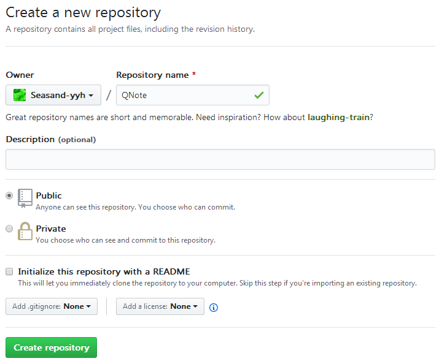
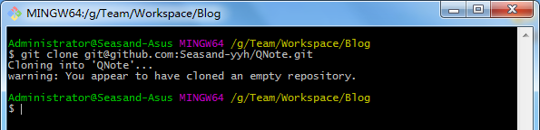
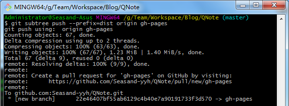

# gitbook + github pages 搭建个人博客

---

#### 在GitHub上创建仓库

#### 将仓库clone到本地

#### 使用gitbook创建项目

在QNote目录下，添加book.json文件，文件内容如下：

~~~javascript
{
  "title": "QNote",
  "description": "学习笔记",
  "author": "Seasand-yyh",
  "language": "zh-hans",
  "extension": null,
  "generator": "site",
  "links": {
	"sharing": {
	  "all": false,
	  "facebook": false,
	  "google": false,
	  "twitter": false,
	  "weibo": false
	},
	"sidebar": {
	  
	}
  },
  "output": null,
  "plugins": ["expandable-chapters", "splitter", "back-to-top-button"]
}
~~~

初始化项目

~~~l
gitbook install
gitbook init
~~~

生成README.md 和 SUMMARY.md两个文件。

编辑好内容后，构建

~~~
gitbook build ./ ./dist
~~~

也可以先在本地进行预览

~~~
gitbook serve
~~~

#### 同步到GitHub

在QNote目录下新建.gitignore文件，添加如下内容：

~~~
_book
node_modules
~~~

~~~
git push -u origin master
~~~

将dist文件夹推送到gh-pages分支

~~~
git subtree push --prefix=dist origin gh-pages
~~~

访问https://{username}.github.io/QNote，即可。

---

