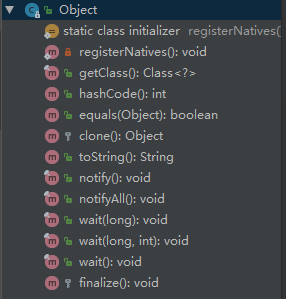
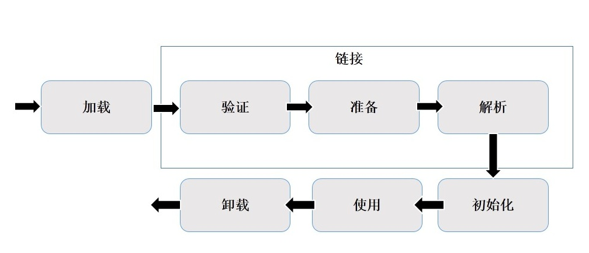
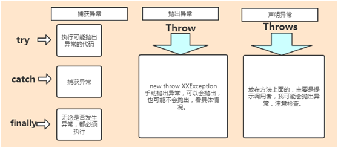
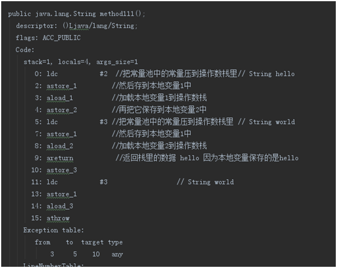

# 面试最常被问的 Java 后端题目及参考答案

---

## 一、Java基础篇

### 1、Object 有哪些常用方法？大致说一下每个方法的含义

下面是对应方法的含义：

1、clone 方法

保护方法，实现对象的浅复制，只有实现了 Cloneable 接口才可以调用该方法，否则抛出 CloneNotSupportedException 异常，深拷贝也需要实现 Cloneable，同时其成员变量为引用类型的也需要实现 Cloneable，然后重写 clone 方法。

2、finalize 方法

该方法和垃圾收集器有关系，判断一个对象是否可以被回收的最后一步就是判断是否重写了此方法。

3、equals 方法

该方法使用频率非常高。一般 equals 和 == 是不一样的，但是在 Object 中两者是一样的。子类一般都要重写这个方法。

4、hashCode 方法

该方法用于哈希查找，重写了 equals 方法一般都要重写 hashCode 方法，这个方法在一些具有哈希功能的 Collection 中用到。

一般必须满足 obj1.equals(obj2)==true。可以推出 obj1.hashCode()==obj2.hashCode()，但是 hashCode 相等不一定就满足 equals。不过为了提高效率，应该尽量使上面两个条件接近等价。

JDK 1.6、1.7 默认是返回随机数；JDK 1.8 默认是通过和当前线程有关的一个随机数 + 三个确定值，运用 Marsaglia’s xorshift scheme 随机数算法得到的一个随机数。

5、wait 方法

配合 synchronized 使用，wait 方法就是使当前线程等待该对象的锁，当前线程必须是该对象的拥有者，也就是具有该对象的锁。wait() 方法一直等待，直到获得锁或者被中断。wait(long timeout) 设定一个超时间隔，如果在规定时间内没有获得锁就返回。

调用该方法后当前线程进入睡眠状态，直到以下事件发生：

* 其他线程调用了该对象的 notify 方法；
* 其他线程调用了该对象的 notifyAll 方法；
* 其他线程调用了 interrupt 中断该线程；
* 时间间隔到了。

此时该线程就可以被调度了，如果是被中断的话就抛出一个 InterruptedException 异常。

6、notify 方法

配合 synchronized 使用，该方法唤醒在该对象上等待队列中的某个线程（同步队列中的线程是给抢占 CPU 的线程，等待队列中的线程指的是等待唤醒的线程）。

7、notifyAll 方法

配合 synchronized 使用，该方法唤醒在该对象上等待队列中的所有线程。

8、总结

只要把上面几个方法熟悉就可以了，toString 和 getClass 方法可以不用去讨论它们。该题目考察的是对 Object 的熟悉程度，平时用的很多方法并没看其定义但是也在用，比如说：wait() 方法，equals() 方法等。

Class Object is the root of the class hierarchy.Every class has Object as a superclass. All objects, including arrays, implement the methods of this class.

大致意思：Object 是所有类的根，是所有类的父类，所有对象包括数组都实现了 Object 的方法。

9、面试扩散

上面提到了 wait、notify、notifyAll 方法，或许面试官会问你为什么 sleep 方法不属于 Object 的方法呢？因为提到 wait 等方法，所以最好把 synchronized 都说清楚，把线程状态也都说清楚，尝试让面试官跟着你的节奏走。

### 2、Java创建对象有哪几种方式？

1、使用 new 关键字，这也是我们平时使用的最多的创建对象的方式，示例：

~~~java
User user=new User();
~~~

2、反射方式创建对象，使用 newInstance()，但是得处理两个异常 InstantiationException、IllegalAccessException：

~~~java
User user=User.class.newInstance();
Object object=(Object)Class.forName("java.lang.Object").newInstance();
~~~

3、使用 clone 方法，前面题目中 clone 是 Object 的方法，所以所有对象都有这个方法。

4、使用反序列化创建对象，调用 ObjectInputStream 类的 readObject() 方法。

我们反序列化一个对象，JVM 会给我们创建一个单独的对象。JVM 创建对象并不会调用任何构造函数。一个对象实现了 Serializable 接口，就可以把对象写入到文件中，并通过读取文件来创建对象。

总结：

创建对象的方式关键字：new、反射、clone 拷贝、反序列化。

### 3、获取一个类对象的方式有哪些？

搞清楚类对象和实例对象，但都是对象。

第一种：通过类对象的 getClass() 方法获取，细心点的都知道，这个 getClass 是 Object 类里面的方法。

~~~java
User user=new User();
//clazz就是一个User的类对象
Class<?> clazz=user.getClass();
~~~

第二种：通过类的静态成员表示，每个类都有隐含的静态成员 class。

~~~java
//clazz就是一个User的类对象
Class<?> clazz=User.class;
~~~

第三种：通过 Class 类的静态方法 forName() 方法获取。

~~~java
Class<?> clazz = Class.forName("com.tian.User");
~~~

### 4、反射中 Class.forName() 和 ClassLoader.loadClass() 的区别

1、装载：通过类的全限定名获取二进制字节流，将二进制字节流转换成方法区中的运行时数据结构，在内存中生成Java.lang.class对象； 

2、链接：执行下面的校验、准备和解析步骤，其中解析步骤是可以选择的； 

1）校验：检查导入类或接口的二进制数据的正确性；（文件格式验证，元数据验证，字节码验证，符号引用验证） 

2）准备：给类的静态变量分配并初始化存储空间； 

3）解析：将常量池中的符号引用转成直接引用； 

3、初始化：激活类的静态变量的初始化Java代码和静态Java代码块，并初始化程序员设置的变量值。

Class.forName(className)方法，内部实际调用的方法是Class.forName(className,true,classloader); 第2个boolean参数表示类是否需要初始化，  Class.forName(className)默认是需要初始化。 一旦初始化，就会触发目标对象的 static块代码执行，static参数也也会被再次初始化。

ClassLoader.loadClass(className)方法，内部实际调用的方法是 ClassLoader.loadClass(className,false); 第2个 boolean参数，表示目标对象是否进行链接，false表示不进行链接，由上面介绍可以知道，不进行链接意味着不进行包括初始化等一些列步骤，那么静态块和静态对象就不会得到执行。

### 5、ArrayList 和 LinkedList 的区别有哪些？

* ArrayList

优点：ArrayList 是实现了基于动态数组的数据结构，因为地址连续，一旦数据存储好了，查询操作效率会比较高（在内存里是连着放的）。

缺点：因为地址连续，ArrayList 要移动数据，所以插入和删除操作效率比较低。

* LinkedList

优点：LinkedList 基于链表的数据结构，地址是任意的，所以在开辟内存空间的时候不需要等一个连续的地址。对于新增和删除操作，LinkedList 比较占优势。LinkedList 适用于要头尾操作或插入指定位置的场景。

缺点：因为 LinkedList 要移动指针，所以查询操作性能比较低。

适用场景分析：

* 当需要对数据进行对随机访问的时候，选用 ArrayList。
* 当需要对数据进行多次增加删除修改时，采用 LinkedList。
* 如果容量固定，并且只会添加到尾部，不会引起扩容，优先采用 ArrayList。

当然，绝大数业务的场景下，使用 ArrayList 就够了，但需要注意避免 ArrayList 的扩容，以及非顺序的插入。

### 6、用过 ArrayList 吗？说一下它有什么特点？

只要是搞 Java 的肯定都会回答“用过”。所以，回答题目的后半部分——ArrayList 的特点。可以从这几个方面去回答：

Java 集合框架中的一种存放相同类型的元素数据，是一种变长的集合类，基于定长数组实现，当加入数据达到一定程度后，会实行自动扩容，即扩大数组大小。

底层是使用数组实现，添加元素。

如果 add(o)，添加到的是数组的尾部，如果要增加的数据量很大，应该使用 ensureCapacity() 方法，该方法的作用是预先设置 ArrayList 的大小，这样可以大大提高初始化速度。

如果使用 add(int,o)，添加到某个位置，那么可能会挪动大量的数组元素，并且可能会触发扩容机制。

高并发的情况下，线程不安全。多个线程同时操作 ArrayList，会引发不可预知的异常或错误。

ArrayList 实现了 Cloneable 接口，标识着它可以被复制。注意：ArrayList 里面的 clone() 复制其实是浅复制。

### 7、有数组了为什么还要搞个 ArrayList 呢？

通常我们在使用的时候，如果在不明确要插入多少数据的情况下，普通数组就很尴尬了，因为你不知道需要初始化数组大小为多少，而 ArrayList 可以使用默认的大小，当元素个数到达一定程度后，会自动扩容。

可以这么来理解：我们常说的数组是定死的数组，ArrayList 却是动态数组。

### 8、说说什么是 fail-fast？

fail-fast 机制是 Java 集合（Collection）中的一种错误机制。当多个线程对同一个集合的内容进行操作时，就可能会产生 fail-fast 事件。

例如：当某一个线程 A 通过 iterator 去遍历某集合的过程中，若该集合的内容被其他线程所改变了，那么线程 A 访问集合时，就会抛出 ConcurrentModificationException 异常，产生 fail-fast 事件。这里的操作主要是指 add、remove 和 clear，对集合元素个数进行修改。

解决办法：建议使用“java.util.concurrent 包下的类”去取代“java.util 包下的类”。

可以这么理解：在遍历之前，把 modCount 记下来 expectModCount，后面 expectModCount 去和 modCount 进行比较，如果不相等了，证明已并发了，被修改了，于是抛出 ConcurrentModificationException 异常。

### 9、HashTable 与 HashMap 的区别

1、出生的版本不一样，HashTable出生于Java发布的第一版本JDK1.0，HashMap出生于JDK1.2。

2、都实现了 Map、Cloneable、Serializable（当前 JDK 版本 1.8）。

3、HashMap 继承的是 AbstractMap，并且 AbstractMap 也实现了 Map 接口。Hashtable 继承 Dictionary。

4、Hashtable 中大部分 public 修饰普通方法都是 synchronized 字段修饰的，是线程安全的，HashMap 是非线程安全的。

5、Hashtable 的 key 不能为 null，value 也不能为 null，这个可以从 Hashtable 源码中的 put 方法看到，判断如果 value 为 null 就直接抛出空指针异常，在 put 方法中计算 key 的 hash 值之前并没有判断 key 为 null 的情况，那说明，这时候如果 key 为空，照样会抛出空指针异常。

6、HashMap 的 key 和 value 都可以为 null。在计算 hash 值的时候，有判断，如果 key==null，则其 hash=0；至于 value 是否为 null，根本没有判断过。

7、Hashtable 直接使用对象的 hash 值。hash 值是 JDK 根据对象的地址或者字符串或者数字算出来的 int 类型的数值。然后再使用除留余数法来获得最终的位置。然而除法运算是非常耗费时间的，效率很低。HashMap 为了提高计算效率，将哈希表的大小固定为了 2 的幂，这样在取模预算时，不需要做除法，只需要做位运算。位运算比除法的效率要高很多。

8、Hashtable、HashMap 都使用了 Iterator。而由于历史原因，Hashtable 还使用了 Enumeration 的方式。

9、默认情况下，初始容量不同，Hashtable 的初始长度是 11，之后每次扩充容量变为之前的 2n+1（n 为上一次的长度）而 HashMap 的初始长度为 16，之后每次扩充变为原来的两倍。

另外在 Hashtable 源码注释中有这么一句话：

Hashtable is synchronized.  If a thread-safe implementation is not needed, it is recommended to use HashMap in place of Hashtable . If a thread-safe highly-concurrent implementation is desired, then it is recommended to use ConcurrentHashMap in place of Hashtable.

大致意思：Hashtable 是线程安全，推荐使用 HashMap 代替 Hashtable；如果需要线程安全高并发的话，推荐使用 ConcurrentHashMap 代替 Hashtable。

这个回答完了，面试官可能会继续问：HashMap 是线程不安全的，那么在需要线程安全的情况下还要考虑性能，有什么解决方式？

这里最好的选择就是 ConcurrentHashMap 了，但面试官肯定会叫你继续说一下 ConcurrentHashMap 数据结构以及底层原理等。

### 10、HashMap 中的 key 我们可以使用任何类作为 key 吗？

平时可能大家使用的最多的就是使用 String 作为 HashMap 的 key，但是现在我们想使用某个自定义类作为 HashMap 的 key，那就需要注意以下几点：

* 如果类重写了 equals 方法，它也应该重写 hashCode 方法。
* 类的所有实例需要遵循与 equals 和 hashCode 相关的规则。
* 如果一个类没有使用 equals，你不应该在 hashCode 中使用它。
* 咱们自定义 key 类的最佳实践是使之为不可变的，这样，hashCode 值可以被缓存起来，拥有更好的性能。不可变的类也可以确保 hashCode 和 equals 在未来不会改变，这样就会解决与可变相关的问题了。

### 11、HashMap 的长度为什么是 2 的 N 次方呢？

为了能让 HashMap 存数据和取数据的效率高，尽可能地减少 hash 值的碰撞，也就是说尽量把数据能均匀的分配，每个链表或者红黑树长度尽量相等。

我们首先可能会想到 % 取模的操作来实现。

下面是回答的重点哟：

取余（%）操作中如果除数是 2 的幂次，则等价于与其除数减一的与（&）操作（也就是说 hash % length == hash &(length - 1) 的前提是 length 是 2 的 n 次方）。并且，采用二进制位操作 &，相对于 % 能够提高运算效率。

这就是为什么 HashMap 的长度需要 2 的 N 次方了。

### 12、HashMap 与 ConcurrentHashMap 的异同

1、都是 key-value 形式的存储数据；

2、HashMap 是线程不安全的，ConcurrentHashMap 是 JUC 下的线程安全的；

3、HashMap 底层数据结构是数组 + 链表（JDK 1.8 之前）。JDK 1.8 之后是数组 + 链表 + 红黑树。当链表中元素个数达到 8 的时候，链表的查询速度不如红黑树快，链表会转为红黑树，红黑树查询速度快；

4、HashMap 初始数组大小为 16（默认），当出现扩容的时候，以 0.75 * 数组大小的方式进行扩容；

5、ConcurrentHashMap 在 JDK 1.8 之前是采用分段锁来现实的 Segment + HashEntry，Segment 数组大小默认是 16，2 的 n 次方；JDK 1.8 之后，采用 Node + CAS + Synchronized 来保证并发安全进行实现。

### 13、红黑树有哪几个特征？

* 每个节点是红色或黑色的；
* 根节点是黑色的；
* 每个叶子节点都是黑色的（指向空的叶子节点）；
* 如果一个叶子节点是红色，那么其子节点必须都是黑色的；
* 从一个节点到该节点的子孙节点的所有路径上包含相同数目的黑色节点；

### 14、说说你平时是怎么处理 Java 异常的

try-catch-finally

* try 块负责监控可能出现异常的代码
* catch 块负责捕获可能出现的异常，并进行处理
* finally 块负责清理各种资源，不管是否出现异常都会执行
* 其中 try 块是必须的，catch 和 finally 至少存在一个标准异常处理流程

> 抛出异常→捕获异常→捕获成功（当 catch 的异常类型与抛出的异常类型匹配时，捕获成功）→异常被处理，程序继续运行 抛出异常→捕获异常→捕获失败（当 catch 的异常类型与抛出异常类型不匹配时，捕获失败）→异常未被处理，程序中断运行。

在开发过程中会使用到自定义异常，在通常情况下，程序很少会自己抛出异常，因为异常的类名通常也包含了该异常的有用信息，所以在选择抛出异常的时候，应该选择合适的异常类，从而可以明确地描述该异常情况，所以这时候往往都是自定义异常。

自定义异常通常是通过继承 java.lang.Exception 类，如果想自定义 Runtime 异常的话，可以继承 java.lang.RuntimeException 类，实现一个无参构造和一个带字符串参数的有参构造方法。

在业务代码里，可以针对性的使用自定义异常。比如说：该用户不具备某某权限、余额不足等。

### 15、finally 模块执行了吗？是先执行 return 还是先执行 finally 模块？返回什么？

~~~java
public class FinallyDemo {
    public String method111() {
        String ret = "hello";
        try {
            return ret;
        } finally {
            ret = "world";
        }
    }
}
~~~

把 FinallyDemo.java 编译成 class 文件后，找到该 class 文件的当前目录，执行 cmd 命令:

~~~plaintext
javap -verbose FinallyDemo.class >>test.txt
~~~

然后打开 test.txt，关键部分内容如下：

## 二、JVM篇

## 三、Dubbo篇

## 四、Mybatis篇

## 五、MySQL篇

## 六、RabbitMQ篇

## 七、Redis篇

## 八、SpringBoot篇

## 九、Spring篇

## 十、Zookeeper篇

## 十一、并发编程篇

## 十二、设计模式篇

## 十三、其它篇

   

---

