# Java基础学习笔记-语法基础

---

1、软件是指一系列按照特定顺序组织的计算机数据和指令的集合。

2、名词解析

* DOS：Disk Operation System
* CLI：Command Line Interface
* CUI：Graphical User Interface
* SUN：Stanford University Network

3、常用cmd命令

* dir：列出当前目录下的文件及文件夹
* md：创建目录
* rd：删除目录
* cd：进入指定目录
* cd..：退回到上一级目录
* cd \：退回到根目录
* del：删除文件
* exit：退出

rd不能删除非空的目录。

4、Java的跨平台

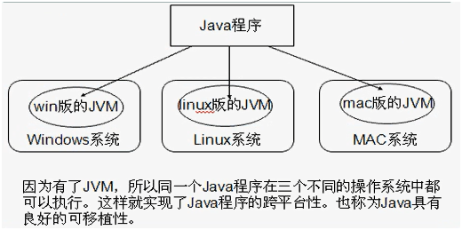

5、为什么JDK中包含一个JRE？

* JRE=JVM+类库
* JDK=JRE+Java的开发工具

JDK中的开发工具（如javac）都是java语言编写的，为了方便实用才打包成EXE文件；如果没有JRE，这些工具是运行不了的。

6、Path环境变量

执行一个程序时，会先在当前目录查找；找不到时才会到path环境变量去查找；

* set：查看所有的环境变量
* set XXX：查看指定的环境变量
* set XXX=XXX：设置环境变量为XXX值
* set XXX=：删除指定的环境变量

通过start命令开启的命令行窗口会保留之前的命令行的环境变量，包括打开时所在的路径；

7、classpath

如果没有设置classpath，就在当前路径下查找类；设置了classpath ，就只会到classpath指定的路径下查找类，不会再查找当前路径下的类；

设置classpath的时候，如果在最后加了分号，则表示当前路径也添加进去了，如：

~~~plaintext
set classpath=c:\myjava;
~~~

但一般会写成如下形式：

~~~plaintext
set classpath=.;c:\myjava
~~~

8、关键字

关键字是指某一种计算机语言对指定的单词赋予了特殊的含义，在表现上都是小写字母。Java中的两个保留字：const、goto。

9、注释

注释分为单行注释、多行注释、文档注释3类。其作用一是解释说明源代码，二是用于调试程序。

* 单行注释可以嵌套单行注释，也可以嵌套多行注释；
* 多行注释可以嵌套单行注释，但不可以嵌套多行注释。

10、Java数据类型

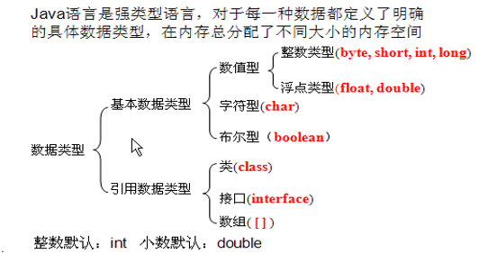

11、自动类型提升

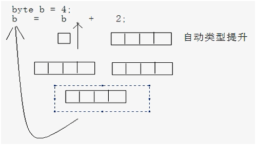

编译报错：可能损失精度；

~~~java
byte b1=3;
byte b2=4;
byte b;
b=b1+b2;
~~~

编译报错。尽管b1和b2都是byte类型，但他们是变量，有可能为127，相加就超过范围了；b=3+4;  相加的都是常量，Java检查他们的和在byte范围内，所以能正常赋值；这和b=7能正常赋值道理是一样的；若b=128，则必然报错；

12、例题

~~~java
short s = 3;
s = s + 6; //编译失败，损失精度。
s += 6; //编译通过，+=是一个赋值运算符，会有一个检查过程。
~~~

13、三元运算符是if/else语句的简写形式，其优点是简化了书写，局限性是只有当if/else语句有结果时才可以简化成三元运算符的形式；因为三元运算符是运算符，运算符是要有运算结果的。

14、switch语句的选项支持byte、short、int、char4种类型；Java5.0 增加了枚举类型； 7.0增加了String类型。具有相同内容的case项可以合并起来以简化书写，其实是利用了没有break直接跳过的特性。

15、if和switch语句的区别：

* 如果是对具体个数的数值判断，if和switch都可以，但是switch会将选项加载进内存，选择效率更高；
* 如果是对区间数值判断，使用if；
* 如果运算结果是布尔值，用if；

16、for循环

~~~java
for(int x=0,y=0; x<5; x++,y++) {
    
}
for(;;) {
    
}
~~~

初始化表达式和循环后表达式可以写多个；循环条件表达式为空则默认为真，表示无限循环。

17、break和continue

* break：应用于选择结构和循环结构；
* continue：应用于循环结构；
* 这两个语句离开其应用范围的存在是没有意义的；
* 这两个语句单独存在时后面都不能有其它语句，因为执行不到（编译失败警告）；

18、例题

~~~java
boolean b = true;
if(b=false)
	System.out.println("a");
else if(b)
	System.out.println("b");
else if(!b)
	System.out.println("c");
else
	System.out.println("d");
~~~

将false赋值给b，b的值是false，即整个表达式结果是false，可以参与判断；但是这种写法只限布尔值类型的赋值。

19、重载

在同一个类中，允许存在一个以上的同名函数，只要它们的参数个数或者参数类型不同即可。与返回值类型无关，只看参数列表。

同一个类中，名称必须一致，与修饰符、返回值类型无关，参数列表不同（类型、个数、顺序），不会引起调用的不确定性。

20、数组定义格式

~~~java
int[] arr = new int[5];
int[] arr = new int[]{1,3,5,7};
int[] arr = {1,3,5,7};
~~~

不能指定数组长度同时初始化值。

21、数组内存图解

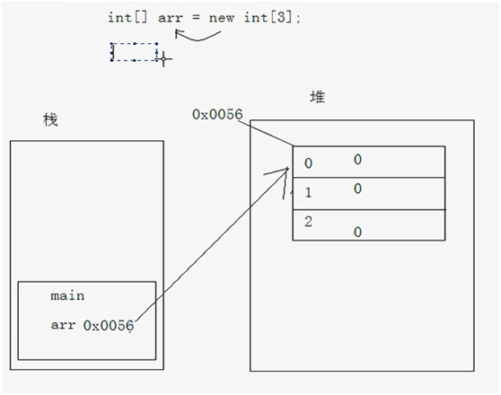

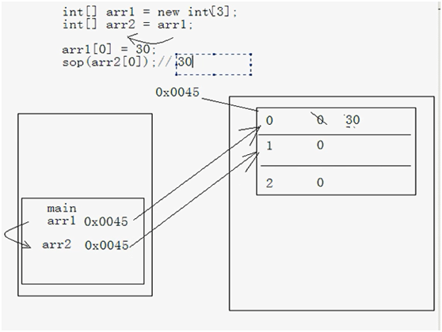

22、选择排序

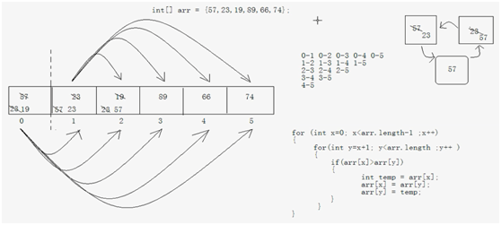

~~~java
public static void selectSort(int[] arr) {
    for(int x=0; x<arr.length-1; x++) {
        for(int y=x+1; y<arr.length; y++) {
            if(arr[x] > arr[y]) {
                int temp = arr[x];
                arr[x] = arr[y];
                arr[y] = temp;
            }
        }
    }
}
~~~

23、冒泡排序

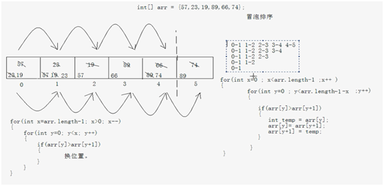

~~~java
public static void bubbleSort(int[] arr) {
    for(int x=0; x<arr.length-1; x++) {
        for(int y=0; y<arr.length-1-x; y++) {
            if(arr[y] > arr[y+1]) {
                int temp = arr[y];
                arr[y] = arr[y+1];
                arr[y+1] = temp;
            }
        }
    }
}
~~~

24、二分查找、折半查找（有序数组）

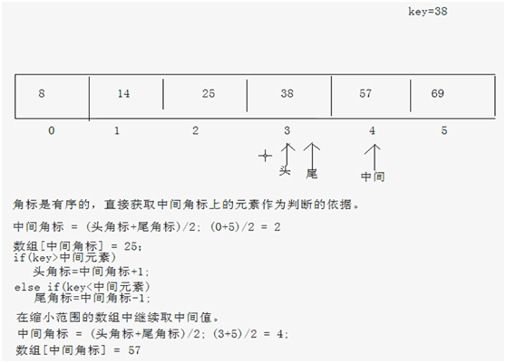

~~~java
public static int binarySearch(int[] arr, int key) {
    int min, max, mid;
    min = 0;
    max = arr.length-1;
    while(min<=max) {
        mid = (min+max)/2;
        if(key>arr[mid]) {
            min = mid+1;
        } else if(key<arr[mid]) {
        	max = mid-1;
        } else {
            return mid;
        }
    }
    return -1;
}
~~~

~~~java
public static int binarySearch(int[] arr, int key) {
    int min, max, mid;
    min = 0;
    max = arr.length-1;
    mid = (min+max)>>1;
    while(arr[mid]!=key) {
        if(key>arr[mid]) {
            min = mid+1;
        } else if(key<arr[mid]) {
        	max = mid-1;
        }
        
        if(min>max) {
            return -1;
        }
        mid = (min+max)>>1;
    }
    return mid;
}
~~~

25、二维数组

~~~java
int[][] arr = new int[3][2];

int[][] arr = new int[3][];
arr[0] = new int[3];
arr[1] = new int[1];
arr[2] = new int[2];

int[][] arr = {{2,4,6}, {3}, {7,9}};

int[] x[], y;
x=y; //error
x[0]=y;
x[0]=y[0]; //error
x[0][0]=y[0];
~~~

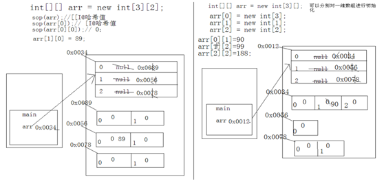

26、文档注释

~~~java
/**
 * 文档注释Demo.
 * @author xxx
 * @version v2.1
 */
public class Demo {
    /**
     * 方法Demo.
     * @param s 这是参数
     * @return 这是返回值
     */
    public static int func(String s) {
        return 1;
    }
}
~~~

命令：`javadoc -d <directory> -author -version XXX.java`；

~~~plaintext
javadoc -d . -author -version Demo.java
~~~

> 类必须是public的，成员需为public或protected的。

27、成员访问权限

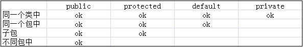

28、jar

* 创建：jar -cvf demo.jar packa packb Demo.class
* 查看：jar -tvf demo.jar
* 解压缩：jar -xvf demo.jar
* 自定义jar包的清单文件：jar -cvfm demo.jar manifest.txt mypack

可以将jar包加入到classpath中，这样jar包中的类就能使用了，相当于一层文件夹。

29、System

* System.exit()
* System.gc()
* System.currentTimeMillis()

~~~java
Properties prop = System.getProperties();
Set<String> names = prop.stringPropertyNames();
for(String name : names) {
	String value = System.getProperty(name);
    System.out.println(name + "=" + value);
}

System.out.println("hello " + System.getProperty("line.separator") + " world!");
~~~

30、Runtime

~~~java
Runtime r = Runtime.getRuntime();
Process p = r.exec("notepad.exe c:\\demo.txt");
Thread.sleep(5000);
p.destroy();
~~~

31、Random

~~~java
for(int x=0; x<10; x++) {
    int d = (int) (Math.random()*10+1);
}

Random r = new Random();
for(int x=0; x<10; x++) {
    int d = r.nextInt(10) + 1;
}
~~~

32、例题

~~~java
String s1 = "abcd";
String s2 = new String("abcd");
System.out.println(s1==s2); //false
System.out.println(s1.equals(s2)); //true
String s3 = "ab" + "cd";
System.out.println(s1==s3); //true
~~~

33、求最大相同子串

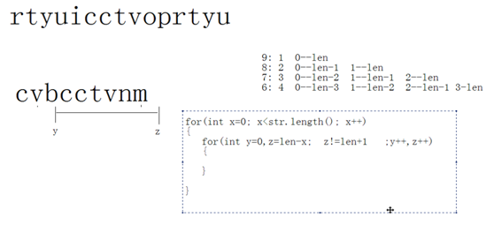

~~~java
//s1为较长串，s2为较短串。
public static String getMaxSubString(String s1, String s2) {
    for(int x=0; x<s2.length(); x++) {
        for(int y=0,z=s2.length()-x; z!=s2.length()+1; y++,z++) {
            String temp = s2.substring(y,z);
            if(s1.contains(temp)) {
                return temp;
            }
        }
    }
    return null;
}
~~~

34、StringBuilder是线程不安全的，但是效率较高；StringBuffer是线程安全的。

35、例题

~~~java
Integer a = new Integer(127);
Integer b = new Integer(127);
System.out.println(a==b); //false
System.out.println(a.equals(b)); //true

Integer c = 127;
Integer d = 127;
System.out.println(c==d); //true
System.out.println(c.equals(d)); //true

Integer e = 128;
Integer f = 128;
System.out.println(e==f); //false
System.out.println(e.equals(f)); //true
~~~

36、可变参数

~~~java
public static int add(String s, int... arr) {
    System.out.println(s);
    int sum = 0;
    for(int i=0; i<arr.length; i++) {
        sum += arr[i];
    }
    return sum;
}
~~~

> 可变参数必须定义在参数列表的最后。

37、静态导入

~~~java
import static java.util.Collections.sort;
import static java.lang.System.*;

public class Demo {
    public static void main(String[] args) {
        out.println("Hello world!");
        
        List<String> list = new ArrayList<String>();
        sort(list);
    }
}
~~~

   

---

