# Java基础学习笔记-面向对象

---

1、面向对象

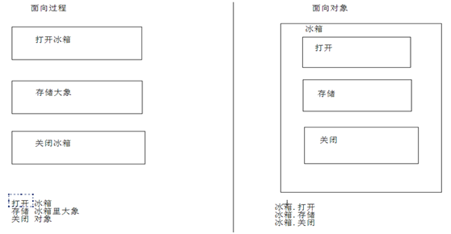

2、对象内存图解

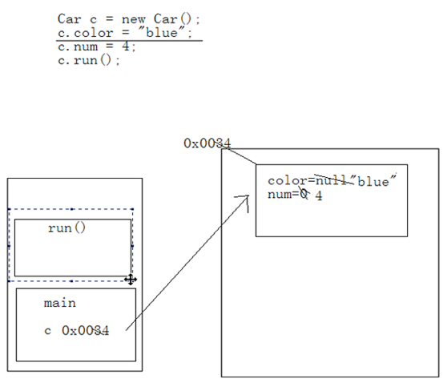

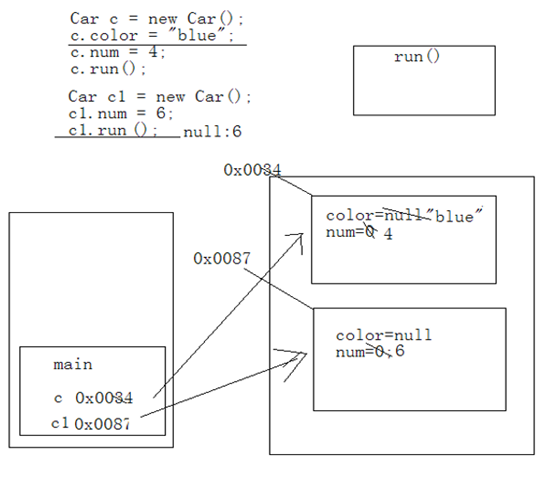

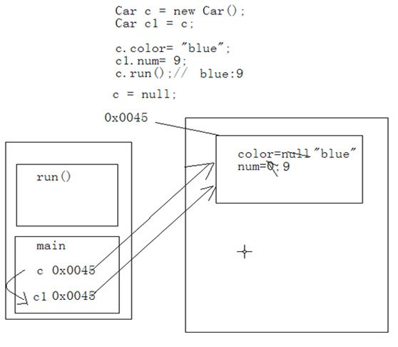

3、成员变量和局部变量的区别

* 成员变量定义在类，作用于整个类；局部变量定义在函数，作用于整个函数，或者定义于语句内，作用于整个语句；
* 成员变量在对象创建时，出现在堆内存的对象当中；局部变量在所属区间被运算时，出现在栈内存中；
* 成员变量随着对象的创建而创建，随着对象的消失而消失；局部变量随着所属区间运算结束而立刻被释放；
* 成员变量在堆内存中，有默认初始化值；局部变量没有默认初始化值；

4、匿名对象

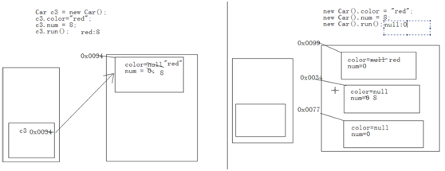

5、基本数据类型、引用数据类型的参数传递

~~~java
class Demo {
    public static void main(String[] args) {
        int x = 2;
        show(x);
        System.out.println(x);
    }
    public static int show(int x) {
        x = 4;
        return x;
    }
}
~~~

~~~java
class Demo {
	int x = 3;
    public static void main(String[] args) {
        Demo d = new Demo();
        d.x = 5;
        show(d);
        System.out.println(d.x);
    }
    public static void show(Demo d) {
        d.x = 4;
    }
}
~~~

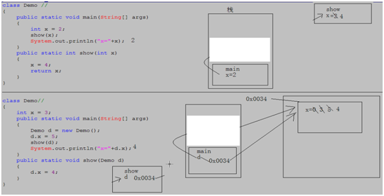

6、构造函数

每一个类中都有一个默认的空参数构造函数，用于给该类对象进行初始化；如果该类中指定了具体的构造函数，那么默认的空参数构造函数就没有了。构造函数中是可以有return语句的。

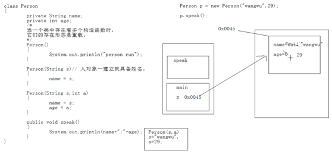

7、this

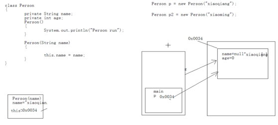

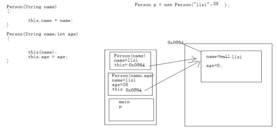

调用本类中构造函数的this语句必须定义在构造函数的第一行，否则编译失败。

8、static

* 被static修饰的成员变量，会被所有对象共享；
* 静态随着类的加载而加载，随着类的消失而消失；
* 优先于对象存在；
* 静态成员可以直接被类名调用；
* 静态方法只能调用静态成员，不能调用非静态成员；非静态方法既可以调用静态成员又可以调用非静态成员；
* 在静态方法中不允许出现this、super等关键字；

9、代码块

~~~java
//静态代码块
class Demo {
    static {
        int x = 1;
    }
}
~~~

~~~java
//构造代码块
class Demo {
    {
        int x = 1;
    }
}
~~~

~~~java
//局部代码块
class Demo {
	public static void func() {
		{
			int x = 1;
		}
	}
}
~~~

10、例题

~~~java
class StaticCode {
    static {
        System.out.println("A");
    }
    public void show() {
        System.out.println("B");
    }
}

class Demo {
    static {
        System.out.println("C");
    }
    public static void main(String[] args) {
        new StaticCode().show();
    }
    static {
        System.out.println("D");
    }
}

//C、D、A、B
~~~

11、对象内存图解

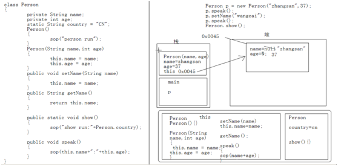

12、this代表本类对象的引用，super代表父类所属的空间。在子类所有构造函数的第一行，都有一条隐式的语句：super()；如果父类中没有空参数的构造函数，子类构造函数中必须手动用super来指定要调用父类的构造函数。this和super调用构造函数都只能定义在构造函数的第一行，且不能同时出现。

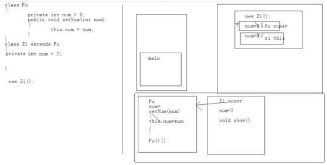

13、覆盖

* 子类方法覆盖父类方法时，必须要保证覆盖方法的权限要大于等于被覆盖方法的权限；
* 静态方法只能覆盖静态；
* 覆盖的方法只能抛出与父类相同的异常或异常的子类；

14、final

* final修饰符既可以修饰类，又可以修饰方法，还可以修饰变量；
* final修饰的类不能被继承；
* final修饰的方法不能被覆盖；
* final修饰的变量是常量，只能赋值一次；

~~~java
final int x = 1;
x = 2; //error
~~~

15、对象的初始化过程

* 将该对象所需的类文件加载进内存；
* 在内存进行方法区的空间分配；
* 通过new在堆内存开辟空间；
* 对象中的属性进行默认初始化；
* 调用对象的构造函数进行初始化；
* 通过构造函数中的super来调用父类的构造函数进行初始化；
* 对象中的属性进行显式初始化；
* 构造代码块初始化；
* 构造函数内部自定义内容初始化；

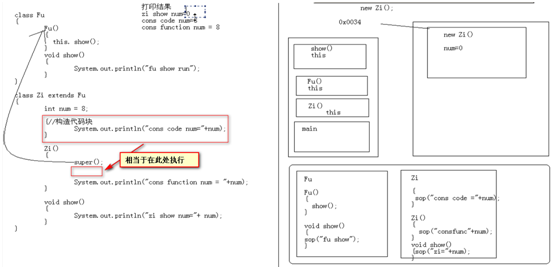

16、抽象关键字不能和哪些关键字共存？

final、static、private

17、接口

~~~java
interface inter {
	public static final int NUM = 1;
	public abstract void show();
}
~~~

* 类与类之间是继承关系，而且是单继承；
* 类与接口之间是实现关系，而且是多实现；
* 接口与接口之间是继承关系，而且是多继承；

~~~java
interface A {
    void showA();
}
interface B {
    void showB();
}
interface C extends A,B {
    void showC();
}
class D implements C {
    public void showA() {}
    public void showB() {}
    public void showC() {}
}
~~~

~~~java
class A {
    public void show() {}
}
interface B {
    public void show();
}
class C extends A implements B {
    public void show() {}
}

//这种情况下C中可以不写show方法
~~~

18、接口和抽象类配合使用

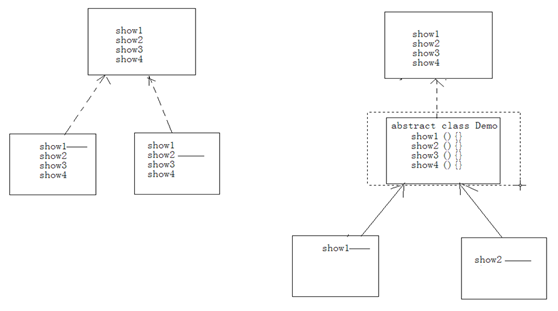

19、在进行对象类型转换时，需要用`instanceof`关键字进行判断，否则很容易发生ClassCastException。

20、内部类

内部类可以直接访问外部类中的成员，因为内部类持有外部类的一个引用，即外部类名.this；外部类要访问内部类中的成员必须先创建内部类对象。当内部类定义在外部类的成员位置上时，可以使用成员的修饰符。

~~~java
class Outer {
    class Inner1{
        public void func() {}
    }
    static class Inner2{
        public static void func() {}
    }
}

class Demo {
    public static void main(String[] args) {
        Outer.Inner1 in1 = new Outer().new Inner1();
        in1.func();
        
        Outer.Inner2 in2 = new Outer.Inner2();
        in2.func();
        Outer.Inner2.func();
    }
}
~~~

内部类定义在局部位置上，不允许访问局部中的变量，只能访问被final修饰的局部常量。

~~~java
class Outer {
    public void show(final int y) {
        final int x = 1;
        class Inner {
            public void func() {
                System.out.println(x+y);
            }
        }
    }
}
~~~

内部类定义在局部位置上，访问到了局部变量必须修饰成final；如show方法执行完弹栈，变量x就销毁了；而inner的对象分配在堆中，还没有被销毁，他的引用可能还在，当再次调用inner的func方法时就访问不到x变量了。

21、多态小结

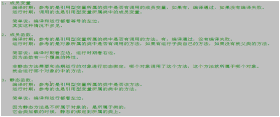

22、练习

1）写出程序结果

~~~java
class Demo {	
	public static void func() {
		try {
			throw  new Exception();
		} finally {
			System.out.println("B");
		}
	}
	public static void main(String[] args) {
		try {
			func();
			System.out.println("A");
		} catch(Exception e) {
			System.out.println("C");
		}
		System.out.println("D");
	}
}
~~~

抛出了一个编译时被检测的异常，该异常还没有被catch，那就必须要用throws在函数上声明。因为没有声明，所以编译失败。如果有异常throws声明，那么结果是:BCD。

2）写出程序结果

~~~java
class Test {
	Test() {
		System.out.println("Test");
	}
}
class Demo extends Test {
	Demo() {
		System.out.println("Demo");
	}
	public static void main(String[] args) {
		new Demo();
		new Test();
	}
}
~~~

Test、Demo、Test

3）写出程序结果

~~~java
interface A{}  
class B implements A {
	public String func() {
		return "func";
	}
}
class Demo {
	public static void main(String[] args) {
		A a=new B();
		System.out.println(a.func());
	}
}
~~~

接口型引用指向自己的子类对象，这是多态形式。当调用非静态函数时，编译时看左边，运行时看右边。发现左边a引用变量所属的接口中并没有定义过func方法。所以编译失败。

4）写出程序结果

~~~java
class Fu {
	boolean show(char a) {
		System.out.println(a);
		return true;
	}
}
class Demo extends Fu {
	public static void main(String[] args) {
		int i=0;
		Fu f=new Demo();
		Demo d=new Demo();
		for(f.show('A'); f.show('B')&&(i<2);f.show('C')) {
			i++;
			d.show('D');
		}	
	}
	boolean show(char a) {
		System.out.println(a);
		return false;
	}
}
~~~

A、B。无论是f还是d调用show方法，运行都是子类中的show方法。因为覆盖了父类中的show方法。 

5）写出程序结果

~~~java
interface A {}
class B implements A {
	public String test() {
		return "yes";
	}
}
class Demo {
	static A get() {
		return new B();
	}
	public static void main(String[] args) {
		A a=get(); //A a = new B();
		System.out.println(a.test()); //编译失败，接口中并为定义test方法。
	}
}
~~~

6）写出程序结果:

~~~java
class Super {
	int i=0;
	public Super(String a) {
		System.out.println("A");
		i=1;	
	}
	public Super() {
		System.out.println("B");
		i+=2;
	}
}
class Demo extends Super {
	public Demo(String a) {
		//super();默认调用了父类中空参数的构造函数。 
		System.out.println("C");
		i+=5;				
	}
	public static void main(String[] args) {
		int i=4;
		Super d=new Demo("A");//多态。 子类实例化。
		System.out.println(d.i);
	}
}

//B C 7
~~~

7）

~~~java
interface Inter {
	void show(int a,int b);
	void func();
}
class Demo {
	public static void main(String[] args) {
		//补足代码；调用两个函数，要求用匿名内部类

		Inter in = new Inter() {
			public void show(int a,int b) {}
			void func() {}
		};
		in.show(4,5);
		in.func();
	}
}
~~~

8）写出程序结果

~~~java
class TD {
	int y=6;
	class Inner {
		static int y=3;  //非静态内部类中不允许定义静态成员。 编译失败。
		void show() {
			System.out.println(y);
		}
	}
}
class TC {
	public static void main(String[] args) {
		TD.Inner ti=new TD().new Inner();
		ti.show();
	}
}
~~~

9）选择题，写出错误答案错误的原因，用单行注释的方式。

~~~java
class Demo {
	 int show(int a,int b){return 0;}
}
class SubDemo extends Demo {
	private int show(int a,long b){return 0;}
}

下面那些函数可以存在于Demo的子类中。	
A.public int show(int a,int b){return 0;}//可以，因为覆盖。
B.private int show(int a,int b){return 0;}//不可以，因为覆盖失败。 权限不够。
C.private int show(int a,long b){return 0;}//可以，因为是子类的特有方法。 
D.public short show(int a,int b){return 0;}//不可以存在，会发生调用的不确定性。
E.static int show(int a,int b){return 0;}//不行，静态只能覆盖静态。
~~~

10）写出程序结果

~~~java
class Fu {
	int num=4;
	void show() {
		System.out.println("showFu");
	}
}
class Zi extends Fu {
	int num=5;
	void show() {
		System.out.println("showZi");
	}
}
class T {
	public static void main(String[] args) {
		Fu f=new Zi();
		Zi z=new Zi();
		System.out.println(f.num); //4
		System.out.println(z.num); //5
		f.show(); //showZi
		z.show(); //showZi	
	}
}
~~~

考的是多态中成员调用的特点：成员变量，编译和运行都看左边。成员函数(非静态):编译看左边，运行看右边。

11）

~~~java
interface A {
	void show();
}
interface B {
	void add(int a,int b);
}
class C implements A,B {
	//程序代码
	private int a,b;
	//private int sum;
	public void show() {
		System.out.println(a+b);
		//System.out.println(sum);
	}
	public void add(int a,int b) {
		this.a = a;
		this.b = b;
		//sum = a+b;
	}
}
class D {
	public static void main(String[] args) {
		C c=new C();
		c.add(4,2);
		c.show();//通过该函数打印以上两个数的和。
	}
}
~~~

12）写出程序结果

~~~java
class Demo {
	public static void main(String[] args) {
		try {
			showExce(); 
			System.out.println("A");
		} catch(Exception e) {
			System.out.println("B");
		} finally {
			System.out.println("C");
		}
		System.out.println("D");
	}
	public static void showExce()throws Exception {
		throw new Exception();
	}
}

//B C D
~~~

13）写出程序结果

~~~java
class Super {
	int i=0;
	public Super(String s) {
		i=1;	
	}
}
class Demo extends Super {
	public Demo(String s) {
		//super();//很遗憾，父类中没有定义空参数的构造函数。编译失败。 
		i=2;			
	}
	public static void main(String[] args) {
		Demo d=new Demo("yes");
		System.out.println(d.i);
	}
}
~~~

14）写出程序结果

~~~java
class Super {
	public int get(){return 4;}
}
class Demo15 extends Super {
	public long get(){return 5;}			
	public static void main(String[] args) {
		Super s=new Demo15();
		System.out.println(s.get());//get方法并没有覆盖，而且产生了不确定性。编译失败。
	}
}
~~~

15）写出程序结果

~~~java
class Demo {	
	public static void func() {
		try {
			throw  new Exception();//因为这句话可以用来结束函数。
			System.out.println("A");// 该语句不可能执行到，编译失败。 
		} catch(Exception e) {
			System.out.println("B");
		}
	}
	public static void main(String[] args) {
		try {
			func();
		} catch(Exception e) {
			System.out.println("C");
		}
		System.out.println("D");
	}
}
~~~

16）

~~~java
class Demo {	
	public void func() {
		//位置1；
		new Inner(); //可以的。
	}
	class Inner{}
	public static void main(String[] args) {
		Demo d=new Demo();
		// 位置2 
		new Inner(); //不行，因为主函数是静态的，内部类是非静态
		new d.Inner(); //--> new new Demo().Inner();不行，格式错误。 
		new Demo.Inner(); //不行。因为Inner是非静态。
	}
}

A.在位置1写 new Inner();// 对.
B.在位置2写 new Inner();// no.		
C.在位置2写 new d.Inner();//格式错误
D.在位置2写 new Demo.Inner();//no
~~~

17）写出程序结果

~~~java
class Exc0 extends Exception{}
class Exc1 extends Exc0{}

class Demo {
	public static void main(String[] args) {
		try {
			throw new Exc1();
		} catch(Exception e) {//编译失败，多catch时，父类catch向下放。
			System.out.println("Exception");
		} catch(Exc0 e) {
			System.out.println("Exc0");
		}
	}
}
~~~

18）写出程序结果

~~~java
class Test { 
	public static String output=""; 
	public static void foo(int i) { 
		try { 
			if(i==1)
				throw new Exception(); 	
			output+="1"; 
		} catch(Exception e) { 
			output+="2"; 
			return; 
		} finally { 
			output+="3"; 
		} 
		output+="4"; 
	}
	public static void main(String args[]) { 
		foo(0);
		System.out.println(output);//134
		foo(1); 
		System.out.println(output); //13423
	}
} 
~~~

19）写出程序结果

~~~java
public class Demo {     
	private static int j = 0; 
	private static boolean methodB(int k) {
		j += k; 
		return true; 
	}
	public static void methodA(int  i) { 
        boolean b;   
		b = i < 10 | methodB (4); 
		b = i < 10 || methodB (8); 
	}
	public static void main (String args[] ) {
		methodA (0); 
		System.out.println(j); //4
	} 
}
~~~

20）补足compare函数内的代码，不许添加其他函数

~~~java
class Circle {	
	private double radius;
	public Circle(double r) {
		radius=r;
	}
	public Circle compare(Circle cir) {
		//程序代码：
		//cir接收到了cir2对象，怎么表示cir1呢？
		//函数内部要使用调用该函数的对象时，用this来表示这个对象。
		/*
		if(this.raidus>cir.radius)
			return this;
		return cir;
		*/
		reutrn this.radius>cir.radius?this:cir;
	}
}
class TC {
	public static void main(String[] args) {
		Circle cir1=new Circle(1.0);
		Circle cir2=new Circle(2.0);
		Circle cir;
		cir=cir1.compare(cir2);
		if(cir1==cir)
			System.out.println("圆1的半径比较大");
		else
			System.out.println("圆2的半径比较大");
	}
}
~~~

   

---

