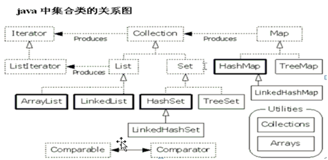
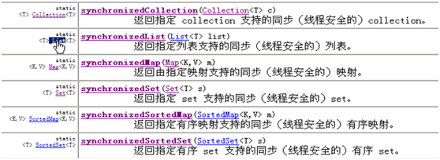

# Java基础学习笔记-集合框架

---

### 概述

1、集合

* 用于存储对象的容器；
* 容器的长度是可变的；

2、集合与数组的区别

* 集合长度是可变的，数组长度是固定的；
* 集合只能存储对象，数组既可以存储对象又可以存储基本类型；
* 集合中存储的对象可以是任意类型的，数组中只能存储同一类型数据；

3、集合体系结构

### Collection主要API简介

1、添加方法

* boolean add(Object o)：一次添加一个元素；
* boolean addAll(Collection c)：将一个容器中的元素添加到当前容器；

2、删除方法

* boolean remove(Object o)：删除集合中指定元素；
* boolean removeAll(Collection c)：删除指定集合中和本集合相同的元素；
* void clear()：清空集合中的元素；

3、判断方法

* boolean contains(Object o)：判断当前集合是否包含指定元素；
* boolean contains(Collection c)：判断当前集合是否包含指定集合中的元素；
* boolean isEmpty()：判断集合是否为空；

4、获取元素个数

* int size()：获取元素个数；

5、取交集

* boolean retainAll(Collection c)：保留和指定集合中相同的元素，不相同的元素会被删除；

6、将集合转换成数组

* Object[] toArray()：集合转换成数组；

### 迭代器

~~~java
List list = new ArrayList();
list.add("abc1");
list.add("abc2");
list.add("abc3");
list.add("abc4");

Iterator it = list.iterator();
while(it.hasNext()) {
    String str = (String) (it.next());
    if(str.equals("abc3")) {
        list.add("abc5");
    }
    System.out.println(str);
}
~~~

在对集合元素进行迭代时，如果对集合元素进行修改，会抛出并发修改异常（ConcurrentModificationException）。迭代器是在集合元素修改前获取的，并不能实时知晓元素的变化。因此，集合中提供了一种迭代器来解决这种问题，即ListIterator。

~~~java
List list = new ArrayList();
list.add("abc1");
list.add("abc2");
list.add("abc3");
list.add("abc4");

ListIterator it = list.listIterator();
while(it.hasNext()) {
    String str = (String) (it.next());
    if(str.equals("abc3")) {
        list.add("abc5");
        list.remove();
        list.set("abc6");
    }
    System.out.println(str);
}
~~~

> 该迭代器只能用于List集合。

### 使用LinkedList模拟队列

~~~java
class Queue {
    private LinkedList list = null;
    public Queue() {
        list = new LinkedList();
    }
    public void add(Object o) {
        list.addLast(o);
    }
    public Object get() {
        return list.removeFirst();
    }
}
~~~

### 存储自定义对象

1、ArrayList中判断元素是否相同使用的是equals方法，比如contains方法、remove方法等。尤其在存储自定义对象时，该对象一定要覆盖equals方法，建立根据对象自身特点的判断相同的依据。

~~~java
class Person{
    private String name;
    private int age;
    
    public boolean equals(Object o) {
        if(!(o instanceof Person)) {
            return false;
        }
        Person p = (Person) o;
        return this.name.equals(p.name) && this.age==p.age;
    }
}
~~~

2、往哈希表中存储自定义对象，必须重写hashCode方法和equals方法；eclipse提供了快捷的生成hashcode和equals方法，可根据属性来自动生成。

3、往treeset存储自定义对象时，对象必须是有序的。即该对象要实现comparable接口，重写compareTo方法；或者在创建容器的时候指定比较器comparator。

~~~java
TreeSet<Person> ts = new TreeSet<Person>(new Comparator<Person>(){
    public int compare(Person p1, Person p2) {
        int tmp = p1.getName.compareTo(p2.getName());
        return tmp==0 ? p1.getAge()-p2.getAge() : tmp;
    }
});
~~~

### Collections方法简介

* Collections.sort(Collection c)
* Collections.sort(Collection col, Comparator com)
* Collections.max(Collection c)
* Collections.max(Collection col, Comparator com)
* Collections.binarySearch(Collection c, Object o)

* 对已有的比较器进行反转：

~~~java
TreeSet<String> ts = new TreeSet<String>(Collections.reverseOrder());

TreeSet<Person> ts = new TreeSet<Person>(Collections.reverseOrder(new Comparator<Person>(){
    public int compare(Person p1, Person p2) {
        int tmp = p1.getName.compareTo(p2.getName());
        return tmp==0 ? p1.getAge()-p2.getAge() : tmp;
    }
}));
~~~

* 同步集合方法：将非同步集合转换为同步集合

### 数组和集合转换

1、数组转换为集合

Arrays.asList(arr)

将数组转换为集合，可以有更多的方法对数组元素进行操作。但是因为数组长度是固定的，有些方法不能使用，比如增删。

~~~java
String[] arr = {"aaa", "bbb", "ccc"};
List<String> list = Arrays.asList(arr);
~~~

如果数组存的是引用数据类型，就会将数组中每个元素作为集合的元素；如果是基本数据类型，则会将整个数组作为一个元素存到集合中。

~~~java
int[] nums1 = {7, 8, 9};
List<int[]> list1 = Arrays.asList(nums1);
System.out.println(list1.size()); //1

Integer[] nums2 = {Integer.valueOf(7), Integer.valueOf(8), Integer.valueOf(9)};
List<Integer> list2 = Arrays.asList(nums2);
System.out.println(list2.size()); //3
~~~

2、集合转换为数组

将集合转换为数组，可以限制元素的操作，比如增删。

~~~java
List<String> list = new ArrayList<String>();
list.add("aaa");
list.add("bbb");
list.add("ccc");
String[] arr = list.toArray(new String[list.size()]);

//toArray方法参数的数组长度小于size时，内部自动增长；大于size时，多出的位置为null
~~~

### 集合框架体系总结

1、Collection

1）List：列表

特点：

* 1、有序(存储元素的顺序和取出元素的顺序一致)；
* 2、该集合中的元素都有索引，所以可以通过索引(角标)来访问元素； 
* 3、它可以存储重复元素； 

常见子类对象。记住：具体的子类对象，我们要学习应该是该对象的特有的数据结构，以及相关的特点。

* Vector：jdk1.0就存在了，底层是数组结构的，可变长度数组。原理：一旦原数组长度不够，会创建新数组，将原数组的元素复制到新数组中，并将新元素添加到新数组中。Vector是同步的。
* ArrayList：底层是数组结构，也是支持长度可变数组的。是不同步的。替代了Vector，因为效率高。 查询效率很高， 但是增删的效率很低。
* LinkedList：底层是链接列表结构，简称链表结构。是不同步的。这种结构的好处：对元素的增删非常效率很高，但是 查询的效率很低。

2）Set：集

其中的方法和Collection一致，只要重点注意它的子类对象即可。取出元素只能使用迭代器。特点：

* 1，不包含重复元素。(最大的特点)
* 2，这个集合存入元素的顺序和取出元素的顺序不一定一致。(具体的容器对象数据结构不同，顺序也有不同)

常见子类对象：

* HashSet：底层数据结构是哈希表，不保证顺序，是不同步的。
* 哈希表：提高数组的查询效率而出现的。将要存储的元素先通过哈希算法算出一个哈希值来标识存储的位置，代表着元素。要找元素时，先将该元素通过哈希算法算出哈希值，在通过哈希值到哈希表中去查找。

特点：

* 1，不关系元素的顺序。
* 2，提高了查询效率。
* 3，不可能出现重复元素，因为哈希值都不同。即使相同，会再次判断两个元素的equals，内容是否相同。如果内容也相同，不存；如果内容不同，存储。所以哈希表要保证元素的唯一性，必须要依赖于两个方法。1,hashCode   2,equals	

* TreeSet：可以给Set集合中的元素进行指定顺序的排序。非同步的。

默认情况下，是通过元素的自然顺序排的序。它保证元素唯一性的依据是看比较方法的返回结果是否是0：是0，就视为元素相同，不存。

* TreeSet排序的方式一：让元素自身具备比较性，需要实现Comparable接口，覆盖compareTo方法。这种比较方式成为自然顺序排序。如果元素自身不具备比较性或者具备的比较性(自然顺序)不是所需要的。这时只能用第二种方式 。
* TreeSet排序的方式二：让容器自身具备比较性。容器一初始化就具备了比较功能。因为容器时在对象构造时完成的。通过查阅，有一个构造方法TreeSet(Comparator).在容器初始化时可以指定一个比较器。需要实现Comparator接口，覆盖compare方法即可。所以这种方式成为比较器排序。

### 集合的技巧掌握

1、明确具体集合对象名称的后缀：

* 如果后缀是List，都所属于List体系。通常都是非同步的。
* 如果后缀是Set，都属于Set体系，通常也是非同步的。
* 这些体系中的其他子类对象，后缀不是所属接口名的，一般都是同步的，比如Vector。

这在常用子类对象中通用。 

2、明确数据结构：

对于jdk1.2版本的子类对象，后缀名是所属的体系，前缀名是就是数据结构的名称。比如：

* ArrayList:： 看到Array，就要明确是数组结构，查询快。
* LinkedList：看到Link，就要明确链表结构，就要想到 add、get、remove、和first、last结合的方法，增删快。
* HashSet：看到hash，就要明确是哈希表。查询巨快，而且唯一性。就要想到元素必须覆盖 hashCode方法和equals方法。 
* TreeSet：看到Tree，就要明确是二叉树，可以对元素排序。就要想到两种排序方式：1、自然顺序：Comparable接口，覆盖compareTo(一个参数 )；2、比较器：Comparator接口，覆盖compare(两个参数)；判断元素唯一性的依据就是比较方法的返回结果return 0；

   

---

