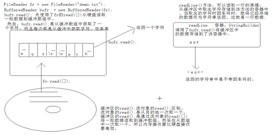
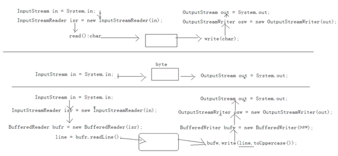
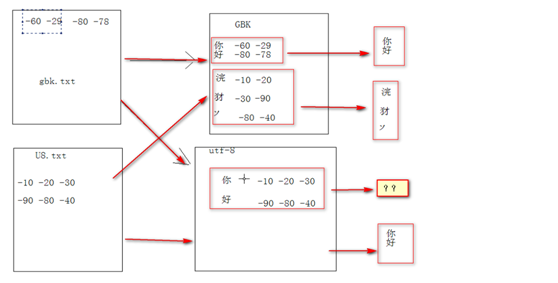
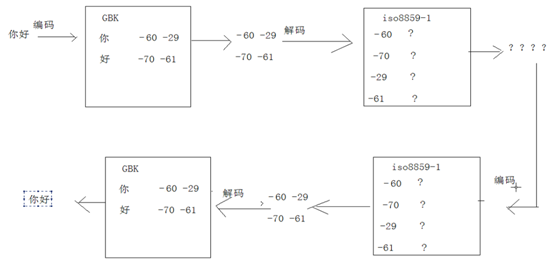

# Java基础学习笔记-IO流

---

1、IO流体系

* 字符流：Reader、Writer
* 字节流：InputStream、OutputStream

2、字符流的由来

以前处理数据都是字节数据，使用字节流技术就可以完成了。因为后期编码表的不断出现，识别某一文字的码表不唯一。比如中文，GBK，unicode都可以识别，就出出现了编码问题。

中文字节数据 gbk --> 流处理--->gbk解析可以了。 

后期，容器出现这样的问题：

中文字节数据gbk --> 流处理 unicode来处理-->数据错误。

为了处理文字数据，就需要通过字节流技术+编码表 相结合来完成。注意：只有文字是这样的，因为文字涉及编码问题。其他数据比如dvd mp3 图片等是不涉及这个问题的。

虽然字节流+编码表可以解决文字数据处理问题，但是较为麻烦。为了便于使用，将字节流和编码表进行了封装，就出现了便于文字操作的流技术：字符流。其实字符流就是：字节流+编码表。

3、FileWriter

~~~java
class Demo {
    public static void main(String[] args) throws Exception {
        FileWriter fw = new FileWriter("demo.txt");
        //FileWriter fw = new FileWriter("demo.txt", true); //追加
        fw.write("abcde");
        fw.flush();
        fw.write("fg");
        fw.flush();
        fw.close();
    }
}
~~~

4、FileReader

~~~java
class Demo {
	public static void main(String[] args) throws Exception {
        FileReader fr = new FileReader("demo.txt");
        int ch = 0;
        while((ch=fr.read()) != -1) {
            System.out.println((char)ch);
        }
        fr.close();
	}
}
~~~

~~~java
class Demo {
	public static void main(String[] args) throws Exception {
        FileReader fr = new FileReader("demo.txt");
        char[] buf = new char[1024];
        int len = 0;
        while((len=fr.read(buf)) != -1) {
            System.out.println(new String(buf, 0, len));
        }
        fr.close();
	}
}
~~~

5、复制文本文件

~~~java
class Demo {
	public static void main(String[] args) throws Exception {
        FileReader fr = new FileReader("demo.txt");
        FileWriter fw = new FileWriter("copy.txt");
        char[] buf = new char[1024];
        int len = 0;
        while((len=fr.read(buf)) != -1) {
            fw.write(buf, 0, len);
        }
        fr.close();
        fw.close();
	}
}
~~~

~~~java
class Demo {
    public static void main(String[] args) {
        BufferedReader bufr = null;
        BufferedWriter bufw = null;
        try {
            bufr = new BufferedReader(new FileReader("demo.txt"));
            bufw = new BufferedWriter(new FileWriter("copy.txt"));
            String line = null;
            while((line=bufr.readLine()) != null) {
                bufw.write(line);
                bufw.newline();
                bufw.flush();
            }
        } catch(Exception e) {
            e.printStackTrace();
        } finally {
        	try {
                if(bufr!=null)
            		bufr.close();
            	if(bufw!=null)
            		bufw.close();
        	} catch(Exception ex) {
                ex.printStackTrace();
        	}
        }
    }
}
~~~

6、缓冲区读取图解

7、LineNumberReader

~~~java
class Demo {
	public static void main(String[] args) throws Exception {
        FileReader fr = new FileReader("demo.txt");
        LineNumberReader lnr = new LineNumberReader(fr);
        String line = null;
        lnr.setLineNumber(100); //从100开始
        while((line=lnr.readLine()) != null) {
            System.out.println(lnr.getLineNumber() +":"+ line);
        }
        lnr.close();
	}
}
~~~

8、FileOutputStream

~~~java
class Demo {
    public static void main(String[] args) throws Exception {
        FileOutputStream fos = new FileOutputStream("demo.txt");
        fos.write("abced".getBytes());
        fos.close();
    }
}
~~~

9、FileInputStream

~~~java
class Demo {
    public static void main(String[] args) throws Exception {
        FileInputStream fis = new FileInputStream("demo.txt");
        int ch = 0;
        while((ch=fis.read()) != -1) {
            System.out.println((char)ch);
        }
        fis.close();
    }
}
~~~

~~~java
class Demo {
    public static void main(String[] args) throws Exception {
        FileInputStream fis = new FileInputStream("demo.txt");
        byte[] buf = new byte[1024];
        //byte[] buf = new byte[fis.available()];
        int len = 0;
        while((len=fis.read(buf)) != -1) {
            System.out.println(new String(buf, 0, len));
        }
        fis.close();
    }
}
~~~

10、复制MP3

~~~java
class Demo {
    public static void main(String[] args) throws Exception {
        BufferedInputStream bufis = new BufferedInputStream(new FileInputStream("demo.mp3"));
        BufferedOutputStream bufos = new BufferedOutputStream(new FileOutputStream("copy.mp3"));
        
        int by = 0;
        while((by=bufis.read()) != -1) {
            bufos.write(by);
        }
        bufis.close();
        bufos.close();
    }
}
~~~

11、系统输入

~~~java
class Demo {
    public static void main(String[] args) throws Exception {
        InputStream in = System.in;
        StringBuilder sb = new StringBuilder();
        int ch = 0;
        while((ch=in.read()) != -1) {
            if(ch=="\r")
            	continue;
            if(ch=="\n") {
                String s = sb.toString();
                if("over".equals(s)) {
                    break;
                } else {
                    System.out.println(s.toUpperCase());
                    sb.delete(0, sb.length());
                }
            } else {
                sb.append(ch);
            }
        }
    }
}
~~~

注意，从系统中获取到的流对象都是唯一的，如果将其关闭，就不能再使用了。所以一般情况下，从System获取到的流对象，一般不需要关闭，随着程序的停止而结束。

12、转换流

~~~java
class Demo {
    public static void main(String[] args) throws Exception {
    	BufferedReader bufr = new BufferedReader(new InputStreamReader(System.in));
    	BufferedWriter bufw = new BufferedWriter(new OutputStreamWriter(System.out));
    	String line = null;
    	while((line=bufr.readLine()) != null) {
            if("over".equals(line)) break;
            bufw.write(line.toUpperCase());
            bufw.newLine();
            bufw.flush();
    	}
    	// 可以不关闭
    }
}
~~~

13、文件转码问题

~~~java
FileWriter fw = new FileWriter("demo.txt"); //等价于FileOutputStream+默认编码表GBK

OutputStreamWriter osw = new OutputStreamWriter(new FileOutputStream("demo.txt"), "UTF-8"); //手动指定编码为UTF-8
~~~

14、File

~~~java
File dir = new File("c:\\mydir");
File file = new File("c:\\mydir\\myfile.txt");
File file2 = new File("c:\\mydir", "myfile.txt");

if(!dir.exists())
	dir.mkdir();
if(!file.exists())
	file.createNewFile();

File cDir = new File("c:\\");
String[] names = cDir.list();
for(String name : names) {
    System.out.println(name);
}
~~~

new File（String str）：当str为多级的路径时，创建的file对象只是对最末级的文件或者文件夹进行封装，操作的都是最末级文件或文件夹的属性；

15、过滤器

~~~java
File file = new File("c:\\");
String[] names = file.list(new FilenameFilter() {
    @Override
    public boolean accept(File dir, String name) {
        return name.endsWith(".java");
    }
});
~~~

~~~java
File file = new File("c:\\");
File[] files = file.listFiles(new FileFilter() {
    @Override
    public boolean accept(File pathname) {
        return pathname.isHidden();
    }
});
~~~

16、递归遍历子目录

~~~java
class Demo {
    public static void main(String[] args) throws Exception {
        File dir = new File("c:\\");
        showDir(dir);
    }
    public static void showDir(File dir) {
        System.out.println("dir:" + dir);
        File[] files = dir.listFiles();
        for(File f : files) {
            if(f.isDirectory()) {
                showDir(f);
            } else {
                 System.out.println("file:" + f);
            }
        }
    }
}
~~~

17、Properties

~~~java
Properties prop = new Properties();
prop.setProperty("a", "111");
prop.setProperty("b", "222");
prop.list(System.out);

FileInputStream fis = new FileInputStream("demo.properties");
prop.load(fis);

prop.setProperty("c", "333");

FileOutputStream fos = new FileOutputStream("demo.properties");
prop.store(fos, "注释说明一下");

fis.close();
fos.close();
~~~

18、打印流PrintStream

* 能够方便地打印各种数值表示形式；
* 它的特有方法不抛出异常；

19、序列流SequenceInputStream

合并多个流：

~~~java
FileInputStream fis1 = new FileInputStream("demo1.txt");
FileInputStream fis2 = new FileInputStream("demo2.txt");
FileInputStream fis3 = new FileInputStream("demo3.txt");

Vector<InputStream> v = new Vector<InputStream>();
v.add(fis1);
v.add(fis2);
v.add(fis3);

Enumeration<InputStream> en = v.elements();
SequenceInputStream sis = new SequenceInputStream(en);

FileOutputStream fos = new FileOutputStream("dest.txt");
byte[] buf = new byte[1024];
int len = 0;
while((len=sis.read(buf)) != -1) {
    fos.write(buf, 0, len);
}

sis.close();
fos.close();
~~~

改用ArrayList，自定义枚举：

~~~java
ArrayList<InputStream> list = new ArrayList<InputStream>();
list.add(fis1);
list.add(fis2);
list.add(fis3);

final Iterator<InputStream> it = list.iterator();
Enumeration<InputStream> en = new Enumeration<InputStream>() {
    @Override
    public boolean hasMoreElements() {
        return it.hasNext();
    }
    @Override
    public InputStream nextElement() {
        return it.next();
    }
};
~~~

或者使用工具类转换：

~~~java
Enumeration<InputStream> en = Collections.enumeration(list);
~~~

20、ObjectInputStream、ObjectOutputStream

~~~java
ObjectOutputStream oos = new ObjectOutputStream(new FileOutputStream("demo.txt"));
oos.writeObject(new Person("xxx", 12));
oos.close();

ObjectInputStream ois = new ObjectInputStream(new FileInputStream("demo.txt"));
Person p = (Person)ois.readObject();
ois.close();
~~~

被操作的对象需要实现Serializable接口。类的非静态、非瞬态（transient）字段的值将被写入。

21、RandomAccessFile

* 不是字节流或字符流体系中的成员；
* 该类是用于操作File的类；
* 该对象既可读取又可以写入；
* 该对象中封装了一个byte[]数组；

~~~java
RandomAccessFile raf = new RandomAccessFile("demo.txt", "rw");
raf.write("abc".getBytes[]);
raf.write(97);

byte[] buf = new byte[4];
raf.read(buf);
String str = new String(buf);

int i = raf.readInt();

raf.seek(3);

raf.close();
~~~

通过seek方法设置数组的指针就可以实现对文件数据的随机读写。

22、管道流PipeInputStream、PipeOutputStream

~~~java
PipeInputStream pis = new PipeInputStream();
PipeOutputStream pos = new PipeOutputStream();
pis.connect(pos);
new Thread(new InputTask(pis)).start();
new Thread(new OutputTask(pos)).start();

class InputTask implements Runnable {
    private PipeInputStream pis;
    InputTask(PipeInputStream pis) {
        this.pis = pis;
    }
    @Override
    public void run() {
        
    }
}

class OutputTask implements Runnable {
    private PipeOutputStream pos;
    OutputTask(PipeOutputStream pos) {
        this.pos = pos;
    }
    @Override
    public void run() {
        
    }
}
~~~

23、其它流

* 操作基本数据类型：DataInputStream、DataOutputStream；
* 操作字节数组：ByteArrayInputStream、ByteArrayOutputStream；
* 操作字符数组：CharArrayReader、CharArrayWriter；
* 操作字符串：StringReader、StringWriter；

24、

~~~java
String str = "你好";
byte[] buf = str.getBytes("GBK");

String s1 = new String(buf, "UTF-8");

byte[] buf2 = s1.getBytes("UTF-8");
String s2 = new String(buf2, "GBK");
~~~

gbk转utf-8的时候，对utf-8不认识的会用特殊字符替换，所以转换失败。

25、流的操作总结

在进行数据操作时，IO包中提供了N多对象不同功能来操作设备上的数据。在实际开发时，到底用哪个流对象来完成数据处理呢？这是我们最为苦恼的事情。

如何明确具体用哪个流对象呢？通过该规律就明了。规律就是四个明确：

1）明确源和目的

* 源：InputStream、Reader 一定是被读取的。
* 目的：OutputStream、Writer 一定是被写入的。

2）处理的数据是否是纯文本的数据

* 是：使用字符流，Reader、Writer；
* 否：使用字节流，InputStream、OutputStream；

如果是源并且是纯文本，Reader；如果是目的并且是纯文本，Writer。

到这里，两个明确确定完，就可以确定出要使用哪个体系。接下来，就应该明确具体这个体系要使用哪个具体的对象。

3）明确数据所在的设备

源设备：

* 键盘(System.in)
* 硬盘(FileXXX)FileReader、FileInputStream
* 内存(数组)ByteArrayInputStream、CharArrayReader、StringReader
* 网络(Socket)

目的设备：

* 显示器(控制台System.out)
* 硬盘(FileXXX)FileWriter、FileOutputStream
* 内存(数组)ByteArrayOutputStream、CharArrayWriter、StringWriter
* 网络(Socket)

具体使用哪个对象就可以明确了。

4）明确是否需要额外功能

* 是否需要高效？缓冲区Buffered 四个。 
* 是否需要转换？转换流InputStreamReader、OutputStreamWriter	
* 是否操作基本数据类型？ DataInputStream、DataOutputStream
* 是否操作对象(对象序列化)？ ObjectInputStream、ObjectOutputStream 
* 需要对多个源合并吗？ SequenceInputStream
* 需要保证数据的表现形式到目的地吗？ PrintWriter 

如果数据有规律，并且源和目的都是file，需要随机访问时，可以使用RandomAccessFile工具类。

   

---

