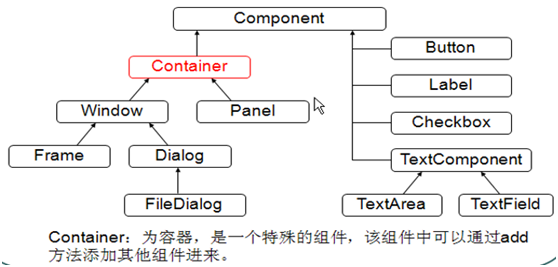

# Java基础学习笔记-GUI

---

### AWT与Swing

* AWT：Abstract Window Toolkit，抽象窗口工具集，需要调用本地系统方法实现功能，属于重量级控件；
* Swing：在AWT基础上建立的一套图形界面系统，提供了更多的组件，完全由Java实现，增强了移植性，属于轻量级控件；
* AWT调用系统组件，不同系统呈现的界面存在差异；Swing在任何系统看到的界面效果一样的；

### 组件体系

### 布局管理

* FlowLayout：流式布局，从左到右顺序排列，Panel的默认布局；
* BorderLayout：边界布局，东、南、西、北、中，Frame的默认布局；
* CardLayout：卡片布局，选项卡；
* GridLayout：网格布局，规则的矩阵；
* GridBagLayout：网格包布局，非规则的矩阵；
* 设置布局为空，则可以自定义放置组件；

### 实例

~~~java
Frame f = new Frame("my frame");
//f.setSize(600, 500);
//f.setLocation(350, 150);
f.setBounds(350, 150, 600, 500);
f.setLayout(new FlowLayout());

Button btn = new Button("my button");
f.add(btn);

f.setVisible();

f.addWindowListener(new WindowAdapter() {
    @Override
    public void windowClosing(WindowEvent e) {
        System.exit(0);
    }
});

btn.addActionListener(new ActionListener() {
    @Override
    public void actionPerformed(ActionEvent e) {
        System.exit(0);
    }
});
~~~

   

---

