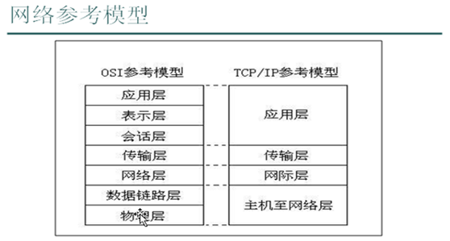
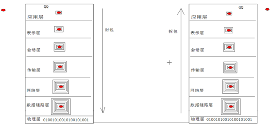
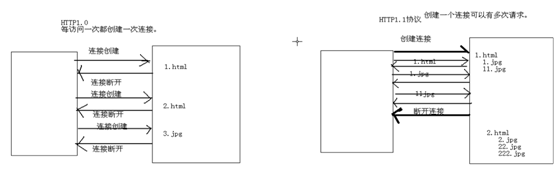

# Java基础学习笔记-网络编程

---

### 网络模型

* OSI参考模型（Open System Interconnection，开放系统互联）
* TCP/IP参考模型

七层协议简述：

* 物理层：主要定义物理设备标准，如网线的接口类型、光纤的接口类型、各种传输介质的传输速率等。它的主要作用是传输比特流，这一层的数据叫做比特。
* 数据链路层：主要将从物理层接收到的数据进行MAC地址（网卡地址）的封装与解封装。常把这一层的数据叫做帧，在这一层工作的设备是交换机。
* 网络层：主要将从下层接收到的数据进行IP地址的封装与解封装。常把这一层的数据叫做数据包，在这一层工作的设备是路由器。
* 传输层：定义了一些传输数据的协议和端口号（WWW端口80等），如TCP、UDP等。主要将从下层接收到的数据进行分段和传输，到达目的地址后在进行重组。常把这一层的数据叫做段。
* 会话层：通过传输层（端口号：传输端口与接收端口）建立数据传输的通路。主要在系统之间发起会话或者接收会话请求。
* 表示层：主要是进行对接收的数据进行解释、加密与解密、压缩与解压缩等。
* 应用层：主要是一些终端的应用，如FTP（各种文件下载）、Web（浏览器）、QQ等。

### InetAddress对象

~~~java
//获取本地主机IP地址
InetAddress ip = InetAddress.getLocalHost();
System.out.println("hostname:" + ip.getHostName());
System.out.println("hostaddr:" + ip.getHostName());

//获取指定主机IP地址
ip = InetAddress.getByName("127.0.0.1");
System.out.println("hostname:" + ip.getHostName());
System.out.println("hostaddr:" + ip.getHostName());

//获取指定主机IP地址
ip = InetAddress.getByName("www.baidu.com");
System.out.println("hostname:" + ip.getHostName());
System.out.println("hostaddr:" + ip.getHostName());
~~~

### TCP与UDP

UDP：

* 将数据及源和目的封装在数据包中，不需要建立连接；
* 每个数据报大小限制在64K之内；
* 无连接，是不可靠的协议；
* 不需要建立连接，速度快；

TCP：

* 建立连接，形成数据传输的通道；
* 在连接中进行大数据量传输；
* 经过三次握手建立连接，是可靠协议；
* 必须建立连接，效率稍低；

### UDP传输

发送端
~~~java
System.out.println("UDP发送端开始运行......");
//DatagramSocket socket = new DatagramSocket();	//使用随机分配的端口
DatagramSocket socket = new DatagramSocket(7777);	//使用指定端口

String data = "UDP发送的数据";
byte[] buffer = data.getBytes();
DatagramPacket packet = new DatagramPacket(buffer, buffer.length, InetAddress.getByName("127.0.0.1"), 8888);

socket.send(packet);
socket.close();
System.out.println("UDP发送端发送完毕！");
~~~

接收端
~~~java
System.out.println("UDP接收端开始运行......");
DatagramSocket socket = new DatagramSocket(8888);	//必须指定端口

byte[] buffer = new byte[1024];
DatagramPacket packet = new DatagramPacket(buffer, buffer.length);
socket.receive(packet);

String ip = packet.getAddress().getHostAddress();
int port = packet.getPort();
String data = new String(packet.getData(), 0, packet.getLength());
System.out.println("从"+ip+":"+port+"接收到的数据是："+data);

socket.close();
System.out.println("UDP接收端接收完毕！");
~~~

聊天程序
~~~java
public class ChatTool {
	public static void main(String[] args) throws Exception {
		DatagramSocket socket = new DatagramSocket(8888);
		new Thread(new SenderThread(socket)).start();
		new Thread(new ReceiverThread(socket)).start();
	}
}

class SenderThread implements Runnable {

	DatagramSocket socket;

	public SenderThread(DatagramSocket socket) {
		this.socket = socket;
	}

	@Override
	public void run() {
		try {
			BufferedReader bufr = new BufferedReader(new InputStreamReader(System.in));
			String line = null;
			byte[] buffer = null;
			while ((line=bufr.readLine())!=null) {
				buffer = line.getBytes();
				DatagramPacket packet = new DatagramPacket(buffer, buffer.length, InetAddress.getByName("127.0.0.1"), 8888);
				//DatagramPacket packet = new DatagramPacket(buffer, buffer.length, InetAddress.getByName("127.0.0.255"), 8888);//255为广播号，整个网段的机器都能接收到，可用于群聊
				socket.send(packet);
				if("#over".equals(line.trim())){
					break;
				}
			}
		} catch (Exception e) {
			e.printStackTrace();
		}
	}
}

class ReceiverThread implements Runnable {

	DatagramSocket socket;

	public ReceiverThread(DatagramSocket socket) {
		this.socket = socket;
	}

	@Override
	public void run() {
		byte[] buffer = new byte[1024];
		DatagramPacket packet = new DatagramPacket(buffer, buffer.length);
		while (true) {
			try {
				socket.receive(packet);
				String ip = packet.getAddress().getHostAddress();
				int port = packet.getPort();
				String data = new String(packet.getData(), 0, packet.getLength());
				if("#over".equals(data)){
					System.out.println(ip+":"+port+"  离开了聊天！");
				}else {
					System.out.println(ip+":"+port+">"+data);
				}
			} catch (Exception e) {
				e.printStackTrace();
			}
		}
	}
}
~~~

### TCP传输

服务端
~~~java
ServerSocket serverSocket = new ServerSocket(8888);
Socket socket = serverSocket.accept();

OutputStream out = socket.getOutputStream();
out.write("Hello World! This is Server！".getBytes());

InputStream in = socket.getInputStream();
byte[] buffer = new byte[1024];
int len = in.read(buffer);
String data = new String(buffer, 0, len);
System.out.println("客户端发送来的数据是："+data);

socket.close();
serverSocket.close();
~~~

客户端
~~~java
Socket socket = new Socket("127.0.0.1", 8888);

OutputStream out = socket.getOutputStream();
out.write("Hello World! This is Client！".getBytes());

InputStream in = socket.getInputStream();
byte[] buffer = new byte[1024];
int len = in.read(buffer);
String data = new String(buffer, 0, len);
System.out.println("服务器发送来的数据是："+data);

socket.close();
~~~

客户端键盘录入数据经过服务器转换为大写再由客户端输出：

客户端
~~~java
Socket socket = new Socket("127.0.0.1", 8888);

BufferedReader bufr = new BufferedReader(new InputStreamReader(System.in));
PrintWriter out = new PrintWriter(socket.getOutputStream(),true);//不带缓冲
BufferedReader in =new BufferedReader(new InputStreamReader(socket.getInputStream()));

String line = null;
while((line=bufr.readLine())!=null){
	//out.print(line);
	out.println(line);	//要使用带换行的方法
	if("#over".equals(line)){
		break;
	}
	System.out.println("经过服务器转换的数据是："+in.readLine());
}
bufr.close();
socket.close();
~~~

服务端
~~~java
ServerSocket serverSocket = new ServerSocket(8888);
Socket socket = serverSocket.accept();

BufferedReader in =new BufferedReader(new InputStreamReader(socket.getInputStream()));
PrintWriter out = new PrintWriter(socket.getOutputStream(),true);

String line = null;
while((line=in.readLine())!=null){
	if("#over".equals(line)){
		break;
	}
	out.println(line.toUpperCase());
}

socket.close();
serverSocket.close();
~~~

多线程文件上传：

客户端
~~~java
public class MultiThreadUploadClient {
	
	public static void main(String[] args) throws Exception {
		Socket socket = new Socket("127.0.0.1", 8888);
		
		File file = new File("srcFile.txt");
		FileInputStream fis = new FileInputStream(file);
		OutputStream out = socket.getOutputStream();//不带缓冲
		BufferedReader in =new BufferedReader(new InputStreamReader(socket.getInputStream()));
		
		byte[] buffer = new byte[1024];
		int len = 0;
		while((len=fis.read(buffer))!=-1){
			out.write(buffer, 0, len);
		}
		//发送一个文件结束标记
		socket.shutdownOutput();
		
		System.out.println(in.readLine());
		fis.close();
		socket.close();
	}
	
}
~~~

服务端
~~~java
public class MultiThreadUploadServer {
	
	public static void main(String[] args) throws Exception {
		ServerSocket serverSocket = new ServerSocket(8888);
		while(true){
			Socket socket = serverSocket.accept();
			new Thread(new Uploader(socket)).start();
		}
	}
	
}

class Uploader implements Runnable{

	Socket socket;
	
	public Uploader(Socket socket) {
		this.socket = socket;
	}

	@Override
	public void run() {
		InputStream in = null;
		OutputStream fos = null;
		try {
			in = socket.getInputStream();
			PrintWriter out = new PrintWriter(socket.getOutputStream(),true);
			
			File file = new File("destFile.txt");
			int count = 1;
			while(file.exists()){
				file = new File("destFile("+(count++)+").txt");
			}
			fos = new FileOutputStream(file);
			
			byte[] buffer = new byte[1024];
			int len = 0;
			while((len=in.read(buffer))!=-1){
				fos.write(buffer, 0, len);
			}
			out.println("文件上传成功！");
			
		} catch (IOException e) {
			e.printStackTrace();
		} finally{
			if(fos!=null){
				try {
					fos.close();
				} catch (IOException e) {
					e.printStackTrace();
				}
			}
		}
	}
}
~~~

### URLConnection对象

~~~java
String urlString = "http://127.0.0.1:8080/mywebapps/index.html?name=xxx&passwd=yyy";
URL url = new URL(urlString);

System.out.println("Protocol:"+url.getProtocol());
System.out.println("Host:"+url.getHost());
System.out.println("Port:"+url.getPort());
System.out.println("Path:"+url.getPath());
System.out.println("Query:"+url.getQuery());

System.out.println("Authority:"+url.getAuthority());
//System.out.println("Content:"+url.getContent());
System.out.println("DefaultPort:"+url.getDefaultPort());
System.out.println("File:"+url.getFile());
System.out.println("Ref:"+url.getRef());
System.out.println("UserInfo:"+url.getUserInfo());

URLConnection connection = url.openConnection();
InputStream in = connection.getInputStream();
byte[] buffer = new byte[1024];
int len = in.read(buffer);
System.out.println(new String(buffer,0,len)); //此对象获取的流读取到的数据不包含头信息，只有响应体内容
~~~

### HTTP1.0与HTTP1.1

### C/S结构与B/S结构

C/S结构：（Client/Sever）

* 客户端和服务端程序都需要开发维护；
* 客户端程序维护起来较为困难；
* 可以将一部分运算分离到客户端来运行，减轻了服务器端的压力。

B/S结构：（Browser/Sever）

* 只需要开发服务器端程序，客户端直接使用系统具备的浏览器软件；
* 只需维护服务器端程序；
* 所有运算都在服务器端执行，压力相对较大。

   

---

