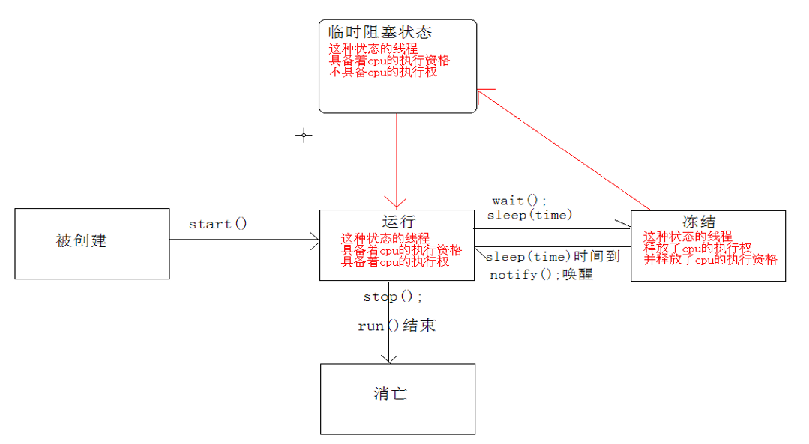
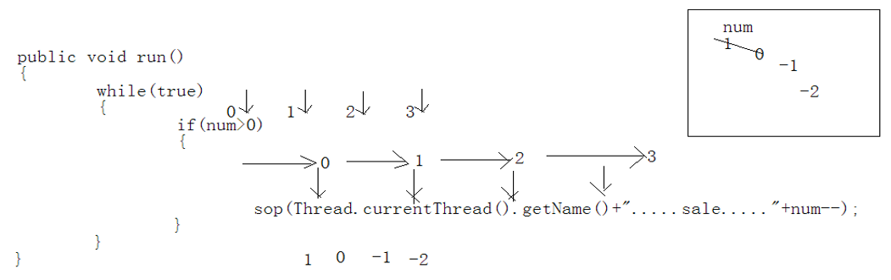
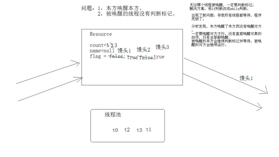

# Java基础学习笔记-多线程

---

### 概述

1、finalize()方法：垃圾收集器回收对象前会调用对象的该方法。

2、System.gc()方法：给垃圾收集器发送一个信号，提醒垃圾收集器回收垃圾，但不一定会立即执行。

3、run()方法和start()方法的区别：直接调用run()方法时其实还是在main线程里执行，调用start()方法是开了新的线程来执行任务。

4、每个线程的start()方法只能调用一次，即一个线程不能多次启动。

### 线程运行状态

### 创建线程的方式

1、继承Thread类

~~~java
package cn.seasand.code.p01_createthread.d01;

public class CreateThreadDemo {
	
	public static void main(String[] args) {
		Task d1 = new Task("AAA");
		Task d2 = new Task("BBB");
		
		//d1.run();
		//d2.run();
		
		d1.start();
		d2.start();
	}
	
}

class Task extends Thread {
	
	private String name;
	
	Task(String name) {
		this.name = name;
	}
	
	public void run() {
		for(int i=0; i<10; i++) {
			System.out.println(this.name + "---" + i + "===" + getName() + ":::" +Thread.currentThread().getName());
		}
	}
}
~~~

2、实现Runnable接口

~~~java
package cn.seasand.code.p01_createthread.d02;

public class CreateThreadDemo {
	
	public static void main(String[] args) {
		Task d1 = new Task("AAA");
		Task d2 = new Task("BBB");
		new Thread(d1).start();
		new Thread(d2).start();
	}
	
}

class Task implements Runnable  {
	
	private String name;
	
	Task(String name) {
		this.name = name;
	}
	
	@Override
	public void run() {
		for(int i=0; i<10; i++) {
			System.out.println(this.name + "---" + i + "===" + ":::" +Thread.currentThread().getName());
		}
	}
}
~~~

### 售票案例

~~~java
package cn.seasand.code.p02_saleticket.d01;

public class TicketDemo {
	
	public static void main(String[] args) {
		Ticket t = new Ticket();
		new Thread(t).start();
		new Thread(t).start();
		new Thread(t).start();
		new Thread(t).start();
	}
	
}

class Ticket implements Runnable {
	
	private int num = 100;
	
	@Override
	public void run() {
		while(true) {
			if(num>0) {
				System.out.println(Thread.currentThread().getName() + "---" + num--);
			}
		}
	}
	
}
~~~

### 线程安全问题

多线程操作共享数据会引发安全问题。

~~~java
package cn.seasand.code.p03_sync.d01;

public class SafeProblem {
	
	public static void main(String[] args) {
		Ticket t = new Ticket();
		new Thread(t).start();
		new Thread(t).start();
		new Thread(t).start();
		new Thread(t).start();
	}
	
}

class Ticket implements Runnable {
	
	private int num = 100;
	
	@Override
	public void run() {
		while(true) {
			if(num>0) {
				try {
					Thread.sleep(100);
				} catch (InterruptedException e) {
					e.printStackTrace();
				}
				System.out.println(Thread.currentThread().getName() + "===" + num--);
			}
		}
	}
	
}
~~~

运行结果：

~~~plaintext
...
Thread-2===3
Thread-1===2
Thread-3===1
Thread-0===0
Thread-1===-1
Thread-2===-2
~~~

如下图，线程在进入if判断之后被切换走了，会使if判断被绕过，从而出现了负数的情况；

### 同步

同步可以解决线程安全问题。同步的原理就是将需要同步的代码封装起来并加上一把锁。

举个例子，多线程访问共享数据就像多个人排队上一个厕所。一个人进入厕所，首先是关门上锁，其他人在外面发现这个厕所已经上锁就只能排队等候。当这个人从厕所出来，开锁，即释放了锁，其他人才能进入。

同步的前提：

* 同步需要两个或两个以上的线程；
* 多个线程使用的是同一个锁；

同步的弊端：当线程相当多时，因为每个线程都会去判断同步上的锁，这是很耗费资源的，降低了程序的效率；

1、同步代码块

~~~java
package cn.seasand.code.p03_sync.d02;

public class SyncBlock {
	
	public static void main(String[] args) {
		Ticket t = new Ticket();
		new Thread(t).start();
		new Thread(t).start();
		new Thread(t).start();
		new Thread(t).start();
	}
	
}

class Ticket implements Runnable {
	
	private int num = 100;
	Object lock = new Object();
	
	@Override
	public void run() {
		while(true) {
			synchronized(lock) {
				if(num>0) {
					try {
						Thread.sleep(100);
					} catch (InterruptedException e) {
						e.printStackTrace();
					}
					System.out.println(Thread.currentThread().getName() + "===" + num--);
				}
			}
		}
	}
	
}
~~~

2、同步函数

同步函数使用的锁是什么呢？函数肯定被对象调用，代表调用函数对象的引用就是this。 也就是说同步函数使用锁是this。

~~~java
package cn.seasand.code.p03_sync.d03;

public class SyncFunc {
	
	public static void main(String[] args) {
		Ticket t = new Ticket();
		new Thread(t).start();
		new Thread(t).start();
		new Thread(t).start();
		new Thread(t).start();
	}
}

class Ticket implements Runnable {
	
	private int num = 100;
	
	@Override
	public void run() {
		while(true) {
			show();
		}
	}
	
	public synchronized void show() {
		if(num>0) {
			try {
				Thread.sleep(100);
			} catch (InterruptedException e) {
				e.printStackTrace();
			}
			System.out.println(Thread.currentThread().getName() + "===" + num--);
		}
	}
}
~~~

3、证明同步代码块和同步函数使用同一把锁

~~~java
package cn.seasand.code.p03_sync.d04;

/**
 * 通过两个线程来验证同步函数的锁是什么？
 * 都是在卖票，一个是在同步代码块中卖票,一个是同步函数中卖票，如果两个线程用的锁是同一个，就会同步，不会出现错误票的情况。
 */
public class ThisLockDemo {
	
	public static void main(String[] args) {
		Ticket t = new Ticket();
		Thread t1 = new Thread(t);
		Thread t2 = new Thread(t);
		
		t1.start();
		
		try{Thread.sleep(10);}catch(InterruptedException e){}
		
		//在开启了t1后，将标记置为false。
		t.setFlag();
		
		t2.start();
	}
}

class Ticket implements Runnable {
	
	private int num = 200;
	private boolean flag = true;
	
	public void run() {
		if(flag) //为true就执行同步代码块。
			while(true) {
				synchronized(this) {
					if(num>0) {
//						try{Thread.sleep(10);}catch(InterruptedException e){}
						System.out.println(Thread.currentThread().getName()+".....code.........."+num--);
					}
				}
			}
		else //为false就执行同步函数。 
			while(true) {
				show();
			}
	}
	
	public void setFlag() {
		flag = false;
	}
	
	public synchronized void show() {//this
		if(num>0) {
//			try{Thread.sleep(10);}catch(InterruptedException e){}
			System.out.println(Thread.currentThread().getName()+"............func....."+num--);
		}
	}
}
~~~

同步函数和同步代码块有什么区别呢？

* 同步函数比同步代码块写法简单。
* 同步函数使用的锁是this，同步代码块使用的锁是任意指定的对象。
* 建议开发时，使用同步代码块，尤其是需要不同锁时。

4、静态函数的锁

静态同步函数使用的锁是什么？静态随着类的加载而加载的，这时内存中存储的对象至少有一个就是该类字节码文件对象。这个对象的表示方式 类名.class 它就表示字节码文件对象。

~~~java
package cn.seasand.code.p03_sync.d05;

public class StaticLockDemo {
	
	public static void main(String[] args) {
		Ticket t = new Ticket();
		Thread t1 = new Thread(t);
		Thread t2 = new Thread(t);
		
		t1.start();
		
		try{Thread.sleep(10);}catch(InterruptedException e){}
		
		//在开启了t1后，将标记置为false。
		t.setFlag();
		
		t2.start();
	}
}

class Ticket implements Runnable {
	
	private static int num = 200;
	private boolean flag = true;
	
	public void run() {
		if(flag) //为true就执行同步代码块。
			while(true) {
				synchronized(Ticket.class) {
					if(num>0) {
						try{Thread.sleep(10);}catch(InterruptedException e){}
						System.out.println(Thread.currentThread().getName()+".....code.........."+num--);
					}
				}
			}
		else //为false就执行同步函数。 
			while(true) {
				show();
			}
	}
	
	public void setFlag() {
		flag = false;
	}

	public static synchronized void show() {
		if(num>0) {
			try{Thread.sleep(10);}catch(InterruptedException e){}
			System.out.println(Thread.currentThread().getName()+"............func....."+num--);
		}
	}
}
~~~

5、死锁

同步的另一个弊端：死锁。最常见的死锁情况：同步嵌套。同步中还有同步，两个同步用的不是一个锁。 记住尽量避免同步嵌套的情况。

~~~java
package cn.seasand.code.p03_sync.p06;

public class DeadLockDemo {
	
	public static void main(String[] args) {
		Task a = new Task(true);
		Task b = new Task(false);
		
		Thread t1 = new Thread(a);
		Thread t2 = new Thread(b);
		
		t1.start();
		t2.start();
	}
}

class Task implements Runnable {
	
	private boolean flag;
	
	Task(boolean flag) {
		this.flag = flag;
	}
	
	public void run() {
		if(flag) {
			while(true) {
				synchronized(MyLock.locka) {
					System.out.println("if.....locka");
					synchronized(MyLock.lockb) {
						System.out.println("if.....lockb");
						
					}
				}
			}
		} else {
			while(true) {
				synchronized(MyLock.lockb) {
					System.out.println("else.....lockb");
					synchronized(MyLock.locka) {
						System.out.println("else.....locka");
						
					}
				}
			}
		}
	}
}

class MyLock {
	public static Object locka = new Object();
	public static Object lockb = new Object();
}
~~~

### 线程间通信

线程间通信：多个线程在处理同一个资源，但是处理的动作(线程的任务)却不相同。简言之，多个线程，不同任务，处理同一资源。 

1、案例

~~~java
package cn.seasand.code.p04_message.d01;

public class ResourceDemo {
	
	public static void main(String[] args) {
		// 1，创建资源对象。
		Resource r = new Resource();
		
		// 2，创建任务对象。
		Input in = new Input(r);
		Output out = new Output(r);
		
		// 3，创建线程对象。
		Thread t1 = new Thread(in);
		Thread t2 = new Thread(out);
		
		// 4，开启线程。
		t1.start();
		t2.start();
	}
	
}

//描述资源
class Resource {
	String name;
	String sex;
}

//描述输入任务
class Input implements Runnable {
	
	private Resource r ;
	
	Input(Resource r) {
		this.r = r;
	}
	
	public void run() {
		int x = 0;
		while(true) {
			synchronized(r) {
				if(x==0) {
					r.name = "Mike";
					r.sex = "man";
				} else {
					r.name = "小红";
					r.sex = "女女女女";
				}
			}
			x = (x+1)%2;
		}
	}
}

//描述输出任务
class Output implements Runnable {
	
	Resource r;
	
	Output(Resource r) {
		this.r = r;
	}
	
	public void run() {
		while(true) {
			synchronized(r) {
				System.out.println(r.name+"....."+r.sex);
			}
		}
	}
}
~~~

2、等待唤醒机制

涉及到的方法：

* wait():等待，将正在执行的线程释放其执行资格和执行权，并存储到线程池中。
* notify():唤醒，唤醒线程池中被wait的线程，一次唤醒一个，而且是任意的。
* notifyAll():唤醒全部，可以将线程池中的所有wait线程都唤醒，

唤醒的意思就是让线程池中的线程具备执行资格。

这些方法都要使用在同步中才有效。这些方法在使用时必须标明所属锁，这样才可以明确出这些放操作的到底是哪个锁上的线程。

为什么这些操作线程的方法定义在Object类中？因为这些方法在使用时，必须要标明所属的锁，而锁又可以是任意对象。能被任意对象调用的方法一定定义在Object类中。

~~~java
package cn.seasand.code.p04_message.d02;

public class ResourceDemo {
	
	public static void main(String[] args) {
		// 1，创建资源对象。
		Resource r = new Resource();
		
		// 2，创建任务对象。
		Input in = new Input(r);
		Output out = new Output(r);
		
		// 3，创建线程对象。
		Thread t1 = new Thread(in);
		Thread t2 = new Thread(out);
		
		// 4，开启线程。
		t1.start();
		t2.start();
	}
	
}

class Resource {
	String name;
	String sex;
	boolean flag;
}

// 描述输入任务
class Input implements Runnable {
	
	private Resource r ;
	
	Input(Resource r) {
		this.r = r;
	}
	
	public void run() {
		int x = 0;
		while(true) {
			synchronized(r) {
				if(r.flag){
					try{r.wait();}catch(InterruptedException e){}
				}
				if(x==0) {
					r.name = "Mike";
					r.sex = "man";
				} else {
					r.name = "小红";
					r.sex = "女女女女";
				}
				r.flag = true;
				r.notify();
			}
			x = (x+1)%2;
		}
	}
}

// 描述输出任务
class Output implements Runnable {
	
	Resource r;
	
	Output(Resource r) {
		this.r = r;
	}
	
	public void run() {
		while(true) {
			synchronized(r) {
				if(!r.flag) {
					try{r.wait();}catch(InterruptedException e){}
				}
				System.out.println(r.name+"....."+r.sex);
				r.flag = false;
				r.notify();
			}
		}
	}
}
~~~

3、代码整理

~~~java
package cn.seasand.code.p04_message.d03;

public class ResourceDemo {
	
	public static void main(String[] args) {
		// 1，创建资源对象。
		Resource r = new Resource();
		
		// 2，创建任务对象。
		Input in = new Input(r);
		Output out = new Output(r);
		
		// 3，创建线程对象。
		Thread t1 = new Thread(in);
		Thread t2 = new Thread(out);
		
		// 4，开启线程。
		t1.start();
		t2.start();
	}
	
}

class Resource {
	
	private String name;
	private String sex;
	private boolean flag;
	
	public synchronized void set(String name, String sex) {
		if(flag)
			try{this.wait();}catch(InterruptedException e){}
		this.name = name;
		this.sex = sex;
		flag = true;
		this.notify();
	}
	
	public synchronized void out() {
		if(!flag)
			try{this.wait();}catch(InterruptedException e){}
		System.out.println(name+".....---...."+sex);
		flag = false;
		this.notify();
	}
}

// 描述输入任务
class Input implements Runnable {
	
	private Resource r ;
	
	Input(Resource r) {
		this.r = r;
	}
	
	public void run() {
		int x = 0;
		while(true) {
			if(x==0) {
				r.set("Mike","man");
			} else {
				r.set("小红","女女女女");
			}
			x = (x+1)%2;
		}
	}
}

// 描述输出任务
class Output implements Runnable {
	
	Resource r;
	
	Output(Resource r) {
		this.r = r;
	}
	
	public void run() {
		while(true) {
			r.out();
		}
	}
}
~~~

4、多生产者与多消费者问题

发生的问题：生产者生产的商品没有被消费就生产了新的商品。

问题在于两点：

* 本方唤醒了本方。
* 被唤醒的本方没有判断标记，只要将if判断该外while判断。 

将if改为while循环判断标记后，出现了死锁。因为本方唤醒了本方，而被唤醒的本方一判断标记，就继续等待。这样所有的线程都等待了。必须唤醒对方才行，但是没有直接唤醒对方的动作，所以就使用了notifyAll，唤醒全部。 

~~~java
package cn.seasand.code.p04_message.d04;

public class ProConDemo {
	
	public static void main(String[] args) {
		Resource r = new Resource();
		Producer pro = new Producer(r);
		Consumer con = new Consumer(r);
		//两个线程负责生产。
		Thread t0 = new Thread(pro);
		Thread t1 = new Thread(pro);
		//两个线程负责消费。
		Thread t2 = new Thread(con);
		Thread t3 = new Thread(con);
		t0.start();
		t1.start();
		t2.start();
		t3.start();
	}
	
}

class Resource {
	
	private String name;
	private int count = 1;
	private boolean flag;
	
	public synchronized void set(String name) {
		while(flag)
			try{this.wait();}catch(InterruptedException e){}//t0(活-->wait) t1(活)
		this.name = name + count;//馒头1 馒头2 馒头3 
		count++;
		System.out.println(Thread.currentThread().getName()+".....生产者......"+this.name);//Thread-0 生产 馒头1
																						//Thread-0 生产 馒头2
																						//Thread-0 生产 馒头3

		flag = true;
		this.notifyAll();
	}
	
	public synchronized void get() {
		while(!flag)
			try{this.wait();}catch(InterruptedException e){}//t2  t3
		System.out.println(Thread.currentThread().getName()+".........消费者......"+this.name);//Thread-2 消费 馒头1
		flag = false;
		this.notifyAll();
	}
}

//生产者
class Producer implements Runnable {
	
	private Resource r;
	
	Producer(Resource r) {
		this.r = r;
	}
	
	public void run() {
		while(true) {
			r.set("馒头");
		}
	}
}

//消费者
class Consumer implements Runnable {
	
	private Resource r;
	
	Consumer(Resource r) {
		this.r = r;
	}
	
	public void run() {
		while(true) {
			r.get();
		}
	}
}
~~~

### JDK1.5新API

之前的例子要解决本方只唤醒对方用的方式就是定义两个锁：

~~~java
synchronized(生产锁) {
	synchronized(消费锁) {
		if()
			生产wait();

		...;

		消费的notify 消费();//这里应该用的是消费锁的上的notify.
	}
}

synchronized(消费锁) {
	synchronized(生产锁) {
		if()
			消费的wait();
		....;

		生产的notify生产();
	}
}
~~~

这样看上去是可以解决问题的。但是出现了同步嵌套，很容易发生死锁。所以解决办法就是同一个锁，while的标记判断，notifyAll的全部唤醒。 但是这种解决方案效率低，因为还会唤醒本方。

JDK1.5后出现的新的接口和类：Lock，比同步函数和同步代码块要好一些。分析发现：

* 同步函数以及同步代码块所做的都是隐式的锁操作。
* 同步函数或者同步代码块使用的锁和监视器是同一个。

Lock接口，是将锁进行单独对象的封装，而且提供了对锁对象很多功能。比如：lock()获取锁，unlock()释放锁。Lock对锁的操作都是显示操作。所以它的出现要比同步函数或者同步代码块明确的多，更符合面向对象思想。简单一句话：Lock接口的出现替代了同步，即在代码中将同步替换成Lock。

原来在同步中，锁和监视器是同一个对象。现在升级后，锁是一个单独的对象。而且将监视器的方法也单独封装到了一个对象中，这个对象就是升级后Condition。

升级后，锁和监视器都进行了单独的封装。锁被封装成了Lock对象， 监视器方法都被封装到了Condition对象(监视器对象)中。说白了，Lock替代了同步，Condition替代了Object中的监视器方法。

Condition中提供了监视器的方法：awati().signal(),signalAll();

如何让锁和监视器产生联系呢？直接通过Lock接口中的newCondition()方法就可以获取到能绑定到该Lock对象的上的监视器对象Condition。

有了新特性Lock、Condition，就可以解决这个问题了。之前是有两个锁嵌套，容易死锁，现在方案是只有锁，但是锁上可以加入多个监视器。一个监视生产者，一个监视消费者。

官方示例：

~~~java
class BoundedBuffer {
	
	final Lock lock = new ReentrantLock();
	final Condition notFull = lock.newCondition();
	final Condition notEmpty = lock.newCondition();
	
	final Object[] items = new Object[100];
	int putptr, takeptr, count;
	
	public void put(Object x) throws InterruptedException {
		lock.lock();
		try {
			while (count == items.length)
				notFull.await();
			items[putptr] = x;
			if (++putptr == items.length)
				putptr = 0;
			++count;
			notEmpty.signal();
		} finally {
			lock.unlock();
		}
	}
	
	public Object take() throws InterruptedException {
		lock.lock();
		try {
			while (count == 0)
				notEmpty.await();
			Object x = items[takeptr];
			if (++takeptr == items.length)
				takeptr = 0;
			--count;
			notFull.signal();
			return x;
		} finally {
			lock.unlock();
		}
	}
}
~~~

旧版本修改：

~~~java
package cn.seasand.code.p05_jdk5new.d02;

import java.util.concurrent.locks.Condition;
import java.util.concurrent.locks.Lock;
import java.util.concurrent.locks.ReentrantLock;

public class ProConDemo {
	
	public static void main(String[] args) {
		Resource r = new Resource();
		Producer pro = new Producer(r);
		Consumer con = new Consumer(r);
		//两个线程负责生产。
		Thread t0 = new Thread(pro);
		Thread t1 = new Thread(pro);
		//两个线程负责消费。
		Thread t2 = new Thread(con);
		Thread t3 = new Thread(con);
		t0.start();
		t1.start();
		t2.start();
		t3.start();
	}
	
}

class Resource {
	
	private String name;
	private int count = 1;
	private boolean flag;
	//创建一个锁对象。
	private final Lock lock = new ReentrantLock();
	//获取一个该锁上的监视器。 
	private Condition con = lock.newCondition();
	
	public void set(String name) {
		//获取锁。
		lock.lock();
		try {
			while(flag)
				try{con.await();}catch(InterruptedException e){}//t0(活-->wait) t1(活)
			this.name = name + count;//馒头1 馒头2 馒头3 
			
			count++;
			
			System.out.println(Thread.currentThread().getName()+".....生产者......"+this.name);//Thread-0 生产 馒头1
																							//Thread-0 生产 馒头2
																							//Thread-0 生产 馒头3
			
			flag = true;
			con.signalAll();
		} finally {
			//释放锁。
			lock.unlock();
		}
	}
	
	public void get() {
		lock.lock();
		try {
			while(!flag)
				try{con.await();}catch(InterruptedException e){}//t2  t3
			
			System.out.println(Thread.currentThread().getName()+".........消费者......"+this.name);//Thread-2 消费 馒头1
			flag = false;
			con.signalAll();
		} finally {
			lock.unlock();
		}
	}
}

//生产者
class Producer implements Runnable {
	
	private Resource r;
	
	Producer(Resource r) {
		this.r = r;
	}
	
	public void run() {
		while(true) {
			r.set("馒头");
		}
	}
}

//消费者
class Consumer implements Runnable {
	
	private Resource r;
	
	Consumer(Resource r) {
		this.r = r;
	}
	
	public void run() {
		while(true) {
			r.get();
		}
	}
}
~~~

Condition接口替代了Object中的监视方法，并将监视器方法封装成了Condition。和以前不同的是，以前一个锁上只能有一组监视器方法。现在，一个Lock锁上可以多组监视器方法对象。可以实现一组负责生产者，一组负责消费者。多生产者多消费者问题解决如下：

~~~java
package cn.seasand.code.p05_jdk5new.d03;

import java.util.concurrent.locks.Condition;
import java.util.concurrent.locks.Lock;
import java.util.concurrent.locks.ReentrantLock;

public class ProConDemo {
	
	public static void main(String[] args) {
		Resource r = new Resource();
		Producer pro = new Producer(r);
		Consumer con = new Consumer(r);
		//两个线程负责生产。
		Thread t0 = new Thread(pro);
		Thread t1 = new Thread(pro);
		//两个线程负责消费。
		Thread t2 = new Thread(con);
		Thread t3 = new Thread(con);
		t0.start();
		t1.start();
		t2.start();
		t3.start();
	}
	
}

class Resource {
	
	private String name;
	private int count = 1;
	private boolean flag;
	//创建一个锁对象。
	private final Lock lock = new ReentrantLock();
	//创建一个生产者的监视器。
	private Condition producer_con = lock.newCondition();
	//创建一个消费者监视器。
	private Condition consumer_con = lock.newCondition();
	
	public void set(String name) {
		//获取锁。
		lock.lock();
		try {
			while(flag)
				try{producer_con.await();}catch(InterruptedException e){}//t0(活-->wait) t1(活)
			this.name = name + count;//馒头1 馒头2 馒头3 
			
			count++;
			
			System.out.println(Thread.currentThread().getName()+".....生产者......"+this.name);//Thread-0 生产 馒头1
																							//Thread-0 生产 馒头2
																							//Thread-0 生产 馒头3
			
			flag = true;
			consumer_con.signal();
		} finally {
			//释放锁。
			lock.unlock();
		}
	}
	
	public void get() {
		lock.lock();
		try {
			while(!flag)
				try{consumer_con.await();}catch(InterruptedException e){}//t2  t3
			
			System.out.println(Thread.currentThread().getName()+".........消费者......"+this.name);//Thread-2 消费 馒头1
			flag = false;
			producer_con.signal();
		} finally {
			lock.unlock();
		}
	}
}

//生产者
class Producer implements Runnable {
	
	private Resource r;
	
	Producer(Resource r) {
		this.r = r;
	}
	
	public void run() {
		while(true) {
			r.set("馒头");
		}
	}
}

//消费者
class Consumer implements Runnable {
	
	private Resource r;
	
	Consumer(Resource r) {
		this.r = r;
	}
	
	public void run() {
		while(true) {
			r.get();
		}
	}
}
~~~

### 停止线程

* stop()方法：过时。
* run()方法结束：当线程没有了要运行的代码时线程就结束了，意味着任务结束，线程消失。

一般情况下run方法中都会定义循环。开启新的执行路径就是为了对多次的运算和其他代码进行同时的执行。

~~~java
//这种线程任务是毫无意义的，根本就不需要多线程执行。
public void run() {
	System.out.println("ok");	
}

public void run() {
	while(true) {
		System.out.println("ok");
	}
}
~~~

开启多线程会同时并重复做很多运算。结束run方法，只要控制住run方法中的循环即可。控制循环通常需要通过标记来完成，如下：

~~~java
package cn.seasand.code.p06_stopthread.d01;

public class StopThreadDemo {
	
	public static void main(String[] args) {
		StopThread st = new StopThread();
		
		Thread t1 = new Thread(st);
		Thread t2 = new Thread(st);
		t1.start();
		t2.start();
		
		int num = 1;
		while(true) {
			if(++num==50) {
				st.setFlag(); //将标记置为false。让t1，t2对应的线程结束。
				break;
			}
			System.out.println(Thread.currentThread().getName()+"....."+num);
		}
		System.out.println("over");
	}
	
}

class StopThread implements Runnable {
	
	private boolean flag = true;
	
	public void run() {
		while(flag) {
			System.out.println(Thread.currentThread().getName()+"......run");
		}
	}
	
	public void setFlag() {
		flag = false;
	}
}
~~~

如果读不到标记怎么办？比如在任务中让线程处于了冻结状态。释放了执行资格，无法执行标记，run方法没结束，线程也无法结束。如下：

~~~java
package cn.seasand.code.p06_stopthread.d02;

public class StopThreadDemo {
	
	public static void main(String[] args) {
		StopThread st = new StopThread();
		
		Thread t1 = new Thread(st);
		Thread t2 = new Thread(st);
		t1.start();
		t2.start();
		
		int num = 1;
		while(true) {
			if(++num==50) {
				st.setFlag(); //将标记置为false。让t1，t2对应的线程结束。
				break;
			}
			System.out.println(Thread.currentThread().getName()+"....."+num);
		}
		System.out.println("over");
	}
	
}

class StopThread implements Runnable {
	
	private boolean flag = true;
	
	public synchronized void run() {
		while(flag) {
			try {
				wait();
			} catch (InterruptedException e) {
				e.printStackTrace();
			}
			System.out.println(Thread.currentThread().getName()+"......run");
		}
	}
	
	public void setFlag() {
		flag = false;
	}
}
~~~

Thread类中有一个interupt方法，可以将线程的冻结状态清除，让线程恢复到具备执行资格。

~~~java
package cn.seasand.code.p06_stopthread.d03;

public class StopThreadDemo {
	
	public static void main(String[] args) {
		StopThread st = new StopThread();
		
		Thread t1 = new Thread(st);
		Thread t2 = new Thread(st);
		t1.start();
		t2.start();
		
		int num = 1;
		while(true) {
			if(++num==50) {
				st.setFlag(); //将标记置为false。让t1，t2对应的线程结束。
				
				t1.interrupt();
				t2.interrupt();
				
				break;
			}
			System.out.println(Thread.currentThread().getName()+"....."+num);
		}
		System.out.println("over");
	}
	
}

class StopThread implements Runnable {
	
	private boolean flag = true;
	
	public synchronized void run() {
		while(flag) {
			try {
				wait();
			} catch (InterruptedException e) {
				e.printStackTrace();
			}
			System.out.println(Thread.currentThread().getName()+"......run");
		}
	}
	
	public void setFlag() {
		flag = false;
	}
}
~~~

### 线程的其它方法

1、setDaemon：守护线程，需在线程start方法前执行。

2、setPriority：优先级（1~10，默认5）

~~~java
Task t = new Task();
t.setPriority(Thread.MAX_PRIORITY);
~~~

3、join：加入执行

~~~java
package cn.seasand.code.p07_join.d01;

public class JoinDemo {
	
	public static void main(String[] args) {
		Task d1 = new Task("AAA");
		Task d2 = new Task("BBB");
		
		d1.start();
		d2.start();
		
		//主线程运行到此处，发现d1要加入运行，则主线程释放了执行权处于休眠状态；此时剩下d1与d2在执行；只有当d1执行完，主线程才会重新执行。
		try{d1.join();}catch(InterruptedException e){}
		
		for(int x=0; x<30; x++) {
			System.out.println(Thread.currentThread().toString()+"......"+x);
		}
	}
	
}

class Task extends Thread {
	
	Task(String name) {
		super(name);
	}
	
	public void run() {
		for(int x=0; x<30; x++) {
			System.out.println(Thread.currentThread().toString()+"......"+x);
			Thread.yield();
		}
	}
}
~~~

4、yield：暂时停一下

~~~java
Thread.yield();
~~~

5、wait()方法和sleep()方法的区别：

* 两个方法都可以让线程处于冻结状态；
* sleep()必须指定时间，wait()可以指定时间，也可以不指定；
* wait()方法释放CPU执行权，释放锁；
* sleep()方法释放CPU执行权，不释放锁；

   

---

