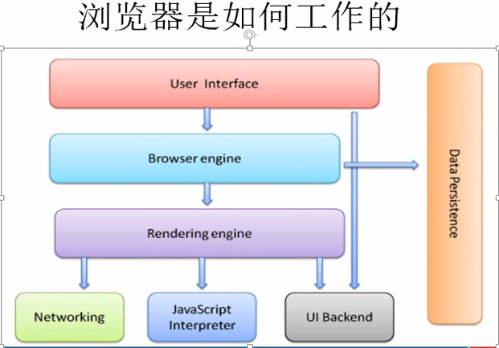
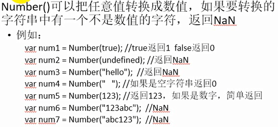

# JavaScript笔记汇总

---

---

## 基础

### 1、浏览器是如何工作的？

---

### 2、永远不要测试某个特定的浮点数值

不要判断两个浮点数是否相等。

~~~javascript
var a = 0.1;
var b = 0.2;
console.log(a + b);
console.log(a + b == 0.3);

console.log(0.07*100);
~~~

执行结果：

0.30000000000000004
false
7.000000000000001

---

### 3、

---

### 4、

~~~javascript
var b = 'abc' && 'def'; console.log(b); //def
var b = 'abc' && undefined; console.log(b); //undefined
var b = undefined && 'def'; console.log(b); //undefined
var b = undefined && null; console.log(b); //undefined

var b = 'abc' || 'def'; console.log(b); //abc
var b = 'abc' || undefined; console.log(b); //abc
var b = undefined || 'def'; console.log(b); //def
var b = undefined || null; console.log(b); //null

~~~

---

### 5、

---

---

## 语法

## 关键字和保留字

## 变量

## 数据类型

## 操作符

## 语句

## 函数

