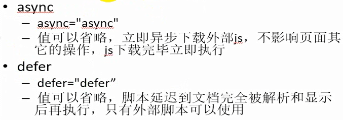

# script标签属性async、defer

---

(1)情况一

index.html

~~~html
<!DOCTYPE html>
<html lang="en">
<head>
	<meta charset="UTF-8">
	<title>Document</title>
	
</head>
<body>
	<h1>Hello HTML</h1>
</body>
</html>
~~~

main.js

~~~javascript
//main.js
window.alert('hello world!');
~~~

由于HTML从上往下解析执行，所以会先弹框，再看到`<h1>`标签内容。

(2)情况二

index.html

~~~html
<!DOCTYPE html>
<html lang="en">
<head>
	<meta charset="UTF-8">
	<title>Document</title>
	
</head>
<body>
	<h1>Hello HTML</h1>
</body>
</html>
~~~

main.js

~~~javascript
//main.js
window.alert('hello world!');
~~~

加上async属性，main.js中的代码将会异步执行。（弹框和H1标签的显示顺序不确定）

(3)情况三

index.html

~~~html
<!DOCTYPE html>
<html lang="en">
<head>
	<meta charset="UTF-8">
	<title>Document</title>
	
</head>
<body>
	
	<h1>Hello HTML1</h1>
	

	
	<h1>Hello HTML2</h1>
	
</body>
</html>
~~~

main.js

~~~javascript
//main.js
window.alert('hello world!');
~~~

执行结果：

弹框显示hello world！  
弹框显示start1  
弹框显示end1  
显示标签Hello HTML1  
弹框显示start2  
弹框显示end2  
显示标签Hello HTML2  

(4)情况四

index.html

~~~html
<!DOCTYPE html>
<html lang="en">
<head>
	<meta charset="UTF-8">
	<title>Document</title>
	
</head>
<body>
	
	<h1>Hello HTML</h1>
	

	
	<h1>Hello HTML</h1>
	
</body>
</html>
~~~

main.js

~~~javascript
//main.js
window.alert('hello world!');
~~~

执行结果：

弹框显示start1  
弹框显示end1  
弹框显示hello world！  
显示标签Hello HTML1  
弹框显示start2  
弹框显示end2  
显示标签Hello HTML2

(5)情况五

index.html

~~~html
<!DOCTYPE html>
<html lang="en">
<head>
	<meta charset="UTF-8">
	<title>Document</title>
	
</head>
<body>
	
	<h1>Hello HTML</h1>
	

	
	<h1>Hello HTML</h1>
	
</body>
</html>
~~~

main.js

~~~javascript
//main.js
window.alert('hello world!');
~~~

执行结果：

弹框显示start1  
弹框显示end1  
显示标签Hello HTML1  
弹框显示start2  
弹框显示end2  
显示标签Hello HTML2  
弹框显示hello world！

总结：

即这两个属性都有异步加载js的功能，async是加载完立即执行，执行时机不可控，且执行期间页面解析会暂停；defer是加载完并且页面完全解析和显示后才执行。

---

