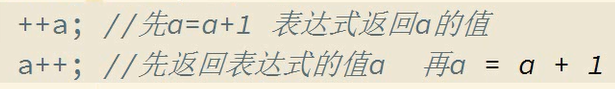

# a++ 与 ++a实例

---


```javascript
var a=1; var b= ++a + ++a; console.log(b); //5
var a=1; var b= ++a + a++; console.log(b); //4
var a=1; var b= a++ + ++a; console.log(b); //4
var a=1; var b= a++ + a++; console.log(b); //3
```




---

