# Temp

---


### 1、浏览器是如何工作的？


### 2、永远不要测试某个特定的浮点数值

不要判断两个浮点数是否相等。

~~~javascript
var a = 0.1;
var b = 0.2;
console.log(a + b);
console.log(a + b == 0.3);

console.log(0.07*100);
~~~

执行结果：

0.30000000000000004
false
7.000000000000001


### 3、


### 4、

~~~javascript
var b = 'abc' && 'def'; console.log(b); //def
var b = 'abc' && undefined; console.log(b); //undefined
var b = undefined && 'def'; console.log(b); //undefined
var b = undefined && null; console.log(b); //undefined

var b = 'abc' || 'def'; console.log(b); //abc
var b = 'abc' || undefined; console.log(b); //abc
var b = undefined || 'def'; console.log(b); //def
var b = undefined || null; console.log(b); //null
~~~


### 5、

使用innerHTML清空元素的内容，绑定的事件不会清除，应使用remove。

~~~javascript
//window 的 name 属性
var name = 123;
console.log(typeof name); //string

var name = {};
console.log(typeof name); //string
~~~


~~~javascript
//window的 top 属性，只读
var top = 123;
console.log(typeof top); //object

'use strict'
var top = 123;
console.log(typeof top);
//Uncaught TypeError: Cannot assign to read only property 'top' of object '#<Window>'
~~~


~~~javascript
//阻塞onunload
window.onunload = function(){
    alert('123');
};
//刷新页面可看到效果
~~~


### 6、拖拽示例

~~~html
<html>
    <head>
        <style>
            #box{width:100px;height:100px;border:1px solid red;position:absolute;cursor:move;user-select:none;}
        </style>
    </head>
    <body>
        <div id="box">Drag me</div>
    </body>
    <script>
        var box = document.getElementById('box');
        box.onmousedown = function(e){
            e = e || window.event;
            //鼠标距box顶点距离 = 鼠标距页面顶点距离 - box距离页面顶点距离
            var x = e.pageX - box.offsetLeft;
            var y = e.pageY - box.offsetTop;
            document.onmousemove = function(e){
                e = e || window.event;
                box.style.left = (e.pageX - x) + 'px';
                box.style.top = (e.pageY - y) + 'px';
            };
        };
        document.onmouseup = function(){ //mouseup要注册到document，否则可能无法取消mousemove.
            document.onmousemove = null;
        };
    </script>
</html>
~~~


### 7、obj.style只能获取元素的内联样式

~~~html
<!DOCTYPE html>
<html lang="en">
<head>
	<meta charset="UTF-8">
	<title>Document</title>
    <style>
        #myDiv{
            height: 100px;
            color: red;
        }
    </style>
	<script type="text/javascript">
        window.onload = function() {
            var divObj = document.getElementById('myDiv');
            divObj.style.width = '200px';
            divObj.style.fontSize = '14px';
            
            console.log(divObj.style.height); //无法获取
            console.log(divObj.style.color); //无法获取
        }
	</script>
</head>
<body>
	<div id="myDiv" style="width:100px;font-size:12px;border:1px solid blue;">DIV</div>
</body>
</html>
~~~


### 8、

onmouseover 、onmouseout

onmouseenter、onmouseleave:不会触发冒泡


### 9、原型三角图：

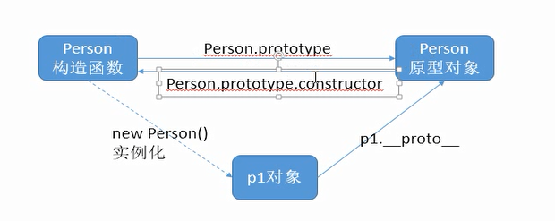


原型链：

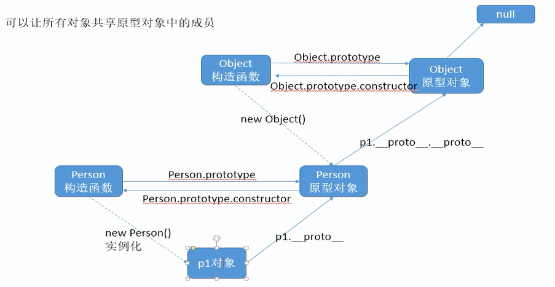


### 10、

~~~javascript
//构造函数
function Person(name, age){
    this.name = name;
    this.age = age;
}
//往原型添加type属性
Person.prototype.type = 'Chinese People';

var p1 = new Person('zhangsan', 21);
var p2 = new Person('lisi', 22);

//改变p1的type
p1.type = 'GuangDong People';

console.log(p1.type); //GuangDong People
console.log(p2.type); //Chinese People

//注：成员属性的读取会查找原型链，但设置属性不影响原型链

~~~


### 11、

~~~javascript
Array.prototype = {};

var arr = [];
console.dir(arr);
~~~

内置对象的prototype是只读的，在严格模式下修改会报错。

~~~javascript
'use strict';
Array.prototype = {}; //error
~~~


### 12、

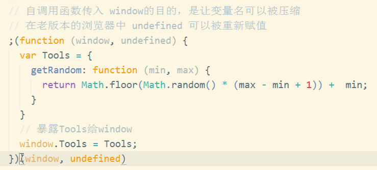

自调用函数前加；。

使用YUI Compressor等工具压缩代码时，如果自调用函数里用到了window对象，window这个变量名不能被压缩的。可以通过在参数上传进来，比如形参为w,从而简写变量名。同理，老版本浏览器undefined可以被修改，此时通过形参u传入，防止在自调用函数里面被篡改。

### 13、

~~~javascript
if(true) {
    function fn() {
        console.log('true');
    }
} else {
    function fn() {
        console.log('false');
    }
}

fn();
~~~

在IE8等老版本浏览器中，结果为false；在新版本浏览器则没有该问题。


### 14、

~~~javascript
function getRandom(){
    var r = Math.random() * 10 + 1;
    return function(){
        return r;
    }
}

var fn = getRandom();

console.log(fn());
console.log(fn());
console.log(fn());

~~~

这种形式能够保证每次得到的随机数都一样。


### 15、

~~~javascript
console.log('111');
for(var i=0; i<3; i++) {
    setTimeout(function() {
        console.log(i);
    }, 0);
}
console.log('222');
~~~


### 16、

~~~javascript
var name = 'The window';
var o = {
    name: 'The object',
    getNameFunc: function() {
        return function() {
            return this.name;
        }
    }
};

console.log(o.getNameFunc()()); //The window
~~~

~~~javascript
var name = 'The window';
var o = {
    name: 'The object',
    getNameFunc: function() {
        var that = this;
        return function() {
            return that.name;
        }
    }
};

console.log(o.getNameFunc()()); //The object
~~~


### 17、


### 18、++a与a++

```javascript
var a=1; var b= ++a + ++a; console.log(b); //5
var a=1; var b= ++a + a++; console.log(b); //4
var a=1; var b= a++ + ++a; console.log(b); //4
var a=1; var b= a++ + a++; console.log(b); //3
```

++a; //先a = a + 1, 表达式返回a的值

a++; //先返回表达式的值a,再 a = a + 1


### 19、数组length属性

~~~javascript
var arr = [1,2,3,4,5,6,7,8];
console.log(arr); //[1,2,3,4,5,6,7,8]

arr.length=1;
console.log(arr); //[1]

arr.length=8;
console.log(arr); //[1]

~~~


### 20 、JavaScript函数不存在重载

~~~javascript
function f1(a, b){
    console.log(a+b);
}

function f1(a, b, c){
    console.log(a+b+c);
}

f1(1, 2); //NaN
~~~

带3个参数的f1会覆盖掉2个参数的f1，所以调用f1函数会执行a+b+c，即1+2+undefined，所以为NaN。


### 21、函数声明与函数表达式

函数声明

```javascript
fun();
function fun(){
    console.log('hello world');
}

//运行结果
hello world
```


函数表达式

```javascript
fun();
var fun = function(){
    console.log('hello world');
};

//运行结果
Uncaught TypeError: fun is not a function
```


### 22、变量作用域的一个问题

~~~javascript
var num = 10;
f();
function f(){
    console.log(num);
    var num = 20;
}

//运行结果
undefined
~~~


~~~javascript
f();
console.log(c);
console.log(b);
console.log(a);
function f(){
    var a=b=c=9;
    console.log(a);
	console.log(b);
	console.log(c);
}

//运行结果
9
9
9
9
9
Uncaught ReferenceError: a is not defined

//关键在于第6行：var a=b=c=9;
//预解析的时候是不包含赋值过程的，所以
//var a=b=c=9 预解析后，变成如下：
//var a;
//a=b=c=9;
//所以b、c都提升为了全局变量
~~~


### 23、创建对象

~~~javascript
function createPerson(name, age){
    var person = new Object();
    person.name = name;
    person.age = age;
    person.say = function(){
        console.log('Hi, this is ' + this.name);
    }
    return person;
}
~~~


~~~javascript
function Person(name, age){
    this.name = name;
    this.age = age;
    this.say = function(){
        console.log('Hi, this is ' + this.name);
    }
}
~~~


### 24、基本类型与引用类型作为参数

~~~javascript
var x = 10;
function f(x){
    x = 20;
}
f(x);
console.log(x);

//运行结果
10
~~~


~~~javascript
var obj = {x: 10};
function f(obj){
    obj.x = 20;
}
f(obj);
console.log(obj.x);

//运行结果
20
~~~


### 25、

ASCII：使用一个字节的7位来表示；

Unicode：使用两个字节来表示；

GB2312：使用两个字节表示一个汉字；

UTF-8：与ASCII重合的部分用一个字节，汉字使用3个字节。


26、

~~~javascript
//浅拷贝
var obj = {
    name: 'zs',
    age: 13,
    b: false,
    car: {name: 'zzss'},
    copy: function() {
        var tmp = {};
        for(var key in this) {
            tmp[key] = this[key];
        }
        return tmp;
    }
};

var copyObj = obj.copy();
~~~

~~~javascript
//深拷贝
function copy() {
    var tmp = {};
    for(var key in this) {
        if(typeof this[key] === 'object') {
            tmp[key] = this[key].copy();
        } else {
            tmp[key] = this[key];
        }
    }
    return tmp;
}

var car = {
    name: 'zzss',
    copy: copy
};

var obj = {
    name: 'zs',
    age: 13,
    b: false,
    car: car,
    copy: copy
};

var copyObj = obj.copy();
~~~


27、

window.onload：当页面，包括引入的js、css、图片加载完成时执行；

JQuery.ready()：页面DOM结构加载完成时执行。


28、

~~~javascript
function inherit(obj) {
    if(Object.create) {
        return Object.create(obj);
    } else {
        function P() {}
        P.prototype = obj;
        return new P();
    }
}
~~~


29、

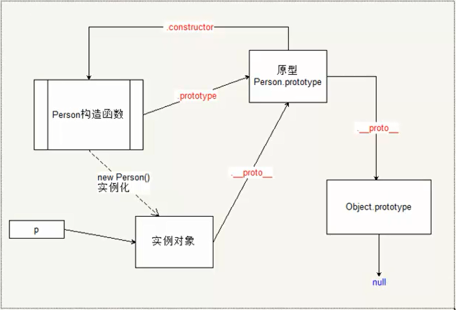


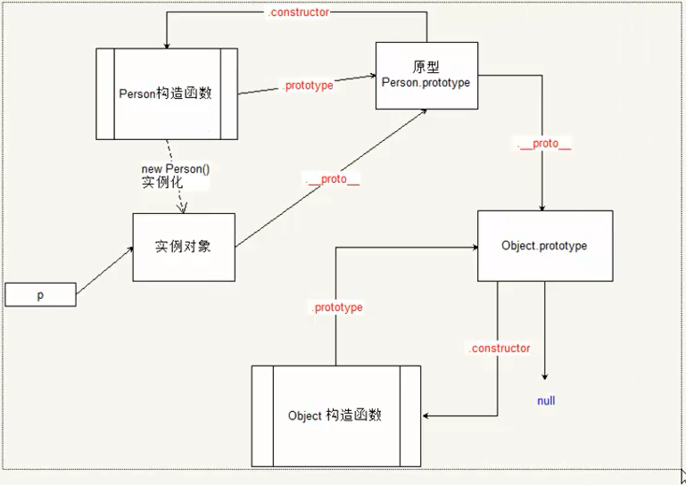


30、

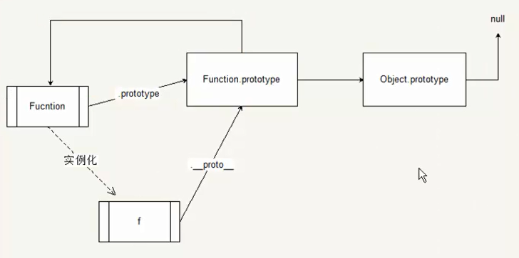


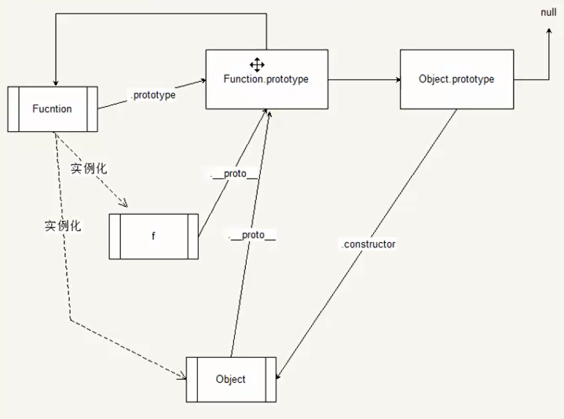

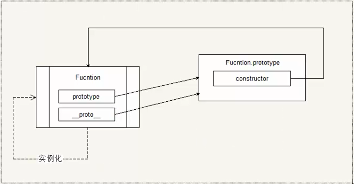

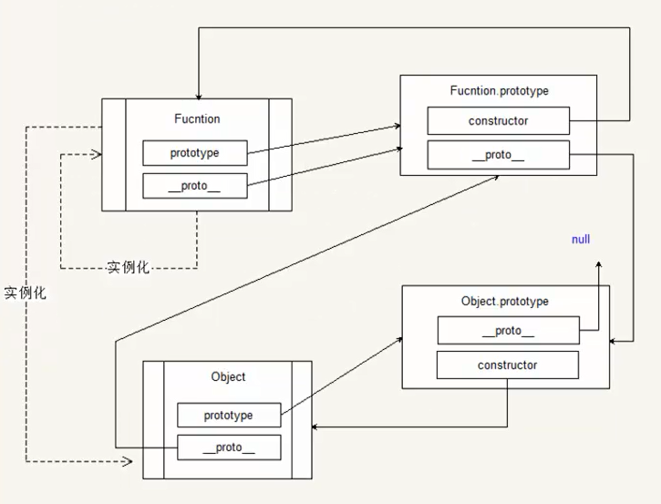

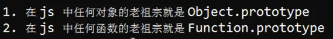


31、

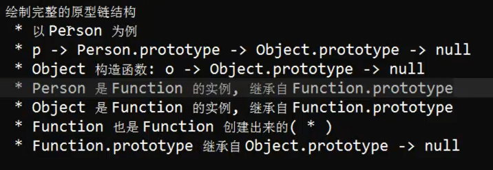

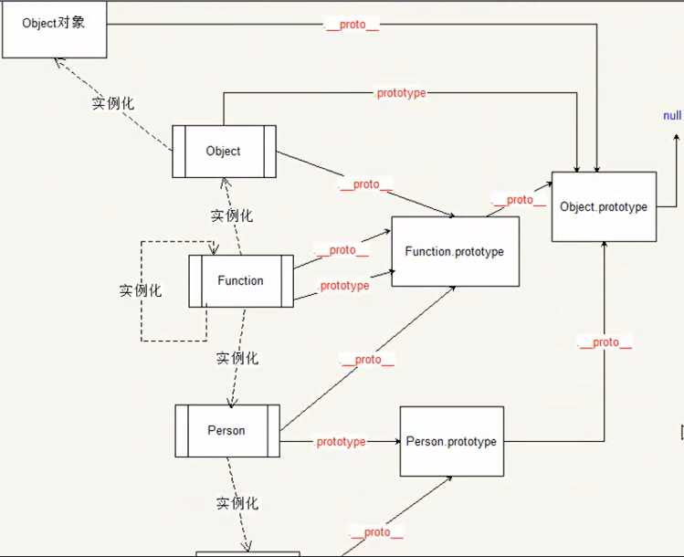


32、

~~~javascript
var o = eval('{name: "zs", age: 12}'); //error
var o = eval('{name: "zs"}'); //o='zs'
// 大括号没有解析为对象，当做代码块了，应加上()
var o = eval('({name: "zs", age: 12})');
~~~


33、

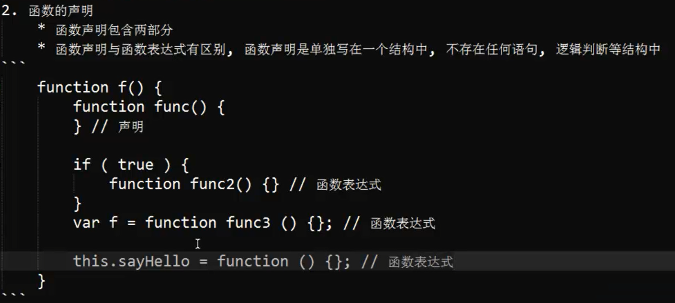


34、

~~~javascript
var num = 1;
function num() {
    console.log(num);
}
num(); //Uncaught TypeError: num is not a function

//相当于
var num;
function num() { console.log(num);} //此时num指向function
num = 1; //num重新赋值为1
num();
~~~


35、

~~~javascript
if(! 'a' in window) {
    var a = 123;
}
console.log(a); //undefined
~~~


36、

~~~javascript
var func = function foo() {};
foo(); //error 只能在函数体内使用

(function foo(){})
foo(); //error 括号()会将函数声明变成表达式
~~~


37、

~~~javascript
var num = 123;
function f1() {
    console.log(num);
}

function f2() {
    var num = 456;
    f1();
}

f2(); //123;
~~~


38、

~~~javascript
var each = function(arr, callback) {
    for(var i = 0; i < arr.length; i++) {
        if(callback.call(arr[i], i, arr[i]) === false) {
            break;
        }
    }
};

var arr = [1,2,3,5,4,3,6,7];
each(arr, function(index, value) {
    if(value === 3) {
        return false; //定义跳出标志.
    }
});

each(arr, function(index, value) {
    console.log(this); //能使用this.
});
~~~


39、

做能力检测，如果在调用的时候才做，则每调用一次就检测一次，会影响性能（比如会去搜索原型链）；

解决方法是在加载代码预解析时检测

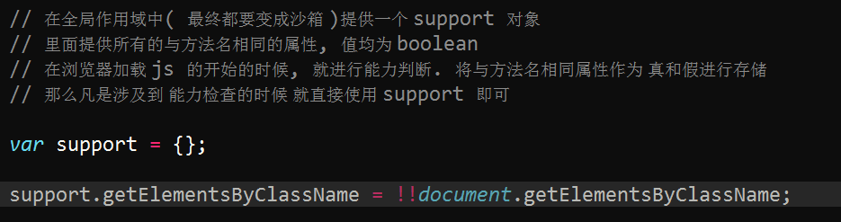

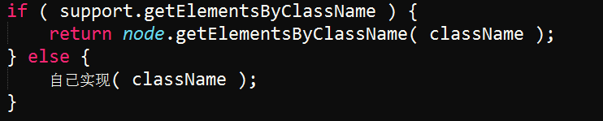


单单检测方法是否存在还不足够，还要检测该方法是否符合要求，比如，对于恶意修改

`document.getElementsByClassName = 123;` 检测存在为真，但是并不符合要求。

可以使用模拟的方式来检测（JQuery实现原理）

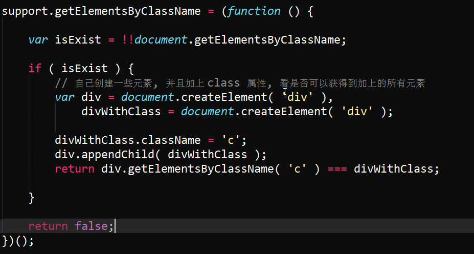


40、

~~~javascript
// <div id="id" class="c1 c2 c3"></div>
var className = 'c';
document.getElementById('id').className.indexOf(className) !== -1; //true, 但不符合

(' '+document.getElementById('id').className+' ').indexOf(' '+className+' ') !== -1; //false

className = 'c2';
(' '+document.getElementById('id').className+' ').indexOf(' '+className+' ') !== -1; //true
~~~


41、


---


