# MySQL性能管理及架构设计

---

### 

### 影响MySQL性能的因素

1、影响性能的几个方面

* 服务器硬件：CPU、内存、磁盘IO、网络；
* 服务器系统；
* 数据库存储引擎的选择：（1）MyISAM：不支持事务，表级锁；（2）InnoDB：支持事务，完美支持行级锁；
* 数据库参数配置（影响较前几项大）；
* 数据库结构设计和SQL语句（慢查询）；

2、CPU

我们是需要频率更高的CPU还是数量更多的CPU？

* 应用是CPU密集型的吗？需要更好的CPU（频率更高的）而不是数量更多；
* 系统的并发量如何？并发高，需要数量更多的CPU；
* 一般情况下，对Web类应用而言，核心数量比频率更重要；
* 老版本MySQL对多核CPU的支持不太好，因此还要考虑MySQL的版本问题；
* 64位系统使用了32位的服务器版本；

> 当前版本的MySQL不支持多CPU对同一SQL的并发处理。

3、内存

* MyISAM：将索引缓存到内存，数据通过操作系统进行缓存；
* InnoDB：同时在内存中缓存索引和数据；
* 内存越多越好，但是并不能通过增加内存无限制地提高性能；
* 当内存的大小与数据文件相近，即足够缓存数据文件时，大小就已经符合了；
* 多余出来的内存虽然对数据库性能提升不大，但是可以提高系统其它服务的性能，进而提高服务器整体的性能；
* 内存主频选择主板能支持的最高频率，每个通道的类型应保证相同；

4、IO子系统

1）传统机械磁盘

特点：价格低、存储空间大，但是读写较慢；

如何选择传统机械硬盘？考虑如下因素：

* 存储容量
* 传输速度
* 访问时间
* 主轴转速
* 物理尺寸

2）RAID

磁盘冗余队列（Redundant Arrays of Independent Disks），就是可以把多个容量较小的磁盘组合成一组容量更大的磁盘，并提供数据冗余来保证数据完整性的技术。

* RAID 0：也称为数据条带，只需2块以上的磁盘串联起来即可，成本低，可以提高整个磁盘的性能和吞吐量；但是没有提供冗余或错误修复能力；

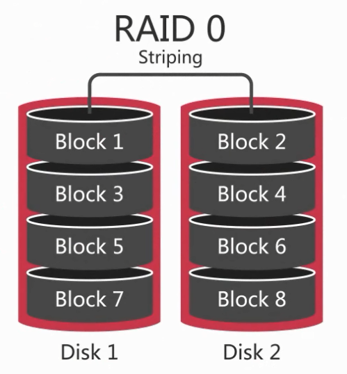

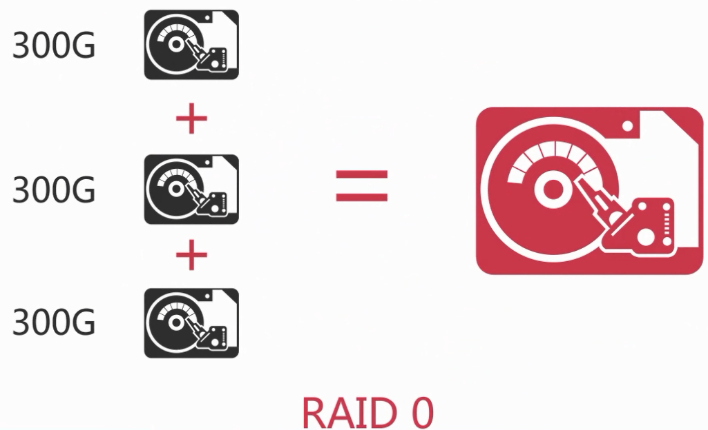

* RAID 1：又称为磁盘镜像，原理是把一个磁盘的数据镜像到另一个磁盘，能最大限度的保证系统的可靠性和可修复性；

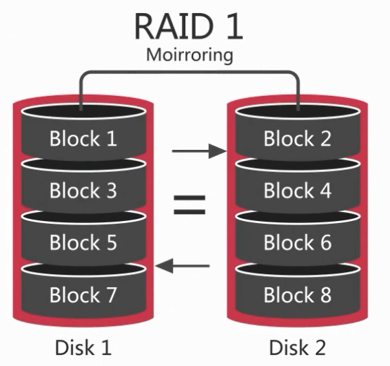

* RAID 5：分布式奇偶校验；通过分布式奇偶校验块把数据分散到多个磁盘上，这样任何一个磁盘数据失效，都可以奇偶校验块中重建；但是如果两个磁盘失效，则整个卷的数据都无法恢复；

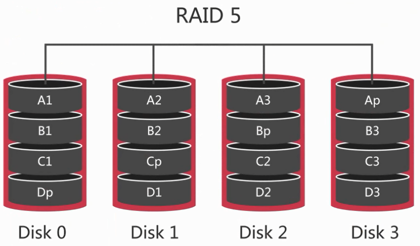

* RAID 10：又称分片的镜像；是对磁盘先做RAID1之后对两组RAID1的磁盘再做RAID0，所以对读写都有良好的性能，相对于RAID5重建起来更简单，速度也更快；

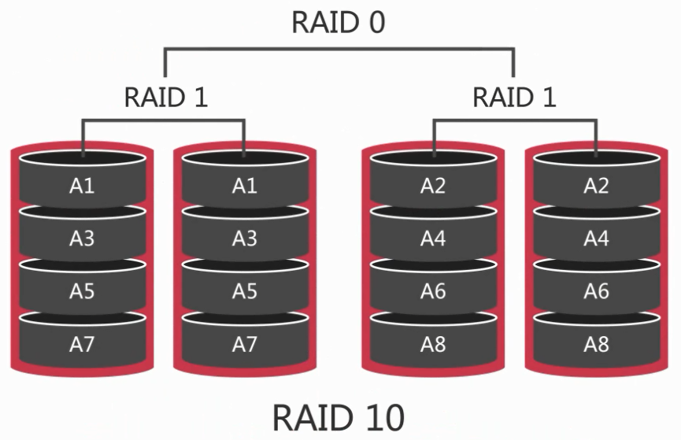

对比与选择：

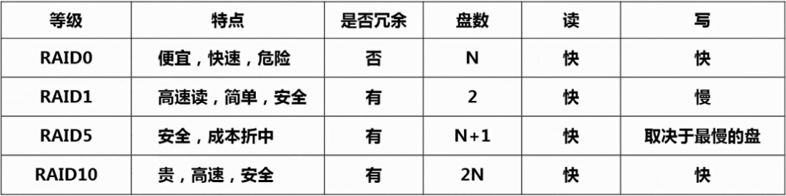

3）固态存储SSD、PCIe卡

特点：

* 相比机械硬盘有更好的随机读写性能；
* 更好地支持并发；
* 但是相比更容易损坏；

使用场景：

* 适用于存在大量随机IO的场景；
* 适用于解决单线程负载的IO瓶颈；

4）网络存储SAN和NAS

SAN（Storage Area Network）和NAS（Network-Attached Storage）是两种外部文件存储设备加载到服务器上的方法。

适用场景：数据库备份

5、网络

网络延迟、网络带宽、网络质量

* 采用高性能和高带宽的网络接口设备和交换机；
* 对多个网卡进行绑定，增强可用性和带宽；
* 尽可能地进行网络隔离；

6、硬件方面总结

1）CPU

* 64位CPU一定要工作在64位的系统下；
* 对于并发比较高的场景CPU的数量比频率重要；
* 对于CPU密集型场景和复杂SQL则频率越高越好；

2）内存

* 选择主板所能使用的最高频率的内存；
* 内存的大小对性能很重要，所以尽可能大；

3）IO子系统

PCIe->SSD->RAID10->磁盘->SAN

7、操作系统

8、存储引擎

9、数据库参数配置

### MySQL基准测试

### MySQL数据库结构优化

### MySQL高可用架构设计

### 数据库索引优化

MySQL支持的索引类型：B-tree索引、Hash索引。

1、B-tree索引

1）B-tree索引的特点：

* B-tree索引以B+树的结构存储数据；

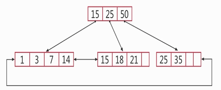

* B-tree索引能够加快数据的查询速度；
* B-tree索引更适合进行范围查找；

2）在什么情况下可以用到B-tree索引？

* 全值匹配的查询；
* 匹配最左前缀的查询；
* 匹配列前缀查询；
* 匹配范围值的查询；
* 精确匹配左前列并范围匹配另外一列；
* 只访问索引的查询；

3）B-tree索引的使用限制：

* 如果不是按照索引最左列开始查找，则无法使用索引；
* 使用索引时不能跳过索引中的列；
* not in和`<>`操作无法使用索引；
* 如果查询中有某个列的范围查询，则其右边所有列都无法使用索引；

2、Hash索引

1）Hash索引的特点：

* Hash索引是基于Hash表实现的，只有查询条件精确匹配Hash索引中的所有列时，才能够使用到Hash索引；
* 对于Hash索引中的所有列，存储引擎都会为每一行计算一个Hash码，Hash索引中存储的就是Hash码；

2）Hash索引的限制

* Hash索引必须进行二次查找；
* Hash索引无法用于排序；
* Hash索引不支持部分索引查找也不支持范围查找；
* Hash索引中Hash码的计算可能存在Hash冲突；

3、为什么要使用索引？

* 索引大大减少了存储引擎需要扫描的数据量；
* 索引可以帮助我们进行排序以避免使用临时表；
* 索引可以把随机IO变成顺序IO；

4、索引不是越多越好

* 索引会增加写操作的成本；
* 太多的索引会增加查询优化器的选择时间；

5、索引优化策略

1）索引列上不能使用表达式或函数

~~~sql
select * from product where to_days(out_date)-to_days(current_date) <= 30;

select * from product where out_date<=date_add(current_date, interval 30 day);
~~~

2）前缀索引和索引列的选择性

~~~sql
create index index_name on table(col_name(n));
~~~

索引的选择性是不重复的索引值和表的记录数的比值；

3）联合索引：如何选择索引列的顺序？

* 经常会被使用到的列优先；
* 选择性高的列优先；
* 宽度小的列优先；

4）覆盖索引

4.1）优点

* 可以优化缓存，减少磁盘IO操作；
* 可以减少随机IO，将随机IO变为顺序IO操作；
* 可以避免对InnoDB主键索引的二次查询；
* 可以避免MyISAM表进行系统调用；

4.2）无法使用覆盖索引的情况

* 存储引擎不支持覆盖索引；
* 查询中使用了太多的列；
* 使用了双%和like的查询；

6、使用索引来优化查询

1）使用索引扫描来优化排序

通过排序操作，按照索引顺序扫描数据；

* 索引的列顺序和order by子句的顺序完全一致；
* 索引中所有列的方向（升序，降序）和order by子句完全一致；
* order by中的字段全部在关联表中的第一张表中；

2）模拟Hash索引优化查询

* 只能处理键值的全值匹配查找；
* 所使用的Hash函数决定着索引键的大小；

3）利用索引优化锁

* 索引可以减少锁定的行数；
* 索引可以加快处理速度，同时也加快了锁的释放；

7、索引的维护与优化

1）删除重复和冗余的索引

使用工具检测：

~~~plaintext
pt-duplicate-key-checker h=127.0.0.1
~~~

2）查找未被使用过的索引

~~~sql
select object_schema, object_name, index_name, b.`table_rows` 
from performance_schema.table_io_waits_summary_by_index_usage a 
join information_schema.tables b on a.object_schema=b.table_schema and a.object_name=b.table_name 
where index_name is not null and count_star=0 
order by object_schema, object_name;
~~~

3）更新索引统计信息及减少索引碎片

~~~plaintext
analyze table table_name;

optimize table table_name;
~~~

### SQL查询优化

查询优化、索引优化、库表结构优化需要齐头并进。

* 如何设计最优的数据库表结构；
* 如何建立最好的索引；
* 如何扩展数据库的查询；

1、获取存在性能问题SQL的方式

* 通过用户反馈获取存在性能问题的SQL；
* 通过慢查询日志获取存在性能问题的SQL；
* 实时获取存在性能问题的SQL；

2、慢查询日志

1）相关参数：

* slow_query_log：on/off，启动停止记录慢查日志，可通过脚本定时开关；
* slow_query_log_file：指定慢查日志的存储路径，默认保存在MySQL的数据目录中，建议分开存储；
* long_query_time：指定记录慢查日志SQL执行时间的阈值，默认值为10秒；
* log_queries_not_using_indexes：是否记录未使用索引的SQL；

2）慢查询日志中的内容：

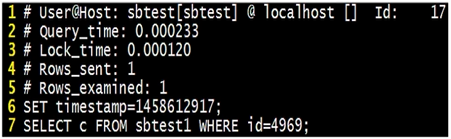

3）常用的慢查询日志分析工具：

* mysqldumpslow

~~~plaintext
mysqldumpslow -s r -t 10 slow-mysql.log

-s:指定按哪种排序方式输出结果
  c：总次数
  t：总时间
  l：锁的时间
  r：总数据行
  at、al、ar：t、l、r的平均数
-t：指定取前几条作为结束输出
~~~

* pt-query-digest

~~~plaintext
pt-query-digest --explain h=127.0.0.1,u=root,p=password slow-mysql.log
~~~

3、实时获取存在性能问题的SQL

~~~sql
select id, `user`, `host`, DB, command, `time`, state, info 
from information_schema.PROCESSLIST 
where TIME >= 60
~~~

4、SQL的各个处理阶段

1）查询速度为什么会慢

处理查询请求的过程：

* 客户端发送SQL请求给服务端；
* 服务器检查是否可以在查询缓存中命中该SQL；
* 服务器端进行SQL解析、预处理，再由优化器生成对应的执行计划；
* 根据执行计划，调用存储引擎API来查询数据；
* 将结果返回给客户端；

2）查询缓存对SQL性能的影响

* 优先检查这个查询是否命中查询缓存中的数据；
* 要从查询缓存中返回结果数据并不容易；
* 对于一个读写频繁的系统使用查询缓存很可能会降低查询处理的效率；

参数设置：

* query_cache_type：on/off/demand，设置查询缓存是否可用；
* query_cache_size：设置查询缓存的内存大小；
* query_cache_limit：设置查询缓存可用缓存的最大值；
* query_cache_wlock_invalidate：设置数据表被锁后是否返回缓存中的数据；
* query_cache_min_res_unit：设置查询缓存分配的内存块最小单位；

3）SQL的解析预处理及生成执行计划

造成MySQL生成错误执行计划的原因：

* 统计信息不准确；
* 执行计划中的成本估算不等同于实际执行计划的成本；
* MySQL优化器所认为的最优可能与你所认为的最优不一样；
* MySQL从不考虑其它并发的查询，这可能会影响当前查询的速度；
* MySQL有时候也会基于一些固定的规则来生成执行计划；
* MySQL不会考虑不受其控制的成本，如存储过程、用户自定义的函数；

4）MySQL优化器可优化的SQL类型

* 重新定义表的关联顺序；
* 将外连接转换成内连接；
* 使用等价变换规则；
* 优化count()、min()和max()；
* 将一个表达式转化为常数表达式；
* 子查询优化，如子查询转换为关联查询；
* 提前终止查询；
* 对in()条件进行优化；

5、如何确定查询处理各阶段所消耗的时间

1）profile

~~~sql
-- 启动profile
set profiling=1;

-- 执行查询

-- 查看总的消耗时间
show profiles;

-- 查看每个阶段所消耗的时间
show profile for query N;
~~~

2）performance_schema

~~~sql
-- 开启
update `setup_instruments` set enabled='YES',TIMED='YES' where name like 'stage%';
update setup_consumers set enabled='YES' where name like 'events%';

-- 查看
select 
	a.thread_id, 
	sql_text, 
	c.event_name, 
	(c.timer_end - c.timer_start)/1000000000 as 'duration(ms)' 
from events_statements_history_long a 
join threads b on a.thread_id=b.thread_id 
join events_stages_history_long c on c.thread_id=b.thread_id and c.event_id between a.event_id and a.end_event_id 
where b.processlist_id=connection_id() and a.event_name='statement/sql/select' 
order by a.thread_id, c.event_id 
~~~

6、特定SQL的查询优化

1）大表的更新\删除需要分批处理

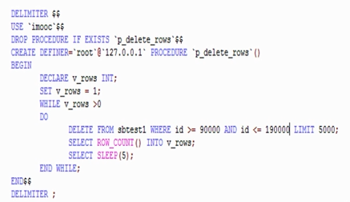

2）大表的表结构修改

* 主从切换：先在从服务器上修改，再把从切换为主，把主切换为从；但是切换有风险；
* 在主服务器新建一张表，再把就表数据复制过去；

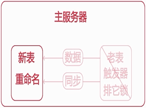

* 使用工具pt-online-schema-change

~~~plaintext
pt-online-schema-change --alter="modify c varchar(150) not null default ''" --user=root --password=pass D=mydb,t=mytab --charset=utf8 --execute
~~~

3）如何优化not in和`<>`查询

~~~sql
select customer_id, first_name, last_name, email 
from custom 
where customer_id not in(select customer_id from payment);

select a.customer_id, a.first_name, a.last_name, a.email 
from custom a 
left join payment b on b.customer_id=a.customer_id 
where b.customer_id is null
~~~

4）使用汇总表优化查询

~~~sql
select count(*) from product_comment where product_id=999;

create table product_comment_cnt(product_id int, cnt int);
-- 每天定时同步
select sum(cnt) from ( 
	select cnt from product_comment_cnt where product_id=999 
	union all 
	select count(*) from product_comment where product_id=999 and timestr>DATE(NOW()) 
) a;
~~~

### 数据库的分库分表

1、数据库分库分表的几种方式

1）把一个实例中的多个数据库拆分到不同的实例；

* 优点：拆分较简单；
* 缺点：如果压力本来就集中在某个库（如订单库），拆分起不到作用；

2）把一个库中的表分离到不同的数据库中；

3）对一个库中的相关表进行水平拆分到不同实例的数据库中（分片）；

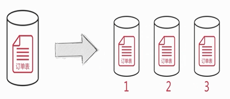

2、数据库分片

1）如何选择分区键

* 分区键要能尽量避免跨分片查询的发生；
* 分区键要能尽量使各个分片中的数据平均；

2）如何存储无需分片的表

* 每个分片中存储一份相同的数据；
* 使用额外的节点统一存储；

3）如何在节点上部署分片

* 每个分片使用单一数据库，并且数据库名也相同；
* 将多个分片表存储在一个数据库中，并在表名上加入分片号后缀；
* 在一个节点中部署多个数据库，每个数据库包含一个分片；

4）如何分配分片中的数据

* 按分区键的Hash值取模来分配分片数据；
* 按分区键的范围来分配分片数据；
* 利用分区键和分片的映射表来分配分片数据；

5）如何生成全局唯一ID

* 使用auto_increment_increment和auto_increment_offset参数；
* 使用全局节点来生成ID；
* 在Redis等缓存服务器中创建全局ID；

3、案例

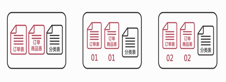

### 数据库监控

1、对什么进行监控？

1）对数据库服务可用性进行监控：

* 数据库进程或端口存在，并不意味着数据库就是可用的；
* 通过网络连接到数据库并且确定数据库是可以对外提供服务的；

2）对数据库性能进行监控：

* QPS和TPS；
* 并发线程数量；
* 如何对InnoDB阻塞和死锁进行监控；

3）对主从复制进行监控：

* 主从复制链路状态的监控；
* 主从复制延迟的监控；
* 定期的确认主从复制的数据是否一致；

4）对服务器资源的监控：

* 磁盘空间：磁盘空间大并不意味着MySQL服务所能使用的空间足够大；
* CPU、内存、Swap分区的使用情况以及网络IO的情况；

2、数据库可用性监控

1）如何确认数据库是否可以通过网络连接？

* mysqladmin -umonitor_user -p -h ping；
* telnet ip db_port；
* 使用程序通过网络建立数据库连接；

2）如何确认数据库是否可读写？

* 检查数据库的read_only参数是否为off；定期对主从服务器中的主数据库的这个参数进行检查；
* 建立监控表并对表中数据进行更新；
* 执行简单的查询：select @@version；

3）如何监控数据库的连接数？

* 时刻关注数据库连接数量的变化；
* show variables like 'max_connections'；
* show global status like 'Threads_connected'；
* 使用百分比进行报警：如 Threads_connected/max_connections > 0.8；

3、数据库性能监控

记录性能监控过程中所采集到的数据库状态。

1）如何计算QPS和TPS？

* QPS = (Queries2-Queries1)/(Uptime_since_flush_status2-Uptime_since_flush_status1)；
* TPS = ((Com_insert2+Com_update2+Com_delete2) - (Com_insert1+Com_update1+Com_delete1))/(Uptime_since_flush_status2-Uptime_since_flush_status1)；

2）如何监控数据库的并发请求数量？

* 数据库系统的性能会随着并发处理请求数量的增加而下降；
* show global status like 'Threads_running'；
* 并发处理的数量通常会远小于同一时间连接到数据库的线程数量；

3）如何监控InnoDB的阻塞？

~~~sql
select 
	b.trx_mysql_thread_id as '被阻塞线程', 
	b.trx_query as '被阻塞SQL', 
	c.trx_mysql_thread_id as '阻塞线程', 
	c.trx_query as '阻塞SQL', 
	(UNIX_TIMESTAMP() - UNIX_TIMESTAMP(c.trx_started)) as '阻塞时间' 
from information_schema.innodb_lock_waits a 
join information_schema.innodb_trx b on b.trx_id=a.requesting_trx_id 
join information_schema.innodb_trx c on c.trx_id=a.blocking_trx_id 
--where (UNIX_TIMESTAMP() - UNIX_TIMESTAMP(c.trx_started)) > 60 
~~~

4、主从复制监控

1）如何监控主从复制链路的状态？

* show slave status；

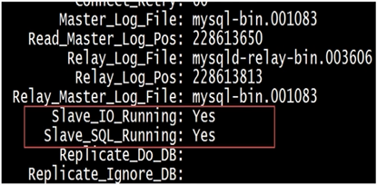

2）如何监控主从复制延迟？

2.1）show slave status；

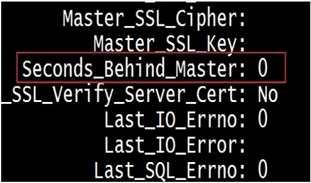

2.2）主服务器上的二进制日志文件名和偏移量：

* show master status；

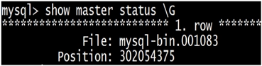

* show slave status；

* 已经传输完成的主服务器上的二进制日志文件名和偏移量：

3）如何验证主从复制的数据是否一致？

* 当每次修复完主从复制，都要检查主从复制数据的一致性；
* pt-table-checksum工具；

~~~plaintext
-- 主库下执行即可
pt-table-checksum u=dba,p='mypassword' --databases mysql --replicate test.checksums
~~~

   

---

