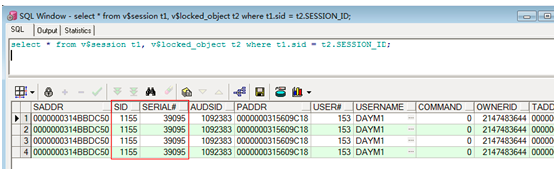

# Oracle 锁表与解锁

---

1、查看锁表进程的SQL语句：

~~~sql
SELECT * FROM v$session t1, v$locked_object t2 WHERE t1.sid = t2.SESSION_ID; 
~~~

2、解锁

根据记录下的SID和serial# ，杀掉锁表进程，即可解除锁定：

~~~sql
--alter system kill session '{SID},{serial#}';
alter system kill session '1155,39095';
~~~

   

---

