# Spring快速入门教程

---

### 1、Spring概念

* Spring是开源的轻量级框架。
* Spring核心主要分为两部分。
  * AOP：面向切面编程，即扩展功能不是通过修改源码实现。
  * IoC：控制反转。比如有一个类，在类里面有方法（不是静态的方法），要调用里面的方法，传统的做法是创建类的对象，使用对象调用方法。创建类对象的过程，需要使用new关键字。在IoC对象的创建不是通过new方式实现，而是交给Spring创建类的对象。
* Spring是一站式框架，在JavaEE三层结构中，每一层都提供不同的解决方案。
  * web层：SpringMVC
  * service层：Spring的IoC
  * dao层：Spring的jdbcTemplate

### 2、Spring的IOC操作

* IOC底层使用技术

  * XML配置文件
  * DOM4J解析XML
  * 工厂设计模式
  * 反射

* 图解IOC实现原理

  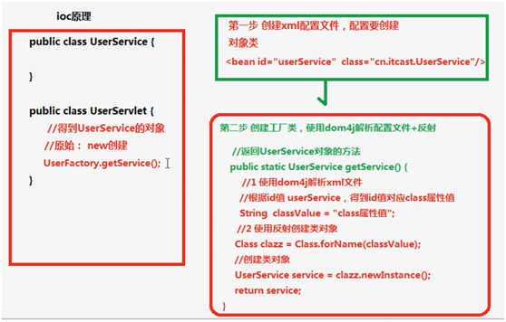

* IOC操作的两种方式

  * IOC的配置文件方式
  * IOC的注解方式

代码实现：

第一步：导入jar包

使用Spring最基本功能的时候，导入4个核心的jar包就可以了。同时也要导入支持日志输出的jar包。

第二步：创建实体类

~~~java
package cn.seasand.code;
public class User{
    public void sayHi(){
        System.out.println("hello spring!");
    }
}
~~~

第三步：创建Spring配置文件，配置创建类

Spring核心配置文件名称和位置不是固定的，建议放到src下，并命名为applicationContext.xml。

~~~xml
<?xml version="1.0" encoding="UTF-8"?>
<beans xmlns="http://www.springframework.org/schema/beans" 
	xmlns:xsi="http://www.w3.org/2001/XMLSchema-instance" 
	xsi:schemaLocation="http://www.springframework.org/schema/beans http://www.springframework.org/schema/beans/spring-beans-3.0.xsd">

	<bean id="user" class="cn.seasand.code.User"></bean>
</beans>
~~~

第四步：测试

~~~java
public void test() {
	ApplicationContext context = new ClassPathXmlApplicationContext("applicationContext.xml");
	User user = (User) context.getBean("user");
	System.out.println(user);
    user.sayHi();
}
~~~

### 3、Bean的实例化方式

* 第一种 使用类的无参构造函数
* 第二种 使用静态工厂创建
* 第三种 使用实例工厂创建

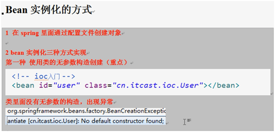

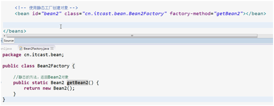

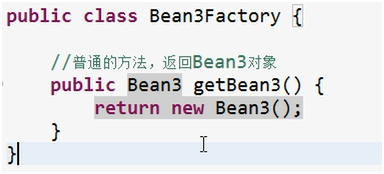

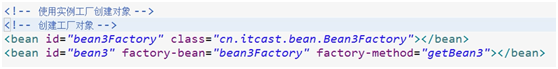

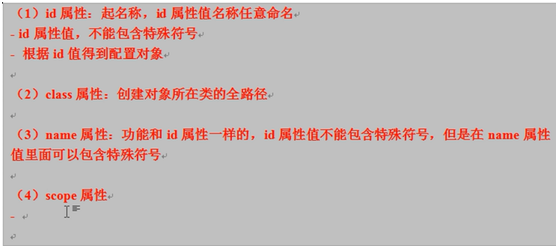

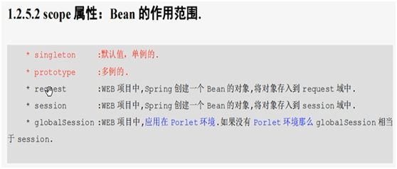

### 4、属性注入

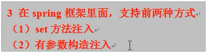

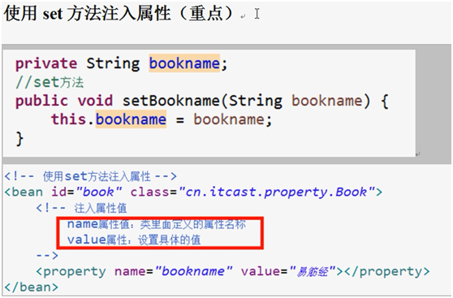

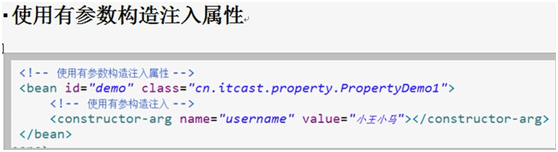

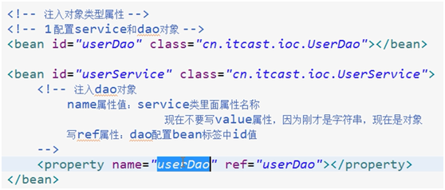

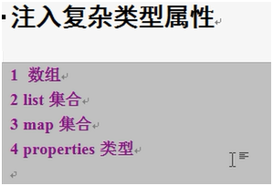

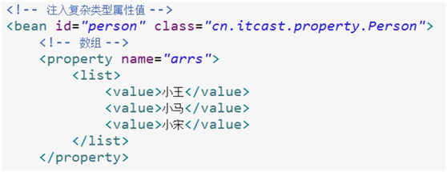

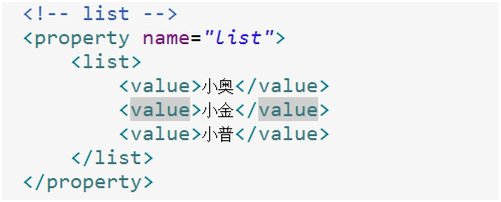

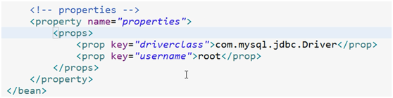

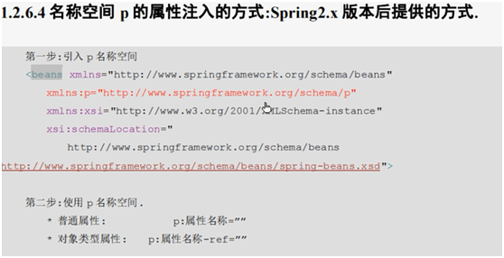

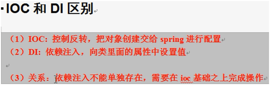

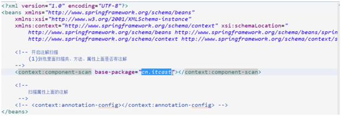

可以指定多个包路径，用逗号分隔；或者指定其父级包路径；

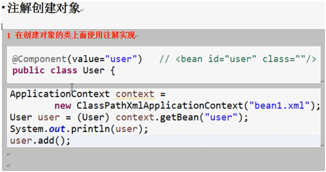

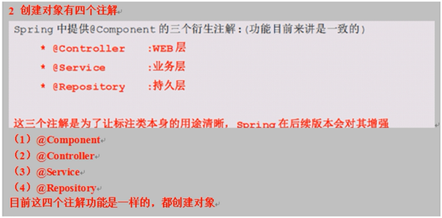

autowired是根据类名找到类的对象的；resource根据name能准确找到value指定对应的对象；

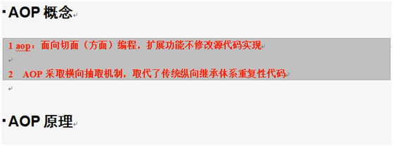

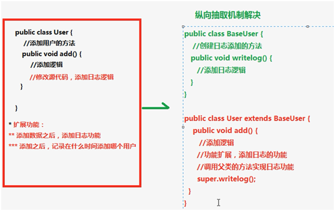

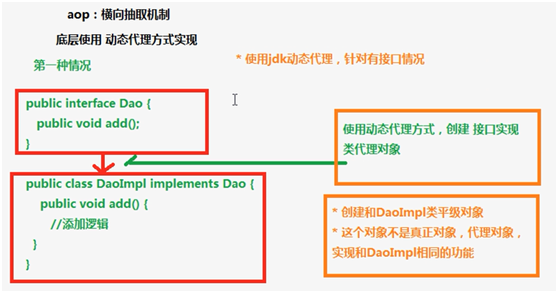

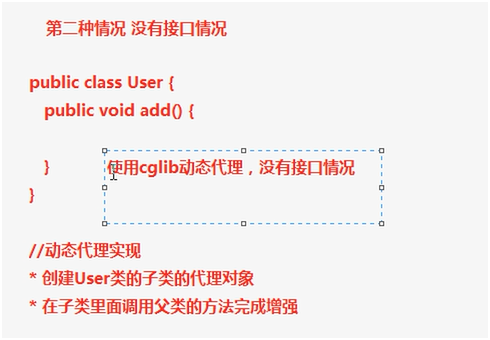

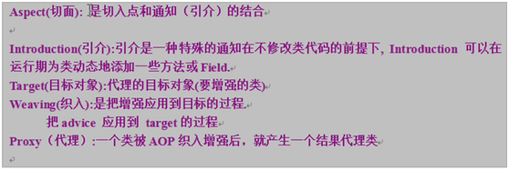

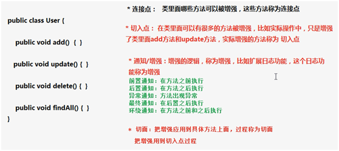

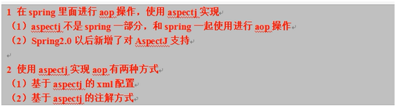

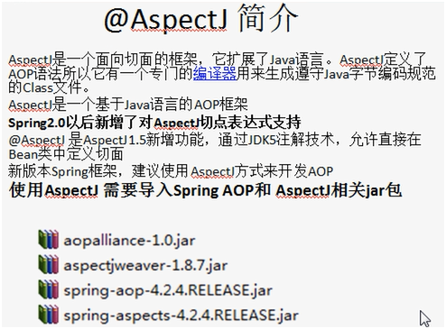

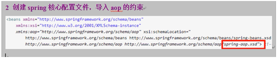

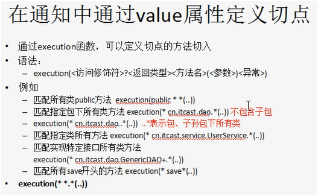

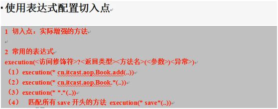

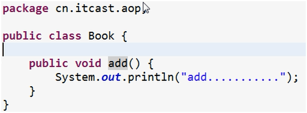

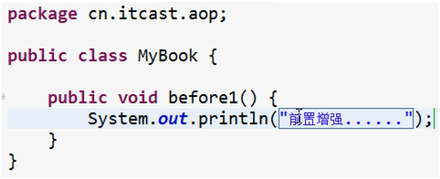

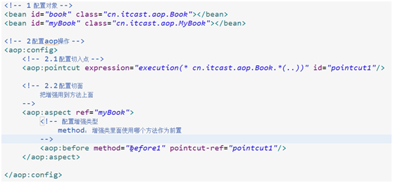

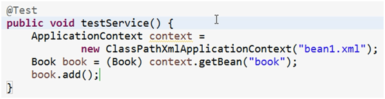

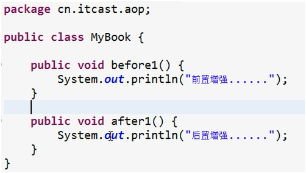

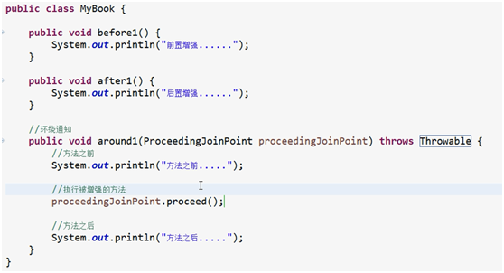

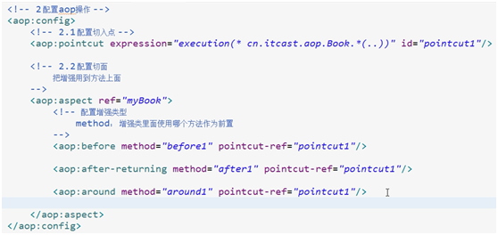

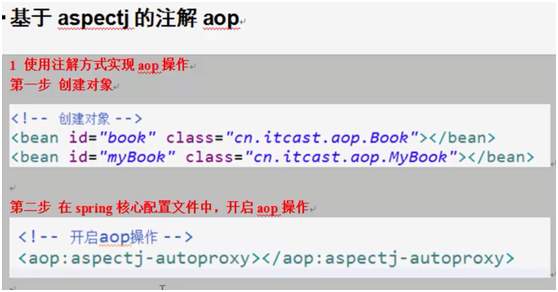

---

