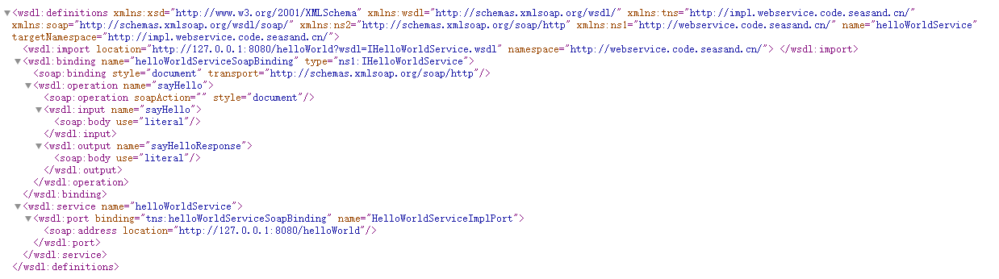

# CXF入门基础

---

### 概述

Apache CXF 是一个开源的 WebService 框架，CXF可以用来构建和开发 WebService，这些服务可以支持多种协议，比如：SOAP、POST/HTTP、HTTP 。CXF 大大简化了WebService并且可以天然地和 Spring 进行无缝集成。CXF是 Celtrix （ESB框架）和 XFire（webserivice） 合并而成，核心是org.apache.cxf.Bus(总线)，类似于Spring的 ApplicationContext。CXF默认是依赖于Spring的，另 CXF 发行包中的jar，如果全部放到lib中，需要 JDK1.6 及以上，否则会报JAX-WS版本不一致的问题。CXF 内置了Jetty服务器 ，它是servlet容器。

CXF框架特点：

* 与Spring、Servlet做了无缝对接，CXF框架里面集成了Servlet容器Jetty；

* 支持注解的方式来发布webservice；

* 能够显示一个webservice的服务列表；

* 能够添加拦截器：输入拦截器、输出拦截器 、输入日志信息拦截器、输出日志拦截器、用户权限认证的拦截器；

### 服务发布

1、服务接口：

~~~java
import javax.jws.WebService;

@WebService
public interface IHelloWorldService {
	public String sayHello(String name);
}
~~~

2、服务实现类：

~~~java
import javax.jws.WebService;
import cn.seasand.code.webservice.IHelloWorldService;

@WebService(endpointInterface = "cn.seasand.code.webservice.IHelloWorldService", serviceName = "helloWorldService")
public class HelloWorldServiceImpl implements IHelloWorldService {
	@Override
	public String sayHello(String name) {
		if (name == null || name.length() <= 0) {
			return "hello world!";
		} else {
			return "hello, " + name + "!";
		}
	}
}
~~~

3、发布服务：

~~~java
import javax.xml.ws.Endpoint;
import cn.seasand.code.webservice.IHelloWorldService;
import cn.seasand.code.webservice.impl.HelloWorldServiceImpl;

public class HelloWorldServer {
	public static void main(String[] args) {
		HelloWorldServer server = new HelloWorldServer();
		server.run();
	}
	public void run() {
		IHelloWorldService helloWorldService = new HelloWorldServiceImpl();
		Endpoint.publish("http://127.0.0.1:8080/helloWorld", helloWorldService);
		System.out.println("helloWorldService publish ...");
	}
}
~~~

打开浏览器，访问`http://127.0.0.1:8080/helloWorld?wsdl`

至此，服务发布成功。

### 服务调用

1、生成客户端代码

1）方法一：使用JDK命令行工具wsimport生成客户端Java代码

~~~plaintext
wsimport -p cn.seasand.code.client.helloworld.webservice -s . http://127.0.0.1:8080/helloWorld?wsdl
~~~

2）方法二：使用CXF命令行工具wsdl2java生成客户端Java代码

~~~plaintext
wsdl2java -p cn.seasand.code.client.helloworld.webservice –d . http://127.0.0.1:8080/helloWorld?wsdl
~~~

2、调用客户端代码

1）方式一

~~~java
public class CallHelloWorldService {
	public static void main(String[] args) {
		CallHelloWorldService client = new CallHelloWorldService();
		String msg = client.callSayHello("Mike");
		System.out.println("msg:" + msg);
	}
	public String callSayHello(String name) {
		IHelloWorldService helloWorldService = new IHelloWorldServiceService().getIHelloWorldServicePort();
		return helloWorldService.sayHello(name);
	}
}
~~~

2）方式二

~~~java
import java.net.URL;
import javax.xml.namespace.QName;
import javax.xml.ws.Service;

public class CallHelloWorldService {
	public static void main(String[] args) throws Exception {
		CallHelloWorldService client = new CallHelloWorldService();
		String msg = client.callSayHello("John");
		System.out.println("msg:" + msg);
	}
	public String callSayHello(String name) throws Exception {
		// 创建URL，资源定位.
		URL url = new URL("http://127.0.0.1:8080/helloWorld?wsdl");
		// QName,确定命名空间地址，以及服务视图名称(可参考wsdl文件头部).
		QName qName = new QName("http://webservice.code.seasand.cn/", "IHelloWorldServiceService");
		// 创建service.
		Service service = Service.create(url, qName);
		// 创建portType（服务端点）.
		IHelloWorldService helloWorldService = service.getPort(IHelloWorldService.class);
		// 通过服务端点调用方法.
		return helloWorldService.sayHello(name);
	}
}
~~~

3）方式三

~~~java
import org.apache.cxf.jaxws.JaxWsProxyFactoryBean;

public class CallHelloWorldService {
	public static void main(String[] args) {
		CallHelloWorldService client = new CallHelloWorldService();
		String msg = client.callSayHello("Mary");
		System.out.println("msg:" + msg);
	}
	public String callSayHello(String name) {
		JaxWsProxyFactoryBean jaxWsProxyFactoryBean = new JaxWsProxyFactoryBean();
		jaxWsProxyFactoryBean.setAddress("http://127.0.0.1:8080/helloWorld?wsdl");
		jaxWsProxyFactoryBean.setServiceClass(IHelloWorldService.class);
		IHelloWorldService helloWorldService = (IHelloWorldService) jaxWsProxyFactoryBean.create();
		return helloWorldService.sayHello(name);
	}
}
~~~

### 整合Spring

1、添加依赖

~~~xml
<properties>
	<spring.version>4.2.5.RELEASE</spring.version>
	<cxf.version>3.3.6</cxf.version>
</properties>

<!-- spring begin -->
<dependency>
	<groupId>org.springframework</groupId>
	<artifactId>spring-core</artifactId>
	<version>${spring.version}</version>
</dependency>
<dependency>
	<groupId>org.springframework</groupId>
	<artifactId>spring-beans</artifactId>
	<version>${spring.version}</version>
</dependency>
<dependency>
	<groupId>org.springframework</groupId>
	<artifactId>spring-tx</artifactId>
	<version>${spring.version}</version>
</dependency>
<dependency>
	<groupId>org.springframework</groupId>
	<artifactId>spring-context</artifactId>
	<version>${spring.version}</version>
</dependency>
<dependency>
	<groupId>org.springframework</groupId>
	<artifactId>spring-context-support</artifactId>
	<version>${spring.version}</version>
</dependency>
<dependency>
	<groupId>org.springframework</groupId>
	<artifactId>spring-web</artifactId>
	<version>${spring.version}</version>
</dependency>
<dependency>
	<groupId>org.springframework</groupId>
	<artifactId>spring-webmvc</artifactId>
	<version>${spring.version}</version>
</dependency>
<dependency>
	<groupId>org.springframework</groupId>
	<artifactId>spring-aop</artifactId>
	<version>${spring.version}</version>
</dependency>
<dependency>
	<groupId>org.springframework</groupId>
	<artifactId>spring-aspects</artifactId>
	<version>${spring.version}</version>
</dependency>
<dependency>
	<groupId>org.springframework</groupId>
	<artifactId>spring-jdbc</artifactId>
	<version>${spring.version}</version>
</dependency>
<!-- spring end -->

<!-- cxf begin -->
<dependency>
	<groupId>org.apache.cxf</groupId>
	<artifactId>cxf-core</artifactId>
	<version>${cxf.version}</version>
</dependency>
<dependency>
	<groupId>org.apache.cxf</groupId>
	<artifactId>cxf-rt-frontend-jaxws</artifactId>
	<version>${cxf.version}</version>
</dependency>
<dependency>
	<groupId>org.apache.cxf</groupId>
	<artifactId>cxf-rt-transports-http</artifactId>
	<version>${cxf.version}</version>
</dependency>
<!-- Jetty is needed if you're not using the CXFServlet -->
<!-- <dependency>
	<groupId>org.apache.cxf</groupId>
	<artifactId>cxf-rt-transports-http-jetty</artifactId>
	<version>${cxf.version}</version>
</dependency> -->
<!-- cxf end -->
~~~

2、web.xml添加CXFServlet

~~~xml
<servlet>
	<servlet-name>CXFServlet</servlet-name>
	<servlet-class>org.apache.cxf.transport.servlet.CXFServlet</servlet-class>
	<load-on-startup>1</load-on-startup>
</servlet>
<servlet-mapping>
	<servlet-name>CXFServlet</servlet-name>
	<url-pattern>/services/*</url-pattern>
</servlet-mapping>
~~~

3、服务接口与服务实现

~~~java
import javax.jws.WebMethod;
import javax.jws.WebParam;
import javax.jws.WebService;

@WebService
public interface IBasicService {
	public String getMsg(String key);
	@WebMethod(operationName = "add")
	public int add(@WebParam(name = "firstArg") int a, @WebParam(name = "secondArg") int b);
}
~~~

~~~java
public class BasicServiceImpl implements IBasicService {
	@Override
	public String getMsg(String key) {
		key = key == null ? "" : key;
		return "message with key:" + key;
	}
	@Override
	public int add(int a, int b) {
		return a + b;
	}
}
~~~

4、applicationContext.xml

~~~xml
<?xml version="1.0" encoding="UTF-8"?>
<beans xmlns="http://www.springframework.org/schema/beans"
	xmlns:context="http://www.springframework.org/schema/context"
	xmlns:aop="http://www.springframework.org/schema/aop"
	xmlns:tx="http://www.springframework.org/schema/tx"
	xmlns:xsi="http://www.w3.org/2001/XMLSchema-instance"
	xsi:schemaLocation="
	http://www.springframework.org/schema/beans http://www.springframework.org/schema/beans/spring-beans-3.0.xsd 
	http://www.springframework.org/schema/context http://www.springframework.org/schema/context/spring-context-3.0.xsd 
	http://www.springframework.org/schema/aop http://www.springframework.org/schema/aop/spring-aop-3.0.xsd 
	http://www.springframework.org/schema/tx http://www.springframework.org/schema/tx/spring-tx-3.0.xsd">

	<!-- 开启注解扫描：指明扫描的基本包路径，多个可用逗号分隔，或者指定父级包路径 -->
	<context:component-scan base-package="cn.seasand.code" />

	<!-- CXF -->
	<import resource="spring-cxf.xml"/>
</beans>
~~~

5、spring-cxf.xml

~~~xml
<?xml version="1.0" encoding="UTF-8"?>
<beans xmlns="http://www.springframework.org/schema/beans"
	xmlns:jaxws="http://cxf.apache.org/jaxws"
	xmlns:xsi="http://www.w3.org/2001/XMLSchema-instance"
	xmlns:p="http://www.springframework.org/schema/p"
	xsi:schemaLocation="http://www.springframework.org/schema/beans 
    http://www.springframework.org/schema/beans/spring-beans-3.0.xsd
    http://cxf.apache.org/jaxws
    http://cxf.apache.org/schemas/jaxws.xsd ">

	<bean id="basicService" class="cn.seasand.code.service.impl.BasicServiceImpl"></bean>

	<!-- 1、导入cxf发布的命名空间 -->
	<!-- xmlns:jaxws="http://cxf.apache.org/jaxws" http://cxf.apache.org/jaxws 
		http://cxf.apache.org/schemas/jaxws.xsd -->

	<!-- 2、通过配置发布webservice服务 -->
	<!-- 2.1 发布简单的webservice服务(不需要定义服务器的接口) -->
	<!-- <jaxws:endpoint address="" implementor=""></jaxws:endpoint> -->

	<!-- 2.2 发布标准的webservice服务:1)发布的地址:address,2)发布的服务接口:serviceClass,3)指定服务具体提供者（实现类对象）:jaxws:serviceBean -->
	<jaxws:server address="/basic"
		serviceClass="cn.seasand.code.service.IBasicService">
		<jaxws:serviceBean>
			<ref bean="basicService" />
		</jaxws:serviceBean>
	</jaxws:server>

</beans>
~~~

6、将项目发布到Tomcat，即可发布该webservice服务。

### 整合SpringBoot

1、添加依赖

~~~xml
<parent>
	<groupId>org.springframework.boot</groupId>
	<artifactId>spring-boot-starter-parent</artifactId>
	<version>2.0.0.RELEASE</version>
</parent>

<properties>
	<cxf.version>3.3.6</cxf.version>
</properties>

<dependencies>
	<dependency>
		<groupId>org.springframework.boot</groupId>
		<artifactId>spring-boot-starter-web</artifactId>
	</dependency>
	<dependency>
		<groupId>org.apache.cxf</groupId>
		<artifactId>cxf-spring-boot-starter-jaxws</artifactId>
		<version>${cxf.version}</version>
	</dependency>
</dependencies>
~~~

2、服务接口与服务实现

~~~java
import javax.jws.WebMethod;
import javax.jws.WebParam;
import javax.jws.WebResult;
import javax.jws.WebService;

@WebService(targetNamespace = "http://webservice.seasand.cn")
public interface IBasicService {
	@WebMethod(operationName = "getMsg") // 在wsdl文档中显示的方法名,可不指定,默认与方法相同;@WebMethod可不指定.
	@WebResult(name = "String")
	public String getMsg(@WebParam(name = "key") String key);
}
~~~

~~~java
import javax.jws.WebService;
import org.springframework.stereotype.Service;
import cn.seasand.code.service.IBasicService;

@Service("basicService")
@WebService(serviceName = "basicService", targetNamespace = "http://webservice.seasand.cn", endpointInterface = "cn.seasand.code.service.IBasicService")
public class BasicServiceImpl implements IBasicService {
	@Override
	public String getMsg(String key) {
		return "message return with key:" + key;
	}
}
~~~

3、CxfConfig

~~~java
import javax.xml.ws.Endpoint;
import org.apache.cxf.Bus;
import org.apache.cxf.jaxws.EndpointImpl;
import org.apache.cxf.transport.servlet.CXFServlet;
import org.springframework.beans.factory.annotation.Autowired;
import org.springframework.boot.web.servlet.ServletRegistrationBean;
import org.springframework.context.annotation.Bean;
import org.springframework.context.annotation.Configuration;
import cn.seasand.code.service.IBasicService;
import cn.seasand.code.service.IDemoService;

@Configuration
public class CxfConfig {
	@Autowired
	private Bus bus;
	@Autowired
	private IBasicService basicService;
	@Autowired
	private IDemoService demoService;

	@Bean
	public ServletRegistrationBean dispatcherServlet() {
		return new ServletRegistrationBean(new CXFServlet(), "/services/*");
	}

	@Bean
	public Endpoint basicEndpoint() {
		Endpoint endpoint = new EndpointImpl(bus, basicService);
		endpoint.publish("/basic");
		return endpoint;
	}

	@Bean
	public Endpoint demoEndpoint() {
		Endpoint endpoint = new EndpointImpl(bus, demoService);
		endpoint.publish("/demo");
		return endpoint;
	}
}
~~~

4、启动项目，即可发布webservice服务。

### 示例-手机号码归属地查询

查询手机号码归属地的webservice：`http://ws.webxml.com.cn/WebServices/MobileCodeWS.asmx?wsdl`；

使用JDK命令行工具wsimport生成客户端Java代码：

~~~plaintext
wsimport -p cn.seasand.code.webservice.mobile -s . http://ws.webxml.com.cn/WebServices/MobileCodeWS.asmx?wsdl
~~~

生成客户端代码后，书写调用的代码：

~~~java
public interface IMobileInfoService {
	public String getMobileInfo(String mobile);
}

@Service("mobileInfoService")
public class MobileInfoServiceImpl implements IMobileInfoService {
	@Override
	public String getMobileInfo(String mobile) {
		// 创建一个MobileCodeWS工厂.
		MobileCodeWS factory = new MobileCodeWS();
		// 根据工厂创建一个MobileCodeWSSoap对象.
		MobileCodeWSSoap mobileCodeWSSoap = factory.getMobileCodeWSSoap();
		// 调用WebService提供的getMobileCodeInfo方法查询手机号码的归属地.
		return mobileCodeWSSoap.getMobileCodeInfo(mobile, null);
	}
}
~~~

~~~java
@RestController
@RequestMapping("/mobileInfo")
public class MobileInfoController {
	@Autowired
	private IMobileInfoService mobileInfoService;

	@RequestMapping("/query")
	public Map<String, Object> query(String mobile) {
		Map<String, Object> resultMap = new HashMap<>();
		if (null == mobile || mobile.length() <= 0) {
			resultMap.put("msg", "mobile is empty!");
			resultMap.put("type", 0);
			return resultMap;
		}
		String result = mobileInfoService.getMobileInfo(mobile);
		resultMap.put("msg", result);
		resultMap.put("type", 1);
		return resultMap;
	}
}
~~~

打开浏览器，访问`http://127.0.0.1:8088/cxf-sample-mobile.info/mobileInfo/query?mobile=13800138000`

   

---

