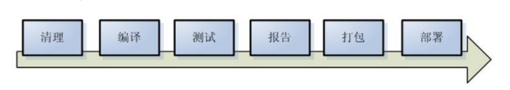
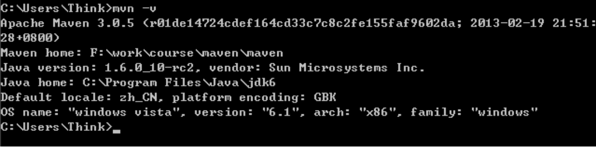
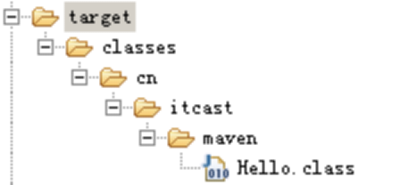
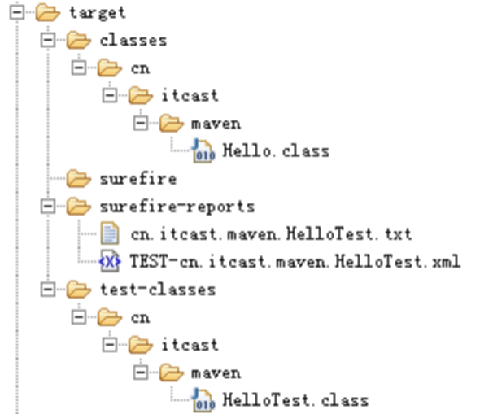
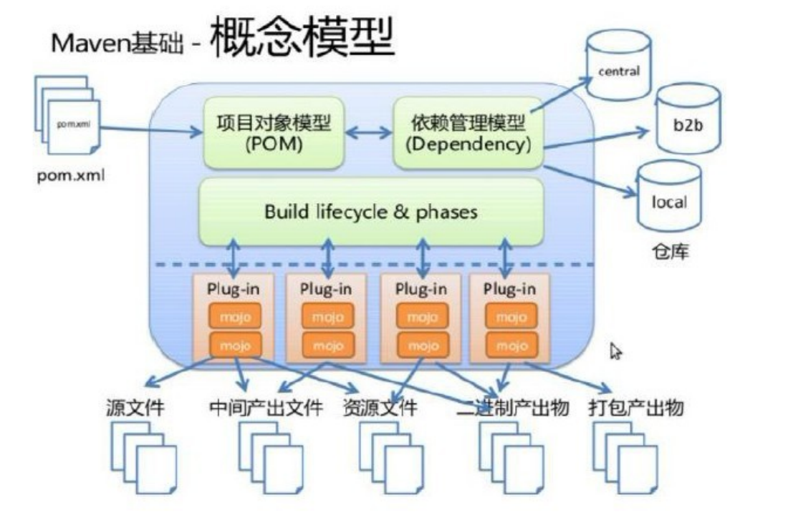
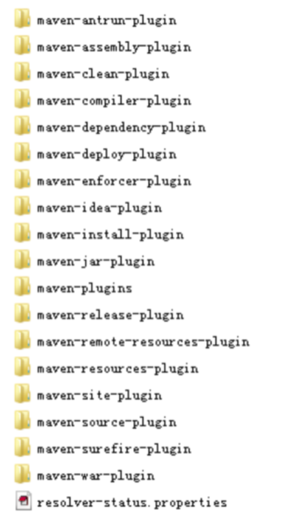

# Java架构师系列-Maven

---

### 一、Maven概念

Maven是一个跨平台的项目管理工具，主要用于基于java平台的项目构建，依赖管理。

如图为项目构建的过程。

### 二、Maven的安装与配置

* 安装配置JDK（Jdk必须1.6以上的版本）；
* 从[官网](http://maven.apache.org/)上下载最新版本的maven；
* 设定path路径：把下载下来的maven解压缩，把bin文件夹目录追加到环境变量的path中；
* 利用命令行检查是否成功；

出现这个图，说明maven安装成功了。

### 三、Maven的结构

说明：

* bin中存放可执行的二进制文件；
* conf中存放settings.xml文件；
* lib中存放运行maven所依赖的jar包；

### 四、Maven项目结构

* src/main/java 存放项目的java文件；
* src/main/resources 存放项目的资源文件，如spring，hibernate的配置文件；
* src/test/java 存放所有的测试的java文件；
* src/test/resources 存放测试用的资源文件；
* target 项目输出位置；
* pom.xml 文件；

pom.xml

~~~xml
<project xmlns="http://maven.apache.org/POM/4.0.0"
   xmlns:xsi="http://www.w3.org/2001/XMLSchema-instance"
   xsi:schemaLocation="http://maven.apache.org/POM/4.0.0
   http://maven.apache.org/xsd/maven-4.0.0.xsd">
	<modelVersion>4.0.0</modelVersion>
	<groupId>cn.seasand.code</groupId>
	<artifactId>helloworld</artifactId>
	<version>1.0</version>
</project>
~~~

* groupId：这是项目组的编号，这在组织或项目中通常是独一无二的。
* artifactId：这是项目的ID，这通常是项目的名称。 例如，consumer-banking。 除了groupId之外，artifactId还定义了artifact在存储库中的位置。
* version：这是项目的版本。与groupId一起使用，artifact在存储库中用于将版本彼此分离。 

### 五、Maven命令构建项目

1、compile

可以看到编译后的文件全部放入到了target里。

2、clean

3、test

4、package

5、install

### 六、Maven的核心概念

1、项目对象模型

maven根据pom.xml文件，把它转化成项目对象模型(POM)，这个时候要解析依赖关系，然后去相对应的maven库中查找到依赖的jar包。在clean，compile，test，package等阶段都有相应的Plug-in来做这些事情。而这些plug-in会产生一些中间产物。

2、插件的位置

在maven解压后的bin文件夹，里面有一个文件m2.config文件，其中：`set maven.home default ${user.home}/m2`，该路径指明了仓库的存储位置。

这里的插件就是执行maven的各种命令所需要的插件。

3、maven坐标的主要组成

* groupId：定义当前maven项目属于哪个项目；
* artifactId：定义实际项目中的某一个模块；
* version：定义当前项目的当前版本；
* packaging：定义当前项目的打包方式；

根据这些坐标，在maven库中可以找到唯一的jar包。

### 七、仓库管理

仓库的分类

* 本地仓库：~/.m2/repository/，每一个用户也可以拥有一个本地仓库；
* 远程仓库：中央仓库，Maven默认的远程仓库，http://repo1.maven.org/maven2 ；
* 私服：是一种特殊的远程仓库，它是架设在局域网内的仓库；
* 镜像：用来替代中央仓库，速度一般比中央仓库快；

### 八、Maven打包原理

1、Maven中央存储库

当你建立一个 Maven 的项目，Maven 会检查你的 pom.xml 文件，以确定哪些依赖下载。首先，Maven 将从本地资源库获得 Maven 的本地资源库依赖资源，如果没有找到，然后把它会从默认的 Maven 中央存储库  http://search.maven.org/  查找下载。

在Maven中，当你声明的库不存在于本地存储库中，也没有不存在于Maven中心储存库，该过程将停止并将错误消息输出到 Maven 控制台。

2、添加远程仓库

默认情况下，Maven从Maven中央仓库下载所有依赖关系。但是，有些库丢失在中央存储库，只有在Java.net或JBoss的储存库远程仓库中能找到。

现在，Maven的依赖库查询顺序更改为：

* 在 Maven 本地资源库中搜索，如果没有找到，进入下一步，否则退出。
* 在 Maven 中央存储库搜索，如果没有找到，进入下一步，否则退出。
* 在Maven的远程存储库搜索，如果没有找到，提示错误信息，否则退出。

### 九、常见错误

1、问题1

pom.xml报错：`web.xml is missing and <failOnMissingWebXml> is set to true`；

出现这个错误的原因是Maven不支持缺少web.xml的web项目。添加Web模块，对项目右键->Java EE Tools->Generate Deployment Descriptor Stub,这样就在 src\main\webapp下面生成了WEB-INF文件夹和web.xml,问题解决。

2、问题2

'parent.relativePath' and 'parent.relativePath' points at wrong local POM @ line 4, column 10；

在应用parent工程中加上`<relativePath>../helloworld-parent/pom.xml</relativePath>`；

3、问题3

No compiler is provided in this environment. Perhaps you are running on a JRE rather than a JDK?

更换为自己本地的jdk即可。

   

---

