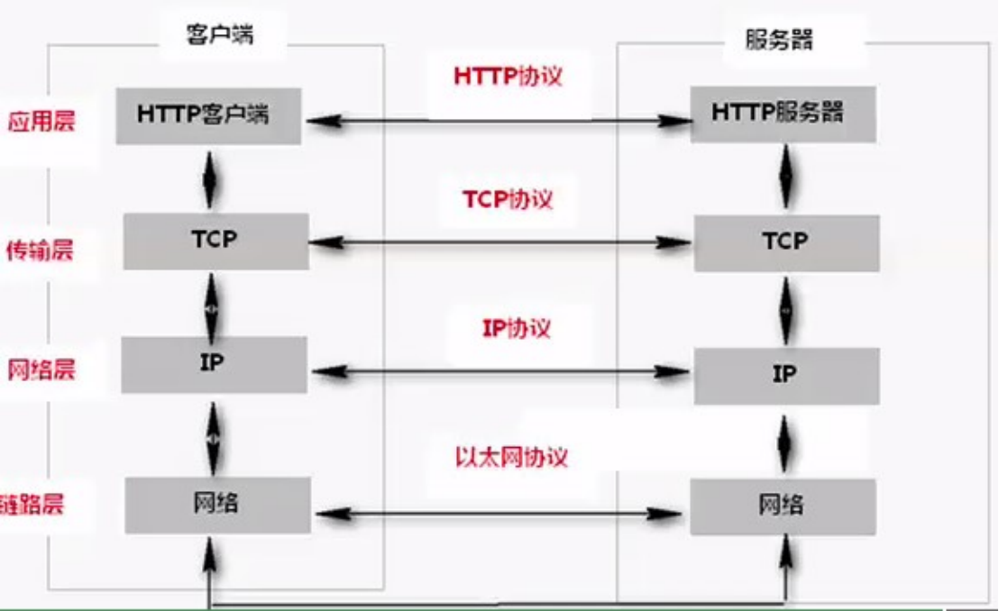
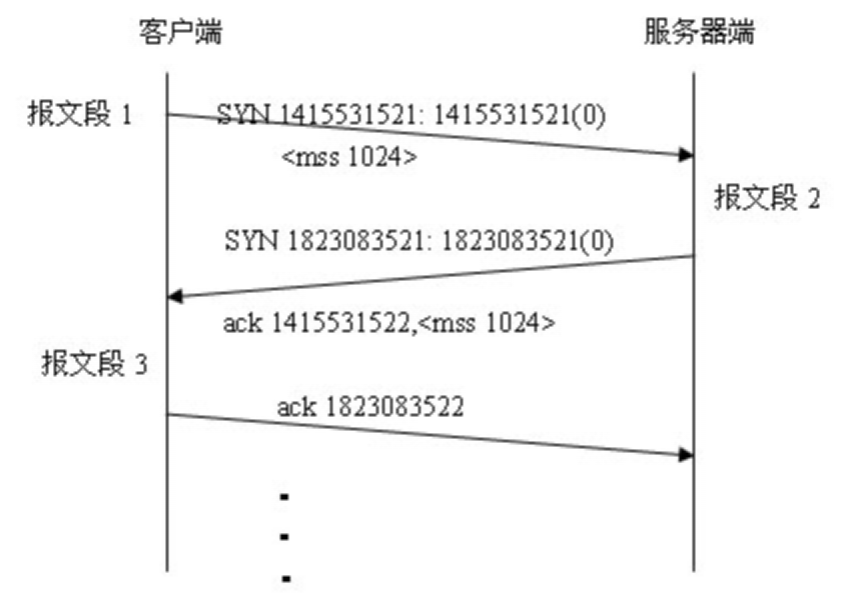
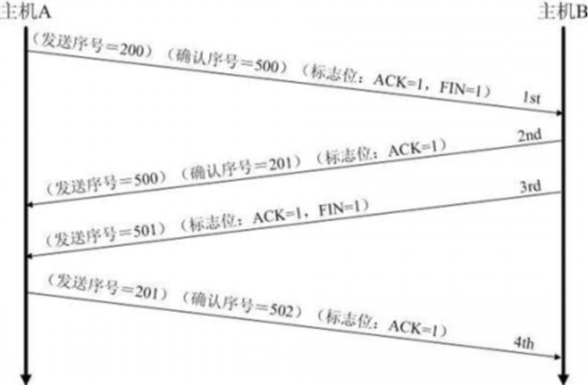

# Java架构师系列-网络编程之Socket

---

### 一、网络模型

1、什么是网络模型

网络编程的本质是两个设备之间的数据交换。当然，在计算机网络中，设备主要指计算机。数据传递本身没有多大的难度，不就是把一个设备中的数据发送给两外一个设备，然后接受另外一个设备反馈的数据。

现在的网络编程基本上都是基于请求/响应方式的，也就是一个设备发送请求数据给另外一个，然后接收另一个设备的反馈。

在网络编程中，发起连接程序，也就是发送第一次请求的程序，被称作客户端(Client)，等待其他程序连接的程序被称作服务器(Server)。客户端程序可以在需要的时候启动，而服务器为了能够时刻相应连接，则需要一直启动。例如以打电话为例，首先拨号的人类似于客户端，接听电话的人必须保持电话畅通类似于服务器。

连接一旦建立以后，就客户端和服务器端就可以进行数据传递了，而且两者的身份是等价的。在一些程序中，程序既有客户端功能也有服务器端功能，最常见的软件就是BT、emule这类软件了。

2、IP地址与域名

在现实生活中，如果要打电话则需要知道对应人的电话号码，如果要寄信则需要知道收信人的地址。在网络中也是这样，需要知道一个设备的位置，则需要使用该设备的IP地址，具体的连接过程由硬件实现，程序员不需要过多的关心。

IP地址是一个规定，现在使用的是IPv4，既由4个0-255之间的数字组成，在计算机内部存储时只需要4个字节即可。在计算机中，IP地址是分配给网卡的，每个网卡有一个唯一的IP地址，如果一个计算机有多个网卡，则该台计算机则拥有多个不同的IP地址，在同一个网络内部，IP地址不能相同。IP地址的概念类似于电话号码、身份证这样的概念。

由于IP地址不方便记忆，所以有专门创造了域名(Domain Name)的概念，其实就是给IP取一个字符的名字，例如163.com、sina.com等。IP和域名之间存在一定的对应关系。如果把IP地址类比成身份证号的话，那么域名就是你的姓名。

其实在网络中只能使用IP地址进行数据传输，所以在传输以前，需要把域名转换为IP，这个由称作DNS的服务器专门来完成。

所以在网络编程中，可以使用IP或域名来标识网络上的一台设备。

3、端口的概念

为了在一台设备上可以运行多个程序，人为的设计了端口(Port)的概念，类似的例子是公司内部的分机号码。

规定一个设备有216个，也就是65536个端口，每个端口对应一个唯一的程序。每个网络程序，无论是客户端还是服务器端，都对应一个或多个特定的端口号。由于0-1024之间多被操作系统占用，所以实际编程时一般采用1024以后的端口号。

使用端口号，可以找到一台设备上唯一的一个程序。所以如果需要和某台计算机建立连接的话，只需要知道IP地址或域名即可，但是如果想和该台计算机上的某个程序交换数据的话，还必须知道该程序使用的端口号。

4、小结

网络编程就是使用IP地址，或域名，和端口连接到另一台计算机上对应的程序，按照规定的协议(数据格式)来交换数据，实际编程中建立连接和发送、接收数据在语言级已经实现，做的更多的工作是设计协议，以及编写生成和解析数据的代码罢了，然后把数据转换成逻辑的结构显示或控制逻辑即可。

对于初学者，或者没有接触过网络编程的程序员，会觉得网络编程涉及的知识很高深，很难，其实这是一种误解，当你的语法熟悉以后，其实基本的网络编程现在已经被实现的异常简单了。

### 二、Socket入门

1、什么是Socket？

Socket就是为网络服务提供的一种机制。通讯的两端都有Sokcet，网络通讯其实就是Sokcet间的通讯，数据在两个Sokcet间通过IO传输。

2、TCP与UDP在概念上的区别：

UDP：

* 是面向无连接，将数据及源的封装成数据包中,不需要建立建立连接；
* 每个数据报的大小在限制64k内；
* 因无连接，是不可靠协议；
* 不需要建立连接，速度快；

TCP：

* 建议连接，形成传输数据的通道；
* 在连接中进行大数据量传输，以字节流方式；
* 通过三次握手完成连接，是可靠协议；
* 必须建立连接，效率会稍低；

### 三、UDP协议

客户端：

~~~java
public class UdpClient {
	public static void main(String[] args) throws IOException {
		System.out.println("udp 发送数据");
		DatagramSocket ds = new DatagramSocket();
		String str = "客户端发送数据....";
		byte[] strByte = str.getBytes();
		DatagramPacket dp = new DatagramPacket(strByte, strByte.length, InetAddress.getByName("192.168.1.3"), 8080);
		ds.send(dp);
		ds.close();
	}
}
~~~

服务端：

~~~java
class UdpServer {
	public static void main(String[] args) throws IOException {
		System.out.println("udp接受数据启动.......");
		DatagramSocket ds = new DatagramSocket(8080);
		byte[] buf = new byte[1024];
		DatagramPacket dp = new DatagramPacket(buf, buf.length);
		// 阻塞效果
		ds.receive(dp);
		System.out.println("来源:"+dp.getAddress().getHostAddress()+",port:"+dp.getPort());
		String str = new String(dp.getData(),0,dp.getLength());
		System.out.println("客户端发送数据:"+str);
		ds.close();
	}
}
~~~

### 四、TCP协议

1、TCP握手协议

在TCP/IP协议中，TCP协议采用三次握手建立一个连接。 

第一次握手：建立连接时，客户端发送SYN包(SYN=J)到服务器，并进入SYN_SEND状态，等待服务器确认； 

第二次握手：服务器收到SYN包，必须确认客户的SYN（ACK=J+1），同时自己也发送一个SYN包（SYN=K），即SYN+ACK包，此时服务器V状态；

第三次握手：客户端收到服务器的SYN＋ACK包，向服务器发送确认包ACK(ACK=K+1)，此包发送完毕，客户端和服务器进入ESTABLISHED状态，完成三次握手。

完成三次握手，客户端与服务器开始传送数据。

2、四次分手

由于TCP连接是全双工的，因此每个方向都必须单独进行关闭。这个原则是当一方完成它的数据发送任务后就能发送一个FIN来终止这个方向的连接。收到一个 FIN只意味着这一方向上没有数据流动，一个TCP连接在收到一个FIN后仍能发送数据。首先进行关闭的一方将执行主动关闭，而另一方执行被动关闭。

（1）客户端A发送一个FIN，用来关闭客户A到服务器B的数据传送。

（2）服务器B收到这个FIN，它发回一个ACK，确认序号为收到的序号加1。和SYN一样，一个FIN将占用一个序号。

（3）服务器B关闭与客户端A的连接，发送一个FIN给客户端A。

（4）客户端A发回ACK报文确认，并将确认序号设置为收到序号加1。

3、为什么建立连接协议是三次握手，而关闭连接却是四次握手呢？

这是因为服务端的LISTEN状态下的SOCKET当收到SYN报文的建连请求后，它可以把ACK和SYN（ACK起应答作用，而SYN起同步作用）放在 一个报文里来发送。

但关闭连接时，当收到对方的FIN报文通知时，它仅仅表示对方没有数据发送给你了；但未必你所有的数据都全部发送给对方了，所以你可以 未必会马上会关闭SOCKET，也即你可能还需要发送一些数据给对方之后，再发送FIN报文给对方来表示你同意现在可以关闭连接了，所以它这里的ACK报 文和FIN报文多数情况下都是分开发送的。

4、为什么TIME_WAIT状态还需要等2MSL后才能返回到CLOSED状态？

这是因为虽然双方都同意关闭连接了，而且握手的4个报文也都协调和发送完毕，按理可以直接回到CLOSED状态（就好比从SYN_SEND状态到ESTABLISH状态那样）；但是因为我们必须要假想网络是不可靠的，你无法保证你最后发送的ACK报文会一定被对方收到，因此对方处于LAST_ACK状态下的SOCKET可能会因为超时未收到ACK报文，而重发FIN报文，所以这个TIME_WAIT状态的作用就是用来重发可能丢失的ACK报文。

5、代码示例

客户端：

~~~java
public class TcpClient {
	 public static void main(String[] args) throws IOException {
		System.out.println("socket启动....");
		Socket s = new Socket("192.168.1.3", 8080);
		OutputStream outputStream = s.getOutputStream();
		outputStream.write("我是客戶端....".getBytes());
		s.close(); 
	}
}
~~~

服务端：

~~~java
public class TcpServer {
	 public static void main(String[] args) throws IOException {
		System.out.println("socket服务器端启动....");
		ServerSocket serverSocket = new ServerSocket(8080);
	    //获取客户端对象
		Socket accept = serverSocket.accept();
		InputStream inputStream = accept.getInputStream();
		byte[] buf= new byte[1024];
		int len=inputStream.read(buf);
		String str =new String(buf,0,len);
		System.out.println("str:"+str);
		serverSocket.close();
	}
}
~~~

   

---

