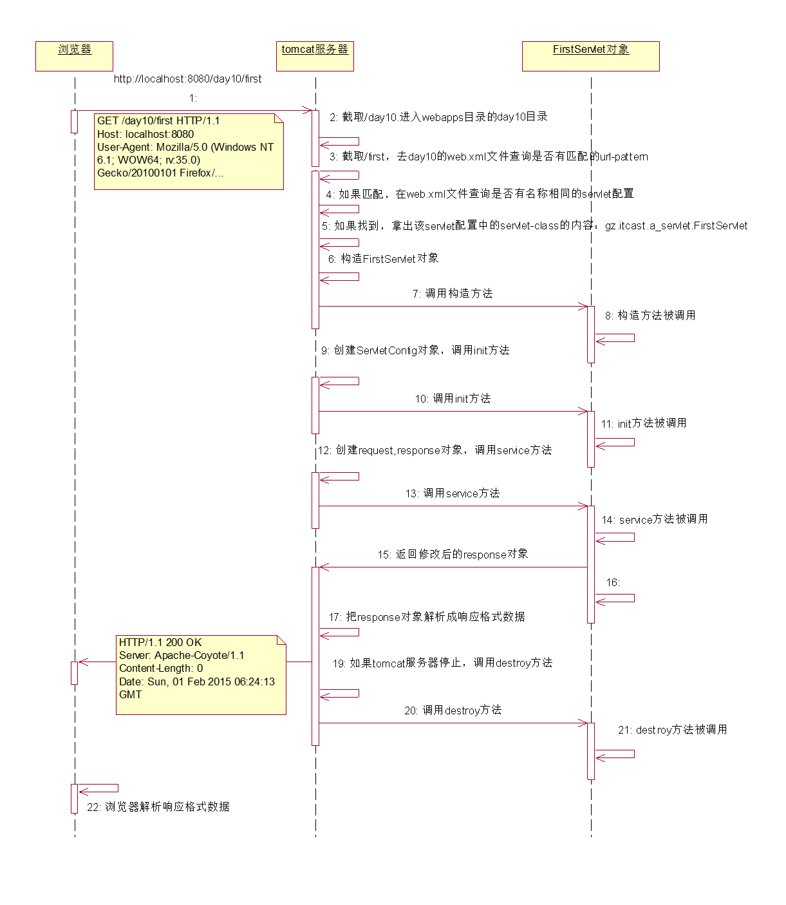

# Java架构师系列-深入理解Servlet

---

### 一、Web项目结构

~~~plaintext
|- WebRoot: web应用的根目录
	|- 静态资源（html+css+js+image+vedio）
	|- WEB-INF：固定写法
		|- classes：（可选）固定写法，存放class字节码文件
		|- lib：（可选）固定写法，存放jar包文件
		|- web.xml    
~~~

注意：

1）WEB-INF目录里面的资源不能通过浏览器直接访问。

2）如果希望访问到WEB-INF里面的资源，就必须把资源配置到一个叫web.xml的文件中。

练习：

1）在webapps下建立一个mybbs目录

2）创建两个文件

2.1 index.html  里面随便写内容	，有超链接-连接到test.html	

2.2 test.html   里面随便写

3）通过浏览器访问到

### 二、手动开发动态资源

1、静态资源和动态资源的区别

* 静态资源：当用户多次访问这个资源，资源的源代码永远不会改变的资源。
* 动态资源：当用户多次访问这个资源，资源的源代码可能会发送改变。

2、动态资源的开发技术

Servlet : 用java语言来编写动态资源的开发技术。

Servlet特点：

* 普通的java类，继承HttpServlet类，覆盖doGet方法
* Servlet类只能交给tomcat服务器运行！（开发者自己不能运行！）

Servlet手动编写步骤：

1）编写一个servlet程序，继承HttpServlet

~~~java
public class HelloServlet extends HttpServlet {
	@Override
	protected void doGet(HttpServletRequest req, HttpServletResponse resp) throws ServletException, IOException {
		//解决中文乱码问题
	    resp.setCharacterEncoding("utf-8");// 内容编码，防止出现中文乱码
		resp.setContentType("text/html;charset=utf-8");		//向浏览器输出内容
		resp.getWriter().write("这是第一个servlet程序。当前时间为："+new Date());
	}
}
~~~

2）找到HelloServlet类的class字节码，然后把拷贝到tomcat的一个web应用中WEB-INF/classes目录下。

3）在当前web应用下的web.xml文件配置Servlet。

~~~xml
<!-- 配置一个servlet程序 -->
<servlet>
	<!-- servlet的内部名称 ，可以自定义-->
	<servlet-name>HelloServlet</servlet-name>
	<!-- servlet类名： 包名+简单类名-->
	<servlet-class>com.itmayiedu.HelloServlet</servlet-class>
</servlet>

<servlet-mapping>
	<!-- servlet的内部名称，和上面的名称保持一致！！！-->
	<servlet-name>HelloServlet</servlet-name>
	<!-- servlet的访问名称： /名称 -->
	<url-pattern>/hello</url-pattern>
</servlet-mapping>
~~~

4）启动tomcat服务器，运行访问。访问servlet:  http://localhost:8080/myweb/hello

### 三、工具开发动态资源

1、开发步骤

1）创建web project （javaweb工程）；

2）在WebRoot下建立静态资源文件；

3）在src下建立动态资源文件；

3.1 new -> Servlet( servlet的代码生成器)；

3.2 写pacakge  -> class名 -> 修改mapping  url ；

4）关联tomcat服务器；

4.1 window-> Preferences - > MyEcplise -> servers -> Tomcat 6.x (注意一定要enable)

5）部署web project应用。（拷贝web应用到tomcat的webapps目录下）

6）启动tomcat服务器；

7）访问servlet，http://localhost:8081/myWeb/hello ；

2、如何开发一个Servlet

步骤：

1）编写java类，继承HttpServlet类

2）重新doGet和doPost方法

3）Servlet程序交给tomcat服务器运行！

3.1 servlet程序的class码拷贝到WEB-INF/classes目录

3.2 在web.xml文件中进行配置

~~~xml
<!-- 配置一个servlet -->
<!-- servlet的配置 -->
<servlet>
	<!-- servlet的内部名称，自定义。尽量有意义 -->
	<servlet-name>FirstServlet</servlet-name>
	<!-- servlet的类全名： 包名+简单类名 -->
	<servlet-class>com.itmayiedu.FirstServlet</servlet-class>
</servlet>

<!-- servlet的映射配置 -->
<servlet-mapping>
	<!-- servlet的内部名称，一定要和上面的内部名称保持一致！！ -->
	<servlet-name>FirstServlet</servlet-name>
	<!-- servlet的映射路径（访问servlet的名称） -->
	<url-pattern>/first</url-pattern>
</servlet-mapping>
~~~

问题：访问此URL：http://localhost:8080/myweb/first

前提： tomcat服务器启动时，首先加载webapps中的每个web应用的web.xml配置文件。

~~~plaintext
http://:	http协议
localhost： 	到本地的hosts文件中查找是否存在该域名对应的IP地址 127.0.0.1
8080：		找到tomcat服务器
/day10：		在tomcat的webapps目录下找 day10的目录
/first：		资源名称。
~~~

1）在myweb的web.xml中查找是否有匹配的url-pattern的内容（/first）

2）如果找到匹配的url-pattern,则使用当前servlet-name的名称到web.xml文件中查询是否相同名称的servlet配置

3）如果找到，则取出对应的servlet配置信息中的servlet-class内容：

字符串： com.itmayiedu.a_servlet.FirstServlet

通过反射：

a）构造FirstServlet的对象

b）然后调用FirstServlet里面的方法

3、Servlet 注解版本

Servlet3.0以上使用 注解自动映射@webServlet。

### 四、Servlet的生命周期（重点）

1、引入

Servlet的生命周期： servlet类对象什么时候创建，什么时候调用什么方法，什么时候销毁。以前的对象： new Student（）； stu.study();   stu=null; Servlet程序的生命周期由tomcat服务器控制的！

2、Servlet重要的四个生命周期方法

* 构造方法： 创建servlet对象的时候调用。默认情况下，第一次访问servlet的时候创建servlet对象只调用1次。证明servlet对象在tomcat是单实例的。
* init方法： 创建完servlet对象的时候调用。只调用1次。
* service方法： 每次发出请求时调用。调用n次。
* destroy方法： 销毁servlet对象的时候调用。停止服务器或者重新部署web应用时销毁servlet对象。只调用1次。		

3、伪代码演示servlet的生命周期

Tomtcat内部代码运行：

1）通过映射找到到servlet-class的内容，字符串： com.itmayiedu.a_servlet.FirstServlet

2）通过反射构造FirstServlet对象

2.1 得到字节码对象

~~~java
Class clazz = class.forName("com.itmayiedu.a_servlet.FirstServlet");
~~~

2.2 调用无参数的构造方法来构造对象

~~~java
Object obj = clazz.newInstance(); ---servlet的构造方法被调用
~~~

3）创建ServletConfig对象，通过反射调用init方法

3.1 得到方法对象

~~~java
Method m = clazz.getDeclareMethod("init",ServletConfig.class);
~~~

3.2 调用方法

~~~java
m.invoke(obj,config); --servlet的init方法被调用
~~~

4）创建request，response对象，通过反射调用service方法

4.1 得到方法对象

~~~java
Methodm m =clazz.getDeclareMethod("service",HttpServletRequest.class,HttpServletResponse.class);
~~~

4.2 调用方法

~~~java
m.invoke(obj,request,response);  --servlet的service方法被调用
~~~

5）当tomcat服务器停止或web应用重新部署，通过反射调用destroy方法

5.1 得到方法对象

~~~java
Method m = clazz.getDeclareMethod("destroy",null);
~~~

5.2 调用方法

~~~java
m.invoke(obj,null); --servlet的destroy方法被调用
~~~

4、用时序图来演示servlet的生命周期

5、Servlet的自动加载

默认情况下，第一次访问servlet的时候创建servlet对象。如果servlet的构造方法或init方法中执行了比较多的逻辑代码，那么导致用户第一次访问sevrlet的时候比较慢。改变servlet创建对象的时机： 提前到加载web应用的时候！

在servlet的配置信息中，加上一个`<load-on-startup>`即可！

~~~xml
<servlet>
	<servlet-name>LifeDemo</servlet-name>
	<servlet-class>com.itmayiedu.life.LifeDemo</servlet-class>
	<!-- 让servlet对象自动加载 -->
	<load-on-startup>1</load-on-startup>注意：整数值越大，创建优先级越低！
</servlet>
~~~

6、Servlet的多线程并发问题

注意： servlet对象在tomcat服务器是单实例多线程的。

因为servlet是多线程的，所以当多个servlet的线程同时访问了servlet的共享数据，如成员变量，可能会引发线程安全问题。

解决办法：

1）把使用到共享数据的代码块进行同步（使用synchronized关键字进行同步）

2）建议在servlet类中尽量不要使用成员变量。如果确实要使用成员，必须同步，而且尽量缩小同步代码块的范（哪里使用到了成员变量，就同步哪里！），以避免因为同步而导致并发效率降低。

线程安全代码：

~~~java
public class ServetlDemo4 extends HttpServlet {
	private int i = 1;

	@Override
	public void init() throws ServletException {
		System.out.println("ServetlDemo4...init()");
	}

	@Override
	protected void doGet(HttpServletRequest req, HttpServletResponse resp) throws ServletException, IOException {
		// 设置编码格式
		// resp.setContentType("text/html;charset=utf-8");
		resp.setCharacterEncoding("utf-8");// 内容编码，防止出现中文乱码
		resp.setContentType("text/html;charset=utf-8");
		synchronized (ServetlDemo4.class) {
			// 向浏览器输出内容
			resp.getWriter().write("这是第" + i + "次访问...");
			try {
				Thread.sleep(5000);
			} catch (Exception e) {
				// TODO: handle exception
			}
			i++;
		}
	}

	@Override
	public void destroy() {
		System.out.println("ServetlDemo4...destroy()");
	}
}
~~~

### 五、ServletContext对象

1、得到web应用路径

~~~java
java.lang.String getContextPath()  //用在请求重定向的资源名称中
~~~

2、域对象有关的方法

域对象：作用是用于保存数据，获取数据。可以在不同的动态资源之间共享数据。

案例：

~~~plaintext
Servlet1:
name=eric
response.sendRedirect("/Servlet2?name=eric"); //保存到域对象中            

Servlet2:
String request.getParameter("name");  //从域对象获取
~~~                 

方案1： 可以通过传递参数的形式，共享数据。局限：只能传递字符串类型。

方案2： 可以使用域对象共享数据，好处：可以共享任何类型的数据！

ServletContext就是一个域对象！

* 保存数据：void setAttribute(java.lang.String name, java.lang.Object object)
* 获取数据： java.lang.Object getAttribute(java.lang.String name)  
* 删除数据： void removeAttribute(java.lang.String name)  

ServletContext域对象：作用范围在整个web应用中有效！

所有域对象：

* HttpServletRequet 域对象
* ServletContext域对象
* HttpSession 域对象
* PageContext域对象	

3、转发与重定向

~~~java
RequestDispatcher getRequestDispatcher(java.lang.String path)
~~~

1）转发

* 地址栏不会改变
* 转发只能转发到当前web应用内的资源
* 可以在转发过程中，可以把数据保存到request域对象中

2）重定向			

* 地址栏会改变，变成重定向到地址。
* 重定向可以跳转到当前web应用，或其他web应用，甚至是外部域名网站。
* 不能再重定向的过程，把数据保存到request中。

自定义重定向：

~~~java
response.setStatus(302); 
response.setHeader("Location","OtherServlet"); 
~~~

结论： 如果要使用request域对象进行数据共享，只能用转发技术！

   

---

