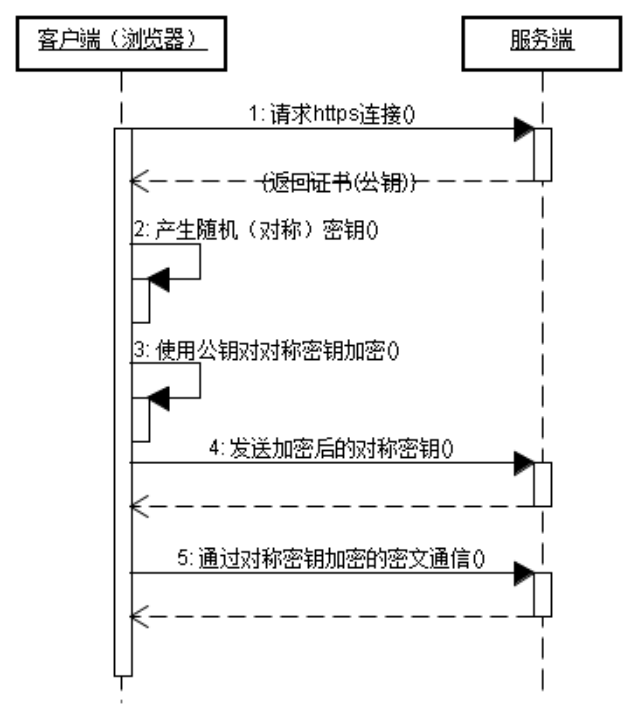

# Java架构师系列-深入理解HTTP

---

### 一、HTTP请求

1、请求行

~~~plaintext
GET /demo/hello HTTP/1.1
~~~

1）请求方式

常见的请求方式： GET 、 POST、 HEAD、 TRACE、 PUT、 CONNECT 、DELETE。常用的请求方式： GET  和 POST。

GET方式提交：

* 地址栏（URI）会跟上参数数据。以？开头，多个参数之间以&分割。
* GET提交参数数据有限制，不超过1KB。
* GET方式不适合提交敏感密码。
* 浏览器直接访问的请求，默认提交方式是GET方式。

POST方式提交：

* 参数不会跟着URI后面。参数而是跟在请求的实体内容中。没有？开头，多个参数之间以&分割。
* POST提交的参数数据没有限制。
* POST方式提交敏感数据。

2）请求资源

* URL:  统一资源定位符。只能定位互联网资源，是URI的子集。
* URI：统一资源标记符。用于标记任何资源，可以是本地文件系统，局域网的资源，可以是互联网资源。

3）HTTP协议版本

* http1.0：当前浏览器客户端与服务器端建立连接之后，只能发送一次请求，一次请求之后连接关闭。
* http1.1：当前浏览器客户端与服务器端建立连接之后，可以在一次连接中发送多次请求。（基本都使用1.1）

2、请求头

~~~plaintext
Accept: text/html,image/*      -- 浏览器接受的数据类型
Accept-Charset: ISO-8859-1     -- 浏览器接受的编码格式
Accept-Encoding: gzip,compress  -- 浏览器接受的数据压缩格式
Accept-Language: en-us,zh-      -- 浏览器接受的语言
Host: www.it315.org:80			   -- 当前请求访问的目标地址（主机:端口）
If-Modified-Since: Tue, 11 Jul 2000 18:23:51 GMT  -- 浏览器最后的缓存时间
Referer: http://www.it315.org/index.jsp      -- 当前请求来自于哪里
User-Agent: Mozilla/4.0 (compatible; MSIE 5.5; Windows NT 5.0)  --浏览器类型
Cookie:name=eric               -- 浏览器保存的cookie信息
Connection: close/Keep-Alive   -- 浏览器跟服务器连接状态。close: 连接关闭， keep-alive：保存连接。
Date: Tue, 11 Jul 2000 18:23:51 GMT      -- 请求发出的时间
~~~

3、实体内容

只有POST提交的参数会放到实体内容中。

### 二、HTTP响应

1、响应行

1）HTTP协议版本

2）状态码

服务器处理请求的结果，常见的状态：

* 200：表示请求处理完成并完美返回。
* 302：表示请求需要进一步细化。
* 404：表示客户访问的资源找不到。
* 500：表示服务器的资源发送错误。

3）状态描述

2、响应头

~~~plaintext
Location: http://www.it315.org/index.jsp --表示重定向的地址，该头和302的状态码一起使用。
Server:apache tomcat            --表示服务器的类型
Content-Encoding: gzip          --表示服务器发送给浏览器的数据压缩类型
Content-Length: 80              --表示服务器发送给浏览器的数据长度
Content-Language: zh-cn         --表示服务器支持的语言
Content-Type: text/html; charset=GB2312 --表示服务器发送给浏览器的数据类型及内容编码
Last-Modified: Tue, 11 Jul 2000 18:23:51 GMT --表示服务器资源的最后修改时间
Refresh: 1;url=http://www.it315.org                --表示定时刷新
Content-Disposition: attachment; filename=aaa.zip --表示告诉浏览器以下载方式打开资源（下载文件时用到）
Transfer-Encoding: chunked
Set-Cookie:SS=Q0=5Lb_nQ; path=/search --表示服务器发送给浏览器的cookie信息（会话管理用到）
Expires: -1                           --表示通知浏览器不进行缓存
Cache-Control: no-cache
Pragma: no-cache
Connection: close/Keep-Alive --表示服务器和浏览器的连接状态。close：关闭连接 keep-alive:保存连接
~~~

3、响应体

### 三、HTTPS与HTTP

1、https与http区别

* https 协议需要到 ca 申请证书，一般免费证书较少，因而需要一定费用。
* http 是超文本传输协议，信息是明文传输，https 则是具有安全性的 ssl 加密传输协议。
* http 和 https 使用的是完全不同的连接方式，用的端口也不一样，前者是 80，后者是 443。
* http 的连接很简单，是无状态的；HTTPS 协议是由 SSL+HTTP 协议构建的可进行加密传输、身份认证的网络协议，比 http 协议安全。

2、https工作原理

我们都知道 HTTPS 能够加密信息，以免敏感信息被第三方获取，所以很多银行网站或电子邮箱等等安全级别较高的服务都会采用 HTTPS 协议。

客户端在使用 HTTPS 方式与 Web 服务器通信时有以下几个步骤，如图所示。

* 客户使用 https 的 URL 访问 Web 服务器，要求与 Web 服务器建立 SSL 连接。
* Web 服务器收到客户端请求后，会将网站的证书信息（证书中包含公钥）传送一份给客户端。
* 客户端的浏览器与 Web 服务器开始协商 SSL 连接的安全等级，也就是信息加密的等级。
* 客户端的浏览器根据双方同意的安全等级，建立会话密钥，然后利用网站的公钥将会话密钥加密，并传送给网站。
* Web 服务器利用自己的私钥解密出会话密钥。
* Web 服务器利用会话密钥加密与客户端之间的通信。

3、https优缺点

虽然说 HTTPS 有很大的优势，但其相对来说，还是存在不足之处的：

* HTTPS 协议握手阶段比较费时，会使页面的加载时间延长近 50%，增加 10% 到 20% 的耗电；
* HTTPS 连接缓存不如 HTTP 高效，会增加数据开销和功耗，甚至已有的安全措施也会因此而受到影响；
* SSL 证书需要钱，功能越强大的证书费用越高，个人网站、小网站没有必要一般不会用；
* SSL 证书通常需要绑定 IP，不能在同一 IP 上绑定多个域名，IPv4 资源不可能支撑这个消耗；
* HTTPS 协议的加密范围也比较有限，在黑客攻击、拒绝服务攻击、服务器劫持等方面几乎起不到什么作用。最关键的，SSL 证书的信用链体系并不安全，特别是在某些国家可以控制 CA 根证书的情况下，中间人攻击一样可行。

### 四、HTTP请求工具

1、客户端模拟http请求工具

postman、RestClient。

2、服务器模拟http请求工具

~~~java
public class HttpClientDemo {

	public void post() {
		// 创建默认的httpClient实例.
		CloseableHttpClient httpclient = HttpClients.createDefault();
		// 创建httppost
		HttpPost httppost = new HttpPost("http://localhost:8080/myDemo/Ajax/serivceJ.action");
		// 创建参数队列
		List<NameValuePair> formparams = new ArrayList<NameValuePair>();
		formparams.add(new BasicNameValuePair("type", "house"));
		UrlEncodedFormEntity uefEntity;
		try {
			uefEntity = new UrlEncodedFormEntity(formparams, "UTF-8");
			httppost.setEntity(uefEntity);
			System.out.println("executing request " + httppost.getURI());
			CloseableHttpResponse response = httpclient.execute(httppost);
			try {
				HttpEntity entity = response.getEntity();
				if (entity != null) {
					System.out.println("-----------------------------");
					System.out.println("Response content: " + EntityUtils.toString(entity, "UTF-8"));
					System.out.println("-----------------------------");
				}
			} finally {
				response.close();
			}
		} catch (ClientProtocolException e) {
			e.printStackTrace();
		} catch (UnsupportedEncodingException e1) {
			e1.printStackTrace();
		} catch (IOException e) {
			e.printStackTrace();
		} finally {
			// 关闭连接,释放资源
			try {
				httpclient.close();
			} catch (IOException e) {
				e.printStackTrace();
			}
		}
	}

	public void get() {
		CloseableHttpClient httpclient = HttpClients.createDefault();
		try {
			// 创建httpget.
			HttpGet httpget = new HttpGet("http://www.baidu.com/");
			System.out.println("executing request " + httpget.getURI());
			// 执行get请求.
			CloseableHttpResponse response = httpclient.execute(httpget);
			try {
				// 获取响应实体
				HttpEntity entity = response.getEntity();
				System.out.println("---------------------------------");
				// 打印响应状态
				System.out.println(response.getStatusLine());
				if (entity != null) {
					// 打印响应内容长度
					System.out.println("Response content length: " + entity.getContentLength());
					// 打印响应内容
					System.out.println("Response content: " + EntityUtils.toString(entity));
				}
				System.out.println("--------------------------------");
			} finally {
				response.close();
			}
		} catch (ClientProtocolException e) {
			e.printStackTrace();
		} catch (ParseException e) {
			e.printStackTrace();
		} catch (IOException e) {
			e.printStackTrace();
		} finally {
			// 关闭连接,释放资源
			try {
				httpclient.close();
			} catch (IOException e) {
				e.printStackTrace();
			}
		}
	}
}
~~~

### 五、跨域解决方案

跨域产生原因：在当前域名请求网站中，默认不允许通过ajax请求发送其他域名（XMLHttpRequest cannot load 跨域问题）。

1、使用后台response添加header

后台response添加header，`response.setHeader("Access-Control-Allow-Origin", "*"); `，支持所有网站。

2、使用JSONP

~~~javascript
$.ajax({
	type: "POST",
	async: false,
	url: "http://a.a.com/a/FromUserServlet?userName=张三",
	dataType: "jsonp", //数据类型为jsonp  
	jsonp: "jsonpCallback", //服务端用于接收callback调用的function名的参数  
	success: function(data) {
		alert(data.result);
	},
	error: function() {
		alert('fail');
	}
});
~~~

~~~java
@WebServlet("/FromUserServlet")
public class FromUserServlet extends HttpServlet {

	@Override
	protected void doGet(HttpServletRequest req, HttpServletResponse resp) throws ServletException, IOException {
		doPost(req, resp);
	}

	@Override
	protected void doPost(HttpServletRequest req, HttpServletResponse resp) throws ServletException, IOException {
		resp.setCharacterEncoding("UTF-8");
		// resp.setHeader("Access-Control-Allow-Origin", "*");
		 String userName = req.getParameter("userName");
		 String userAge = req.getParameter("userAge");
		 System.out.println(userName + "----" + userAge+"---"+req.getMethod());
		// JSONObject jsonObject = new JSONObject();
		// jsonObject.put("success", "添加成功!");
		// resp.getWriter().write("callbackparam(" + jsonObject.toJSONString() + ")");

		try {
			resp.setContentType("text/plain");
			resp.setHeader("Pragma", "No-cache");
			resp.setHeader("Cache-Control", "no-cache");
			resp.setDateHeader("Expires", 0);
			PrintWriter out = resp.getWriter();
			JSONObject resultJSON = new JSONObject(); // 根据需要拼装json
			resultJSON.put("result", "content");
			String jsonpCallback = req.getParameter("jsonpCallback");// 客户端请求参数
			out.println(jsonpCallback + "(" + resultJSON.toJSONString() + ")");// 返回jsonp格式数据
			out.flush();
			out.close();
		} catch (Exception e) {
			// TODO: handle exception
		}
	}
}
~~~

JSONP的优缺点：JSONP只支持get请求不支持psot请求。

3、使用接口网关

使用nginx转发。

   

---

