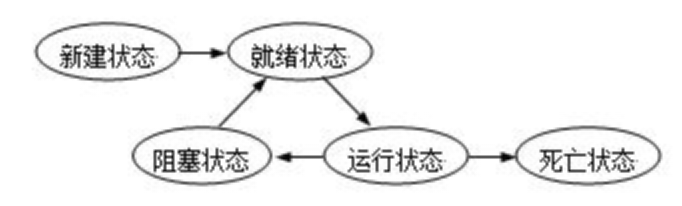
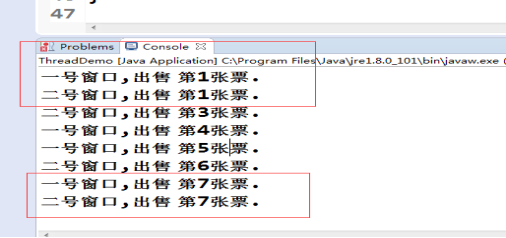
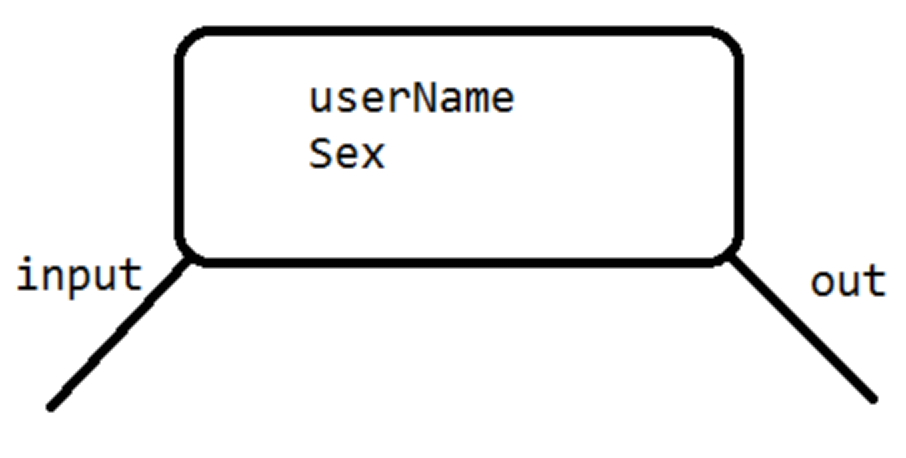
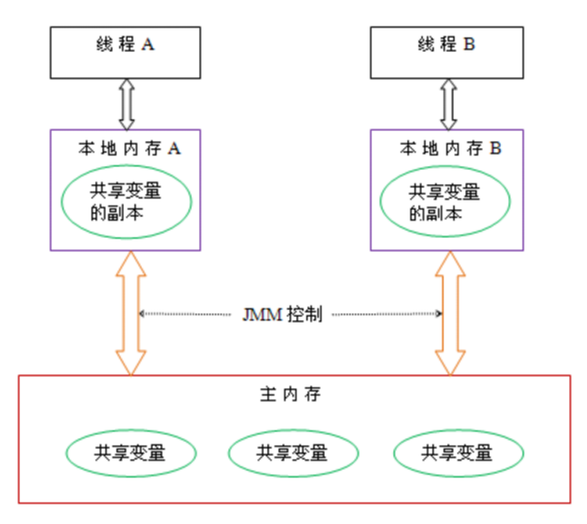
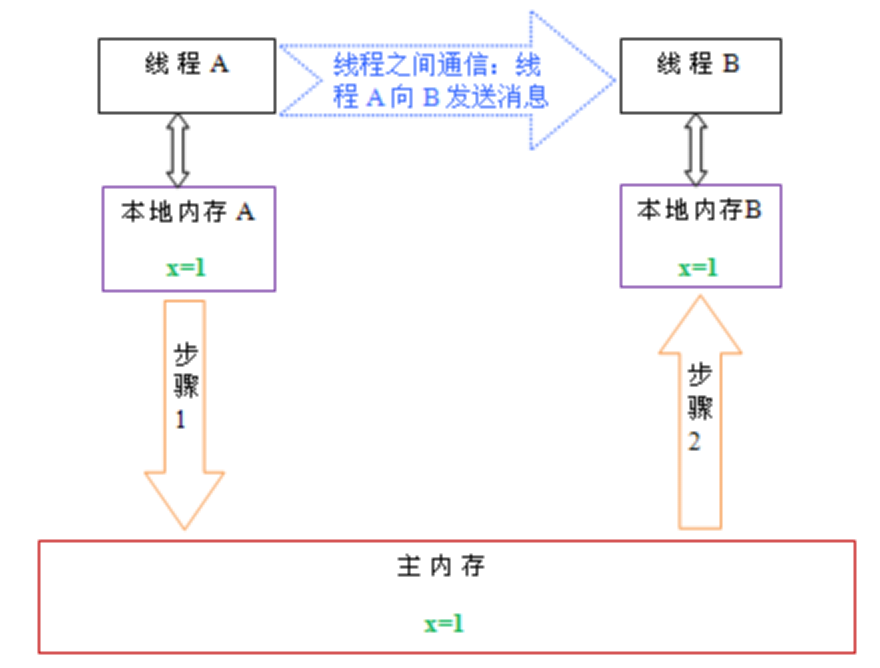

# Java架构师系列-多线程

---

### 一、基本概念

1、线程与进程的区别

每个正在系统上运行的程序都是一个进程，每个进程包含一到多个线程。线程是一组指令的集合，或者是程序的特殊段，它可以在程序里独立执行。也可以把它理解为代码运行的上下文。所以线程基本上是轻量级的进程，它负责在单个程序里执行多任务。通常由操作系统负责多个线程的调度和执行。

使用线程可以把占据时间长的程序中的任务放到后台去处理，程序的运行速度可能加快，在一些等待的任务实现上如用户输入、文件读写和网络收发数据等，线程就比较有用了。在这种情况下可以释放一些珍贵的资源如内存占用等等。

如果有大量的线程，会影响性能，因为操作系统需要在它们之间切换，更多的线程需要更多的内存空间，线程的中止需要考虑其对程序运行的影响。通常块模型数据是在多个线程间共享的，需要防止线程死锁情况的发生。

总结：进程是所有线程的集合，每一个线程是进程中的一条执行路径。

2、为什么要使用多线程？

现在有1000千克的水，目前只有小明一个人去打水，但是小明每小时打水200千克，现在要求一小时内把水全部打完，请问怎么解决？

解决办法:

如果小明一个人将水全部打完需要五个小时，再加四个人同时打水，分别为小军、小红、小玲、小小，加上小明一共五个人同时去打水，五个人每小时打水200千克，那么一小时后就可以完成打完1000千克水。

总结：多线程的好处是提高程序的效率。

### 二、多线程运行状态

线程从创建、运行到结束总是处于下面五个状态之一：新建状态、就绪状态、运行状态、阻塞状态及死亡状态。

1、新建状态

当用new操作符创建一个线程时， 例如new Thread(r)，线程还没有开始运行，此时线程处在新建状态。 当一个线程处于新生状态时，程序还没有开始运行线程中的代码。

2、就绪状态

一个新创建的线程并不自动开始运行，要执行线程，必须调用线程的start()方法。当线程对象调用start()方法即启动了线程，start()方法创建线程运行的系统资源，并调度线程运行run()方法。当start()方法返回后，线程就处于就绪状态。

处于就绪状态的线程并不一定立即运行run()方法，线程还必须同其他线程竞争CPU时间，只有获得CPU时间才可以运行线程。因为在单CPU的计算机系统中，不可能同时运行多个线程，一个时刻仅有一个线程处于运行状态。因此此时可能有多个线程处于就绪状态。对多个处于就绪状态的线程是由Java运行时系统的线程调度程序(thread scheduler)来调度的。

3、运行状态

当线程获得CPU时间后，它才进入运行状态，真正开始执行run()方法。

4、阻塞状态

线程运行过程中，可能由于各种原因进入阻塞状态：

* 线程通过调用sleep方法进入睡眠状态；
* 线程调用一个在I/O上被阻塞的操作，即该操作在输入输出操作完成之前不会返回到它的调用者；
* 线程试图得到一个锁，而该锁正被其他线程持有；
* 线程在等待某个触发条件；

5、死亡状态

有两个原因会导致线程死亡：

* run方法正常退出而自然死亡；
* 一个未捕获的异常终止了run方法而使线程猝死。

为了确定线程在当前是否存活着（就是要么是可运行的，要么是被阻塞了），需要使用isAlive方法。如果是可运行或被阻塞，这个方法返回true； 如果线程仍旧是new状态且不是可运行的， 或者线程死亡了，则返回false。

### 三、多线程创建方式

1、继承Thread类，重写run方法

~~~java
class CreateThread extends Thread {
	// run方法中编写多线程需要执行的代码
	public void run() {
		for (int i = 0; i< 10; i++) {
			System.out.println("i:" + i);
		}
	}
}

public class ThreadDemo {
	public static void main(String[] args) {
		System.out.println("-----多线程创建开始-----");
		// 1.创建一个线程
		CreateThread createThread = new CreateThread();
		// 2.开始执行线程。注意，开启线程不是调用run方法，而是start方法
		System.out.println("-----多线程创建启动-----");
		createThread.start();
		System.out.println("-----多线程创建结束-----");
	}
}
~~~

2、实现Runnable接口，重写run方法

~~~java
class CreateRunnable implements Runnable {
	@Override
	public void run() {
		for (int i = 0; i< 10; i++) {
			System.out.println("i:" + i);
		}
	}
}

public class ThreadDemo2 {
	public static void main(String[] args) {
		System.out.println("-----多线程创建开始-----");
		// 1.创建一个线程
		CreateRunnable createThread = new CreateRunnable();
		// 2.开始执行线程。注意，开启线程不是调用run方法，而是start方法
		System.out.println("-----多线程创建启动-----");
		Thread thread = new Thread(createThread);
		thread.start();
		System.out.println("-----多线程创建结束-----");
	}
}
~~~

3、使用匿名内部类

~~~java
System.out.println("-----多线程创建开始-----");
Thread thread = new Thread(new Runnable() {
	public void run() {
		for (int i = 0; i< 10; i++) {
			System.out.println("i:" + i);
		}
	}
});
thread.start();
System.out.println("-----多线程创建结束-----");
~~~

### 四、线程安全问题

1、什么是线程安全？

当多个线程同时共享，同一个全局变量或静态变量，做写的操作时，可能会发生数据冲突问题，也就是线程安全问题。但是做读操作是不会发生数据冲突问题。

案例：需求现在有100张火车票，有两个窗口同时抢火车票，请使用多线程模拟抢票效果。

代码：

~~~java
class ThreadTrain implements Runnable {
	// 这是车票总票数,多个线程会同时共享资源
	private int trainCount = 100;

	@Override
	public void run() {
		while (trainCount > 0) { // 循环是指线程不停的去卖票
			try { Thread.sleep(10); } catch (InterruptedException e) {}
			sale();
		}
	}

	public void sale() {
		if (trainCount > 0) {
			try { Thread.sleep(10); } catch (Exception e) {}
			System.out.println(Thread.currentThread().getName() + ",出售 第" + (100 - trainCount + 1) + "张票.");
			trainCount--;		
		}
	}
}

public class ThreadDemo {
	public static void main(String[] args) {
		ThreadTrain threadTrain = new ThreadTrain();
		Thread thread1 = new Thread(threadTrain, "一号窗口");
		Thread thread2 = new Thread(threadTrain, "二号窗口");
		thread1.start();
		thread2.start();
	}
}
~~~

运行结果：

一号窗口和二号窗口同时出售火车第一张和第七张，部分火车票会重复出售。结论发现，多个线程共享同一个全局成员变量时，做写的操作可能会发生数据冲突问题。

2、线程安全问题解决办法

问：如何解决多线程之间线程安全问题?

答：使用多线程之间同步或使用锁(lock)。

问：为什么使用线程同步或使用锁能解决线程安全问题呢？

答：将可能会发生数据冲突问题(线程不安全问题)，只能让当前一个线程进行执行。代码执行完成后释放锁，让后才能让其他线程进行执行。这样的话就可以解决线程不安全问题。

问：什么是多线程之间同步？

答：当多个线程共享同一个资源，不会受到其他线程的干扰。

3、同步代码块

~~~java
private Object mutex = new Object(); // 自定义多线程同步锁

public void sale() {
	synchronized (mutex) {
		if (trainCount > 0) {
			try { Thread.sleep(10); } catch (Exception e) {}
			System.out.println(Thread.currentThread().getName() + ",出售 第" + (100 - trainCount + 1) + "张票.");
			trainCount--;
		}
	}
}
~~~

4、同步函数

在方法上修饰synchronized，称为同步函数。

~~~java
public synchronized void sale() {
	if (trainCount > 0) { 
		try { Thread.sleep(40); } catch (Exception e) {}
		System.out.println(Thread.currentThread().getName() + ",出售 第" + (100 - trainCount + 1) + "张票.");
		trainCount--;
	}
}
~~~

5、同步函数使用this锁

证明方式：一个线程使用同步代码块(this明锁)，另一个线程使用同步函数。如果两个线程抢票不能实现同步，那么会出现数据错误。

~~~java
class ThreadTrain implements Runnable {
	// 这是车票总票数,多个线程会同时共享资源
	private int trainCount = 100;
	public boolean flag = true;
	private Object mutex = new Object();

	@Override
	public void run() {
		if (flag) {
			while (true) {
				synchronized (mutex) {
					if (trainCount > 0) {
						try { Thread.sleep(40); } catch (Exception e) {}
						System.out.println(Thread.currentThread().getName() + ", 出售第" + (100 - trainCount + 1) + "张票.");
						trainCount--;
					}
				}
			}
		} else {
			while (true) {
				sale();
			}
		}
	}

	public synchronized void sale() {
		if (trainCount > 0) {
			try { Thread.sleep(40); } catch (Exception e) {}
			System.out.println(Thread.currentThread().getName() + ", 出售 第" + (100 - trainCount + 1) + "张票.");
			trainCount--;
		}
	}
}

public class ThreadDemo {
	public static void main(String[] args) throws InterruptedException {
		ThreadTrain threadTrain = new ThreadTrain();
		Thread thread1 = new Thread(threadTrain, "一号窗口");
		Thread thread2 = new Thread(threadTrain, "二号窗口");
		thread1.start();
		Thread.sleep(40);
		threadTrain.flag = false;
		thread2.start();
	}
}
~~~

6、静态同步函数

什么是静态同步函数？方法上加上static关键字，使用synchronized关键字修饰或者使用类.class文件。静态的同步函数使用的锁是该函数所属字节码文件对象，可以用 getClass方法获取，也可以用当前类名.class 表示。

~~~java
synchronized (ThreadTrain.class) {
	System.out.println(Thread.currentThread().getName() + ",出售 第" + (100 - trainCount + 1) + "张票.");
	trainCount--;
	try { Thread.sleep(100); } catch (Exception e) {}
}
~~~

### 五、多线程死锁

什么是多线程死锁？同步中嵌套同步，导致锁无法释放。

~~~java
class ThreadTrain implements Runnable {
	// 这是车票总票数,多个线程会同时共享资源
	private int trainCount = 100;
	public boolean flag = true;
	private Object mutex = new Object();

	@Override
	public void run() {
		if (flag) {
			while (true) {
				synchronized (mutex) {
					// 锁(同步代码块)在什么时候释放？代码执行完，自动释放锁.
					// 如果flag为true，先拿到obj锁,再拿到this锁，才能执行。
					// 如果flag为false，先拿到this锁,再拿到obj锁，才能执行。
					// 死锁解决办法:不要在同步中嵌套同步。
					sale();
				}
			}
		} else {
			while (true) {
				sale();
			}
		}
	}

	public synchronized void sale() {
		synchronized (mutex) {
			if (trainCount > 0) {
				try { Thread.sleep(40); } catch (Exception e) {}
				System.out.println(Thread.currentThread().getName() + ",出售 第" + (100 - trainCount + 1) + "张票.");
				trainCount--;
			}
		}
	}
}

public class DeadlockThread {
	public static void main(String[] args) throws InterruptedException {
		ThreadTrain threadTrain = new ThreadTrain();
		Thread thread1 = new Thread(threadTrain, "一号窗口");
		Thread thread2 = new Thread(threadTrain, "二号窗口");
		thread1.start();
		Thread.sleep(40);
		threadTrain.flag = false;
		thread2.start();
	}
}
~~~

### 六、多线程之间实现通讯

1、什么是多线程之间通讯？ 

多线程之间通讯，其实就是多个线程在操作同一个资源，但是操作的动作不同。

案例：第一个线程写入(input)用户，另一个线程取读取(out)用户。实现读一个，写一个操作。

代码：

~~~java
class Res {
	public String userSex;
	public String userName;
}

class IntThrad extends Thread {
	private Res res;

	public IntThrad(Res res) {
		this.res = res;
	}

	@Override
	public void run() {
		int count = 0;
		while (true) {
			if (count == 0) {
				res.userName = "张三";
				res.userSex = "男";
			} else {
				res.userName = "小紅";
				res.userSex = "女";
			}
			count = (count + 1) % 2;
		}
	}
}

class OutThread extends Thread {
	private Res res;

	public OutThread(Res res) {
		this.res = res;
	}

	@Override
	public void run() {
		while (true) {
			System.out.println(res.userName + "--" + res.userSex);
		}
	}
}

public class ThreadDemo {
	public static void main(String[] args) throws Exception{
		Res res = new Res();
		IntThrad intThrad = new IntThrad(res);
		OutThread outThread = new OutThread(res);
		intThrad.start();
		outThread.start();
	}
}
~~~

2、解决线程安全问题

IntThrad 加上 synchronized：

~~~java
class IntThrad extends Thread {
	private Res res;

	public IntThrad(Res res) {
		this.res = res;
	}

	@Override
	public void run() {
		int count = 0;
		while (true) {
			synchronized (res) {
				if (count == 0) {
					res.userName = "张三";
					res.userSex = "男";
				} else {
					res.userName = "小紅";
					res.userSex = "女";
				}
				count = (count + 1) % 2;
			}
		}
	}
}
~~~

输出线程加上synchronized：

~~~java
class OutThread extends Thread {
	private Res res;

	public OutThread(Res res) {
		this.res = res;
	}

	@Override
	public void run() {
		while (true) {
			synchronized (res) {
				System.out.println(res.userName + "--" + res.userSex);
			}
		}
	}
}
~~~

3、wait()、notify()、notifyAll()方法

wait()、notify()、notifyAll()是三个定义在Object类里的方法，可以用来控制线程的状态。这三个方法最终调用的都是jvm级的native方法，随着jvm运行平台的不同可能有些许差异。

* 如果对象调用了wait方法就会使持有该对象的线程把该对象的控制权交出去，然后处于等待状态。
* 如果对象调用了notify方法就会通知某个正在等待这个对象的控制权的线程可以继续运行。
* 如果对象调用了notifyAll方法就会通知所有等待这个对象控制权的线程继续运行。

~~~java
class Res {
	public String userSex;
	public String userName;
	//线程通讯标识
	public boolean flag = false;
}

class IntThrad extends Thread {
	private Res res;

	public IntThrad(Res res) {
		this.res = res;
	}

	@Override
	public void run() {
		int count = 0;
		while (true) {
			synchronized (res) {
				if (res.flag) {
					try {
						// 当前线程变为等待，但是可以释放锁
						res.wait();
					} catch (Exception e) {

					}
				}
				if (count == 0) {
					res.userName = "张三";
					res.userSex = "男";
				} else {
					res.userName = "小紅";
					res.userSex = "女";
				}
				count = (count + 1) % 2;
				res.flag = true;
				// 唤醒当前线程
				res.notify();
			}
		}
	}
}

class OutThread extends Thread {
	private Res res;

	public OutThread(Res res) {
		this.res = res;
	}

	@Override
	public void run() {
		while (true) {
			synchronized (res) {
				if (!res.flag) {
					try {
						res.wait();
					} catch (Exception e) {
						// TODO: handle exception
					}
				}
				System.out.println(res.userName + "--" + res.userSex);
				res.flag = false;
				res.notify();
			}
		}
	}
}

public class ThreadDemo {
	public static void main(String[] args) {
		Res res = new Res();
		IntThrad intThrad = new IntThrad(res);
		OutThread outThread = new OutThread(res);
		intThrad.start();
		outThread.start();
	}
}
~~~

4、wait与sleep区别

对于sleep()方法，我们首先要知道该方法是属于Thread类中的。而wait()方法，则是属于Object类中的。

sleep()方法导致了程序暂停执行指定的时间，让出cpu该其他线程，但是他的监控状态依然保持着，当指定的时间到了又会自动恢复运行状态。在调用sleep()方法的过程中，线程不会释放对象锁。

而当调用wait()方法的时候，线程会放弃对象锁，进入等待此对象的等待锁定池，只有针对此对象调用notify()方法后本线程才进入对象锁定池准备获取对象锁进入运行状态。

### 七、JDK1.5 Lock

在 jdk1.5 之后，并发包中新增了 Lock 接口(以及相关实现类)用来实现锁功能。Lock 接口提供了与 synchronized 关键字类似的同步功能，但需要在使用时手动获取锁和释放锁。

1、Lock

~~~java
Lock lock = new ReentrantLock();
lock.lock();
try{
	//可能会出现线程安全的操作
} finally {
	//一定在finally中释放锁
	//也不能把获取锁在try中进行，因为有可能在获取锁的时候抛出异常
	lock.ublock();
}
~~~

2、ReentrantLock

ReentrantLock是一个可重入的互斥锁，ReentrantLock由最近成功获取锁，还没有释放的线程所拥有。当锁被另一个线程拥有时，调用lock的线程可以成功获取锁。如果锁已经被当前线程拥有，当前线程会立即返回。

3、Lock 接口与 synchronized 关键字的区别

* Lock 接口可以尝试非阻塞地获取锁，当前线程尝试获取锁。如果这一时刻锁没有被其他线程获取到，则成功获取并持有锁。
* Lock 接口能被中断地获取锁。与 synchronized 不同，获取到锁的线程能够响应中断，当获取到的锁的线程被中断时，中断异常将会被抛出，同时锁会被释放。
* Lock 接口在指定的截止时间之前获取锁，如果截止时间到了依旧无法获取锁，则返回。

4、Condition用法

 Condition的功能类似于在传统的线程技术中的 Object.wait()和Object.notify()的功能。

~~~java
Condition condition = lock.newCondition();
condition.await();  //类似wait
condition.signal(); //类似notify
condition.signalAll(); //类似notifyALL
~~~

### 八、如何停止线程

停止线程思路：

* 使用退出标志，使线程正常退出，也就是当run方法完成后线程终止。
* 使用stop方法强行终止线程（这个方法不推荐使用，因为stop和suspend、resume一样，也可能发生不可预料的结果）。
* 使用interrupt方法中断线程。（线程在阻塞状态）

~~~java
class StopThread implements Runnable {
	private boolean flag = true;

	@Override
	public synchronized void run() {
		while (flag) {
			try {
				wait();
			} catch (Exception e) {
				//e.printStackTrace();
				stopThread();
			}
			System.out.println("thread run..");
		}
	}

	public void stopThread() {
		flag = false;
	}
}

public class StopThreadDemo {
	public static void main(String[] args) {
		StopThread stopThread = new StopThread();
		Thread thread1 = new Thread(stopThread);
		Thread thread2 = new Thread(stopThread);
		thread1.start();
		thread2.start();
		int i = 0;
		while (true) {
			System.out.println("thread main..");
			if (i == 300) {
				// stopThread.stopThread();
				thread1.interrupt();
				thread2.interrupt();
				break;
			}
			i++;
		}
	}
}
~~~

### 九、线程其他方法

1、守护线程

Java中有两种线程，一种是用户线程，另一种是守护线程。当进程不存在或主线程停止，守护线程也会被停止。使用setDaemon(true)方法设置为守护线程。

~~~java
public class DaemonThread {
	public static void main(String[] args) {
		Thread thread = new Thread(new Runnable() {
			@Override
			public void run() {
				while (true) {
					try {
						Thread.sleep(100);
					} catch (Exception e) {
						// TODO: handle exception
					}
					System.out.println("我是子线程...");
				}
			}
		});
		thread.setDaemon(true);
		thread.start();
		for (int i = 0; i < 10; i++) {
			try {
				Thread.sleep(100);
			} catch (Exception e) {

			}
			System.out.println("我是主线程");
		}
		System.out.println("主线程执行完毕!");
	}
}
~~~

2、join()方法

join()方法作用是让其他线程变为等待。

创建一个线程，子线程执行完毕后，主线程才能执行。

~~~java
class JoinThread implements Runnable {
	public void run() {
		for (int i = 0; i < 100; i++) {
			System.out.println(Thread.currentThread().getName() + "---i:" + i);
		}
	}
}

public class JoinThreadDemo {
	public static void main(String[] args) {
		JoinThread joinThread = new JoinThread();
		Thread t1 = new Thread(joinThread);
		Thread t2 = new Thread(joinThread);
		t1.start();
		t2.start();
		try {
			//其他线程变为等待状态，等t1线程执行完成之后才能执行join方法。
			t1.join();
		} catch (Exception e) {

		}
		for (int i = 0; i < 100; i++) {
			System.out.println("main ---i:" + i);
		}
	}
}
~~~

3、优先级

现代操作系统基本采用时分的形式调度运行的线程，线程分配得到的时间片的多少决定了线程使用处理器资源的多少，也对应了线程优先级这个概念。在JAVA线程中，通过一个int priority来控制优先级，范围为1-10，其中10最高，默认值为5。下面是源码（基于1.8）中关于priority的一些量和方法。

~~~java
class PrioritytThread implements Runnable {
	public void run() {
		for (int i = 0; i < 100; i++) {
			System.out.println(Thread.currentThread().toString() + "---i:" + i);
		}
	}
}

public class ThreadDemo {
	public static void main(String[] args) {
		PrioritytThread prioritytThread = new PrioritytThread();
		Thread t1 = new Thread(prioritytThread);
		Thread t2 = new Thread(prioritytThread);
		t1.start();
		// 注意设置了优先级，不代表每次都一定会被执行，只是CPU调度会有限分配
		t1.setPriority(10);
		t2.start();
	}
}
~~~

4、yield方法

Thread.yield()方法的作用：暂停当前正在执行的线程，并执行其他线程。（可能没有效果）

yield()让当前正在运行的线程回到可运行状态，以允许具有相同优先级的其他线程获得运行的机会。因此，使用yield()的目的是让具有相同优先级的线程之间能够适当的轮换执行。但是，实际中无法保证yield()达到让步的目的，因为，让步的线程可能被线程调度程序再次选中。

结论：大多数情况下，yield()将导致线程从运行状态转到可运行状态，但有可能没有效果。

### 十、多线程三大特性

多线程有三大特性，原子性、可见性、有序性。

1、原子性

即一个操作或者多个操作，要么全部执行并且执行的过程不会被任何因素打断，要么就都不执行。

一个很经典的例子就是银行账户转账问题： 比如从账户A向账户B转1000元，那么必然包括2个操作：从账户A减去1000元，往账户B加上1000元。这2个操作必须要具备原子性才能保证不出现一些意外的问题。

我们操作数据也是如此，比如i = i+1；其中就包括，读取i的值，计算i，写入i。这行代码在Java中是不具备原子性的，则多线程运行肯定会出问题，所以也需要我们使用同步和lock这些东西来确保这个特性了。 

原子性其实就是保证数据一致、线程安全一部分。

2、可见性

当多个线程访问同一个变量时，一个线程修改了这个变量的值，其他线程能够立即看得到修改的值。若两个线程在不同的cpu，那么线程1改变了i的值还没刷新到主存，线程2又使用了i，那么这个i值肯定还是之前的，线程1对变量的修改线程没看到这就是可见性问题。

3、有序性

程序执行的顺序按照代码的先后顺序执行。

一般来说处理器为了提高程序运行效率，可能会对输入代码进行优化，它不保证程序中各个语句的执行先后顺序同代码中的顺序一致，但是它会保证程序最终执行结果和代码顺序执行的结果是一致的。如下：

~~~java
int a = 10; //语句1
int r = 2;  //语句2
a = a + 3;  //语句3
r = a*a;    //语句4
~~~

则因为重排序，他还可能执行顺序为 2-1-3-4，1-3-2-4，但绝不可能 2-1-4-3，因为这打破了依赖关系。显然重排序对单线程运行是不会有任何问题，而多线程就不一定了，所以我们在多线程编程时就得考虑这个问题了。

### 十一、Java内存模型

共享内存模型指的就是Java内存模型(简称JMM)。JMM决定一个线程对共享变量的写入时，能对另一个线程可见。从抽象的角度来看，JMM定义了线程和主内存之间的抽象关系：线程之间的共享变量存储在主内存（main memory）中，每个线程都有一个私有的本地内存（local memory），本地内存中存储了该线程以读/写共享变量的副本。本地内存是JMM的一个抽象概念，并不真实存在。它涵盖了缓存，写缓冲区，寄存器以及其他的硬件和编译器优化。

从上图来看，线程A与线程B之间如要通信的话，必须要经历下面2个步骤：

1）首先，线程A把本地内存A中更新过的共享变量刷新到主内存中去。

2）然后，线程B到主内存中去读取线程A之前已更新过的共享变量。 

下面通过示意图来说明这两个步骤： 

如上图所示，本地内存A和B有主内存中共享变量x的副本。假设初始时，这三个内存中的x值都为0。线程A在执行时，把更新后的x值（假设值为1）临时存放在自己的本地内存A中。当线程A和线程B需要通信时，线程A首先会把自己本地内存中修改后的x值刷新到主内存中，此时主内存中的x值变为了1。随后，线程B到主内存中去读取线程A更新后的x值，此时线程B的本地内存的x值也变为了1。

从整体来看，这两个步骤实质上是线程A在向线程B发送消息，而且这个通信过程必须要经过主内存。JMM通过控制主内存与每个线程的本地内存之间的交互，来为java程序员提供内存可见性保证。

总结：什么是Java内存模型？Java内存模型简称jmm，定义了一个线程对另一个线程可见。共享变量存放在主内存中，每个线程都有自己的本地内存，当多个线程同时访问一个数据的时候，可能本地内存没有及时刷新到主内存，所以就会发生线程安全问题。

### 十二、volatile

1、volatile 关键字

volatile 关键字的作用是变量在多个线程之间可见。

~~~java
class ThreadVolatileDemo extends Thread {
	public boolean flag = true;
	@Override
	public void run() {
		System.out.println("开始执行子线程....");
		while (flag) {
		}
		System.out.println("线程停止");
	}
	public void setRuning(boolean flag) {
		this.flag = flag;
	}
}

public class ThreadVolatile {
	public static void main(String[] args) throws InterruptedException {
		ThreadVolatileDemo threadVolatileDemo = new ThreadVolatileDemo();
		threadVolatileDemo.start();
		Thread.sleep(3000);
		threadVolatileDemo.setRuning(false);
		System.out.println("flag 已经设置成false");
		Thread.sleep(1000);
		System.out.println(threadVolatileDemo.flag);
	}
}
~~~

运行结果：

已经将结果设置为false，为什么还一直在运行呢？

原因：线程之间是不可见的，读取的是副本，没有及时读取到主内存结果。

解决办法：使用volatile关键字将解决线程之间可见性，强制线程每次读取该值的时候都去“主内存”中取值。

2、volatile非原子性

~~~java
public class VolatileNoAtomic extends Thread {
	private static volatile int count;

	private static void addCount() {
		for (int i = 0; i < 1000; i++) {
			count++;
		}
		System.out.println(count);
	}

	public void run() {
		addCount();
	}

	public static void main(String[] args) {

		VolatileNoAtomic[] arr = new VolatileNoAtomic[100];
		for (int i = 0; i < 10; i++) {
			arr[i] = new VolatileNoAtomic();
		}

		for (int i = 0; i < 10; i++) {
			arr[i].start();
		}
	}
}
~~~

结果发现，数据不同步，因为volatile不具备原子性。

3、使用AtomicInteger原子类

~~~java
public class VolatileNoAtomic extends Thread {
	static int count = 0;
	private static AtomicInteger atomicInteger = new AtomicInteger(0);

	@Override
	public void run() {
		for (int i = 0; i < 1000; i++) {
			//等同于i++
			atomicInteger.incrementAndGet();
		}
		System.out.println(count);
	}

	public static void main(String[] args) {
		// 初始化10个线程
		VolatileNoAtomic[] volatileNoAtomic = new VolatileNoAtomic[10];
		for (int i = 0; i < 10; i++) {
			// 创建
			volatileNoAtomic[i] = new VolatileNoAtomic();
		}
		for (int i = 0; i < volatileNoAtomic.length; i++) {
			volatileNoAtomic[i].start();
		}
	}
}
~~~

4、volatile与synchronized区别

* 仅靠volatile不能保证线程的安全性。（原子性）
* volatile轻量级，只能修饰变量。synchronized重量级，还可修饰方法。
* volatile只能保证数据的可见性，不能用来同步，因为多个线程并发访问volatile修饰的变量不会阻塞。
* synchronized不仅保证可见性，而且还保证原子性。因为，只有获得了锁的线程才能进入临界区，从而保证临界区中的所有语句都全部执行。多个线程争抢synchronized锁对象时，会出现阻塞。

5、线程安全性

线程安全性包括两个方面：可见性、原子性。从上面自增的例子中可以看出：仅仅使用volatile并不能保证线程安全性，而synchronized则可实现线程的安全性。

### 十三、ThreadLocal

1、什么是ThreadLocal

ThreadLocal提高一个线程的局部变量，访问某个线程拥有自己局部变量。当使用ThreadLocal维护变量时，ThreadLocal为每个使用该变量的线程提供独立的变量副本，所以每一个线程都可以独立地改变自己的副本，而不会影响其它线程所对应的副本。

2、ThreadLocal的接口方法

ThreadLocal类接口很简单，只有4个方法，我们先来了解一下：

* void set(Object value) 设置当前线程的线程局部变量的值。
* public Object get() 该方法返回当前线程所对应的线程局部变量。
* public void remove() 将当前线程局部变量的值删除，目的是为了减少内存的占用，该方法是JDK 5.0新增的方法。需要指出的是，当线程结束后，对应该线程的局部变量将自动被垃圾回收，所以显式调用该方法清除线程的局部变量并不是必须的操作，但它可以加快内存回收的速度。
* protected Object initialValue() 返回该线程局部变量的初始值，该方法是一个protected的方法，显然是为了让子类覆盖而设计的。这个方法是一个延迟调用方法，在线程第1次调用get()或set(Object)时才执行，并且仅执行1次。ThreadLocal中的缺省实现直接返回一个null。
 
3、案例

创建三个线程，每个线程生成自己独立序列号。

代码：

~~~java
class Res {
	// 生成序列号共享变量
	public static Integer count = 0;
	
	public static ThreadLocal<Integer> threadLocal = new ThreadLocal<Integer>() {
		protected Integer initialValue() {
			return 0;
		};
	};

	public Integer getNum() {
		int count = threadLocal.get() + 1;
		threadLocal.set(count);
		return count;
	}
}

public class ThreadLocaDemo extends Thread {
	private Res res;

	public ThreadLocaDemo(Res res) {
		this.res = res;
	}

	@Override
	public void run() {
		for (int i = 0; i < 3; i++) {
			System.out.println(Thread.currentThread().getName() + "---" + "i---" + i + "--num:" + res.getNum());
		}
	}

	public static void main(String[] args) {
		Res res = new Res();
		ThreadLocaDemo threadLocaDemo1 = new ThreadLocaDemo(res);
		ThreadLocaDemo threadLocaDemo2 = new ThreadLocaDemo(res);
		ThreadLocaDemo threadLocaDemo3 = new ThreadLocaDemo(res);
		threadLocaDemo1.start();
		threadLocaDemo2.start();
		threadLocaDemo3.start();
	}
}
~~~

4、ThreadLocal实现原理

ThreadLocal通过map集合，map.put(“当前线程”, 值)；

### 十四、线程池

1、什么是线程池？

线程池是指在初始化一个多线程应用程序过程中创建一个线程集合，然后在需要执行新的任务时重用这些线程而不是新建一个线程。线程池中线程的数量通常完全取决于可用内存数量和应用程序的需求。然而，增加可用线程数量是可能的。线程池中的每个线程都有被分配一个任务，一旦任务已经完成了，线程回到池子中并等待下一次分配任务。

2、线程池作用

基于以下几个原因在多线程应用程序中使用线程是必须的：

* 线程池改进了一个应用程序的响应时间。由于线程池中的线程已经准备好且等待被分配任务，应用程序可以直接拿来使用而不用新建一个线程。
* 线程池节省了CLR 为每个短生存周期任务创建一个完整的线程的开销并可以在任务完成后回收资源。
* 线程池根据当前在系统中运行的进程来优化线程时间片。
* 线程池允许我们开启多个任务而不用为每个线程设置属性。
* 线程池允许我们为正在执行的任务的程序参数传递一个包含状态信息的对象引用。
* 线程池可以用来解决处理一个特定请求最大线程数量限制问题。

3、线程池四种创建方式

Java通过Executors（jdk1.5并发包）提供四种线程池，分别为：

* newCachedThreadPool创建一个可缓存线程池，如果线程池长度超过处理需要，可灵活回收空闲线程，若无可回收，则新建线程。
* newFixedThreadPool 创建一个定长线程池，可控制线程最大并发数，超出的线程会在队列中等待。
* newScheduledThreadPool 创建一个定长线程池，支持定时及周期性任务执行。
* newSingleThreadExecutor 创建一个单线程化的线程池，它只会用唯一的工作线程来执行任务，保证所有任务按照指定顺序(FIFO, LIFO, 优先级)执行。

4、newCachedThreadPool

创建一个可缓存线程池，如果线程池长度超过处理需要，可灵活回收空闲线程，若无可回收，则新建线程。

~~~java
ExecutorService cachedThreadPool = Executors.newCachedThreadPool();
for (int i = 0; i < 10; i++) {
	final int index = i;
	cachedThreadPool.execute(new Runnable() {
		public void run() {
			System.out.println(Thread.currentThread().getName() + "---" + index);
		}
	});
}
~~~

总结：线程池为无限大，当执行第二个任务时第一个任务已经完成，会复用执行第一个任务的线程，而不用每次新建线程。

5、newFixedThreadPool

创建一个定长线程池，可控制线程最大并发数，超出的线程会在队列中等待。

~~~java
// 创建一个定长线程池，可控制线程最大并发数，超出的线程会在队列中等待
final ExecutorService newCachedThreadPool = Executors.newFixedThreadPool(3);
for (int i = 0; i < 10; i++) {
	final int index = i;
	newCachedThreadPool.execute(new Runnable() {
		public void run() {
			try {
				Thread.sleep(1000);
			} catch (Exception e) {
				// TODO: handle exception
			}
			System.out.println("i:" + index);
		}
	});
}
~~~

总结：因为线程池大小为3，每个任务输出index后sleep 2秒，所以每两秒打印3个数字。定长线程池的大小最好根据系统资源进行设置。如Runtime.getRuntime().availableProcessors()。

6、newScheduledThreadPool

创建一个定长线程池，支持定时及周期性任务执行。

~~~java
// 创建一个定长线程池，支持定时及周期性任务执行。延迟执行示例代码如下：
ScheduledExecutorService newScheduledThreadPool = Executors.newScheduledThreadPool(5);
newScheduledThreadPool.schedule(new Runnable() {
	public void run() {
		System.out.println("delay 3 seconds");
	}
}, 3, TimeUnit.SECONDS);
~~~

7、newSingleThreadExecutor

创建一个单线程化的线程池，它只会用唯一的工作线程来执行任务，保证所有任务按照指定顺序(FIFO, LIFO, 优先级)执行。

~~~java
ExecutorService newSingleThreadExecutor = Executors.newSingleThreadExecutor();
for (int i = 0; i < 10; i++) {
	final int index = i;
	newSingleThreadExecutor.execute(new Runnable() {
		@Override
		public void run() {
			System.out.println("index:" + index);
			try {
				Thread.sleep(200);
			} catch (Exception e) {
				// TODO: handle exception
			}
		}
	});
}
~~~

注意：结果依次输出，相当于顺序执行各个任务。

### 十五、示例

1、有T1、T2、T3三个线程，如何保证T2在T1执行完后执行，T3在T2执行完后执行？

   

---

