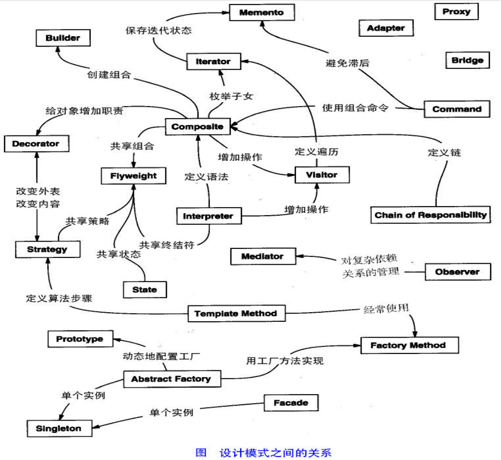
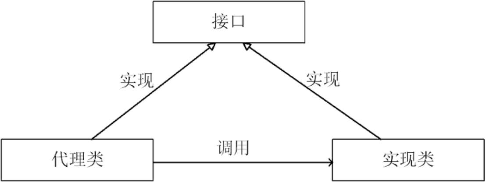

# Java架构师系列-设计模式

---

### 一、概述

1、什么是设计模式？

设计模式（Design pattern）是一套被反复使用、多数人知晓的、经过分类编目的、代码设计经验的总结。使用设计模式是为了可重用代码、让代码更容易被他人理解、保证代码可靠性。 毫无疑问，设计模式于己于他人于系统都是多赢的，设计模式使代码编制真正工程化，设计模式是软件工程的基石，如同大厦的一块块砖石一样。项目中合理的运用设计模式可以完美的解决很多问题，每种模式在现在中都有相应的原理来与之对应，每一个模式描述了一个在我们周围不断重复发生的问题，以及该问题的核心解决方案，这也是它能被广泛应用的原因。

2、设计模式的分类

总体来说设计模式分为三大类：

创建型模式，共五种：工厂方法模式、抽象工厂模式、单例模式、建造者模式、原型模式。

结构型模式，共七种：适配器模式、装饰器模式、代理模式、外观模式、桥接模式、组合模式、享元模式。

行为型模式，共十一种：策略模式、模板方法模式、观察者模式、迭代子模式、责任链模式、命令模式、备忘录模式、状态模式、访问者模式、中介者模式、解释器模式。

其实还有两类：并发型模式和线程池模式。

### 二、设计模式的六大原则

1、开闭原则（Open Close Principle）

开闭原则就是说对扩展开放，对修改关闭。在程序需要进行拓展的时候，不能去修改原有的代码，实现一个热插拔的效果。所以一句话概括就是：为了使程序的扩展性好，易于维护和升级。想要达到这样的效果，我们需要使用接口和抽象类，后面的具体设计中我们会提到这点。

2、里氏代换原则（Liskov Substitution Principle）

里氏代换原则(Liskov Substitution Principle LSP)面向对象设计的基本原则之一。 里氏代换原则中说，任何基类可以出现的地方，子类一定可以出现。 LSP是继承复用的基石，只有当衍生类可以替换掉基类，软件单位的功能不受到影响时，基类才能真正被复用，而衍生类也能够在基类的基础上增加新的行为。里氏代换原则是对“开-闭”原则的补充。实现“开-闭”原则的关键步骤就是抽象化。而基类与子类的继承关系就是抽象化的具体实现，所以里氏代换原则是对实现抽象化的具体步骤的规范。

3、依赖倒转原则（Dependence Inversion Principle）

这个是开闭原则的基础，具体内容：真对接口编程，依赖于抽象而不依赖于具体。

4、接口隔离原则（Interface Segregation Principle）

这个原则的意思是：使用多个隔离的接口，比使用单个接口要好。还是一个降低类之间的耦合度的意思，从这儿我们看出，其实设计模式就是一个软件的设计思想，从大型软件架构出发，为了升级和维护方便。所以上文中多次出现：降低依赖，降低耦合。

5、迪米特法则（最少知道原则）（Demeter Principle）

为什么叫最少知道原则，就是说：一个实体应当尽量少的与其他实体之间发生相互作用，使得系统功能模块相对独立。

6、合成复用原则（Composite Reuse Principle）

原则是尽量使用合成/聚合的方式，而不是使用继承。

### 三、单例模式

单例保证一个对象在JVM中只能有一个实例，常见单例有懒汉式、饿汉式。

懒汉式，就是需要的才会去实例化，线程不安全。饿汉式，就是当class文件被加载的时候，初始化，天生线程安全。

懒汉式：

~~~java
class SingletonTest {
	public static void main(String[] args) {
		Singleton sl1 = Singleton.getSingleton();
		Singleton sl2 = Singleton.getSingleton();
		System.out.println(sl1 == sl2);
	}
}

public class Singleton {
	// 当需要的才会被实例化
	private static Singleton singleton;

	private Singleton() {

	}

	synchronized public static Singleton getSingleton() {
		if (singleton == null) {
			singleton = new Singleton();
		}
		return singleton;
	}
}
~~~

饿汉式：

~~~java
class SingletonTest {
	public static void main(String[] args) {
		Singleton sl1 = Singleton.getSingleton();
		Singleton sl2 = Singleton.getSingleton();
		System.out.println((sl1 == sl2)+"-");
	}
}

public class Singleton {
	//当class 文件被加载初始化
	private static Singleton singleton = new Singleton1();

	private Singleton() {

	}

	public static Singleton getSingleton() {
		return singleton;
	}
}
~~~

### 四、工厂模式

工厂模式实现创建者和调用者分离。

1、简单工厂代码

~~~java
interface Car {
	public void run();
}
class AoDi implements Car {
	@Override
	public void run() {
     System.out.println("奥迪....");
	}
}
class BenChi implements Car {
	@Override
	public void run() {
     System.out.println("奔驰....");
	}
}

public class CarFactory {
	static public Car createCar(String carName) {
		Car car = null;
		if (carName.equals("奥迪")) {
			car = new AoDi();
		} else if (carName.equals("奔驰")) {
			car = new BenChi();
		}
		return car;

	}
	public static void main(String[] args) {
		Car car1 = CarFactory.createCar("奥迪");
		Car car2 = CarFactory.createCar("奔驰");
		car1.run();
		car2.run();
	}
}
~~~

2、工厂方法

~~~java
public interface Car {
	public void run();
}

public class AoDi implements Car {
	@Override
	public void run() {
		System.out.println("奥迪....");
	}
}

public class BenChi implements Car {
	@Override
	public void run() {
		System.out.println("奔驰....");
	}
}

public class AoDiChiFactory {
	static public Car createCar() {
		return new AoDi();
	}
} 

public interface BenChiFactory  {
	static public Car createCar() {
		return new BenChi();
	}
} 

public class Main {
	public static void main(String[] args) {
		Car c1 = AoDiChiFactory.createCar();
		Car c2 = BenChiFactory.createCar();
		c1.run();
		c2.run();
	}
}
~~~

### 五、代理模式

1、什么是代理？

通过代理控制对象的访问，可以详细访问某个对象的方法，在这个方法调用处理，或调用后处理。既(AOP微实现)，AOP核心技术面向切面编程。

2、代理应用场景

* 安全代理，可以屏蔽真实角色；
* 远程代理，远程调用代理类RMI；
* 延迟加载，先加载轻量级代理类，真正需要在加载真实；

3、代理的分类

* 静态代理(静态定义代理类)
* 动态代理(动态生成代理类)：Jdk自带动态代理、Cglib 、javaassist（字节码操作库）

4、静态代理

静态代理需要自己生成代理类。

~~~java
public interface Hose {
	public void mai();
}
public class XiaoMing implements Hose {
	@Override
	public void mai() {
		System.out.println("我是小明,我要买房啦!");
	}
}
class Proxy implements Hose {
	private XiaoMing xiaoMing;
	public Proxy(XiaoMing xiaoMing) {
		this.xiaoMing = xiaoMing;
	}
	public void mai() {
		System.out.println("我是中介 看你买房开始啦!");
		xiaoMing.mai();
		System.out.println("我是中介 看你买房结束啦!");
	}
	public static void main(String[] args) {
		Hose proxy = new Proxy(new XiaoMing());
		proxy.mai();
	}
}
~~~

5、JDK动态代理

不需要生成代理类，实现InvocationHandler 就可以了。

~~~java
public interface Hose {
	public void mai();
}
public class XiaoMing implements Hose {
	@Override
	public void mai() {
		System.out.println("我是小明,我要买房啦!");
	}
}
public class JDKProxy implements InvocationHandler {
	private Object tarjet;

	public JDKProxy(Object tarjet) {
		this.tarjet = tarjet;
	}

	@Override
	public Object invoke(Object proxy, Method method, Object[] args) throws Throwable {
		System.out.println("我是房产中介.....开始监听你买房啦!");
		Object oj = method.invoke(tarjet, args);
		System.out.println("我是房产中介.....结束监听你买房啦!");
		return oj;
	}
}
class Test {
	public static void main(String[] args) {
		XiaoMing xiaoMing = new XiaoMing();
		JDKProxy jdkProxy = new JDKProxy(xiaoMing);
		Hose hose=(Hose) Proxy.newProxyInstance(xiaoMing.getClass().getClassLoader(), xiaoMing.getClass().getInterfaces(), jdkProxy);
		hose.mai();
	}
}
~~~

6、CGLIB动态代理

~~~java
import java.lang.reflect.Method;
import net.sf.cglib.proxy.Enhancer;
import net.sf.cglib.proxy.MethodInterceptor;
import net.sf.cglib.proxy.MethodProxy;

public class Cglib implements MethodInterceptor {
	@Override
	public Object intercept(Object o, Method method, Object[] args, MethodProxy methodProxy) throws Throwable {
		System.out.println("我是买房中介， 开始监听你买房了....");
		Object invokeSuper = methodProxy.invokeSuper(o, args);
		System.out.println("我是买房中介， 开结束你买房了....");
		return invokeSuper;
	}
}
public class Test {
	public static void main(String[] args) {
		Cglib cglib = new Cglib();
		Enhancer enhancer = new Enhancer();
		enhancer.setSuperclass(XiaoMing.class);
		enhancer.setCallback(cglib);
		Hose hose = (Hose) enhancer.create();
		hose.mai();
	}
}
~~~

7、CGLIB与JDK动态代理区别

jdk动态代理是由Java内部的反射机制来实现的，cglib动态代理底层则是借助asm来实现的。总的来说，反射机制在生成类的过程中比较高效，而asm在生成类之后的相关执行过程中比较高效（可以通过将asm生成的类进行缓存，这样解决asm生成类过程低效问题）。还有一点必须注意：jdk动态代理的应用前提，必须是目标类基于统一的接口。如果没有上述前提，jdk动态代理不能应用。

注：asm其实就是java字节码控制。

   

---

