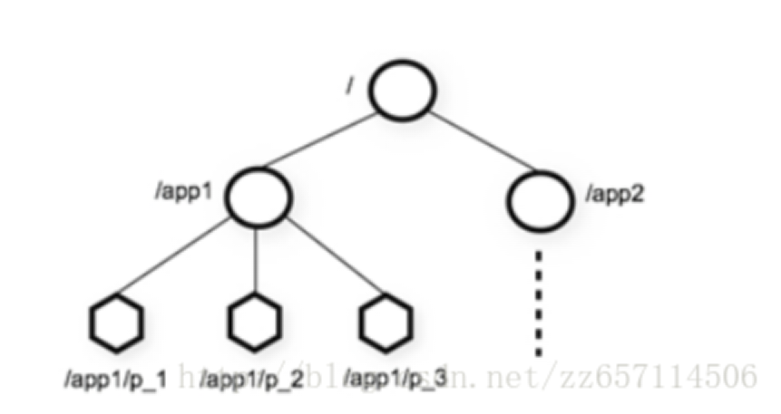
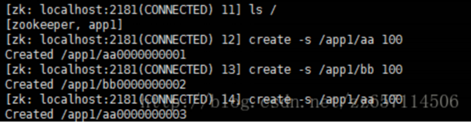
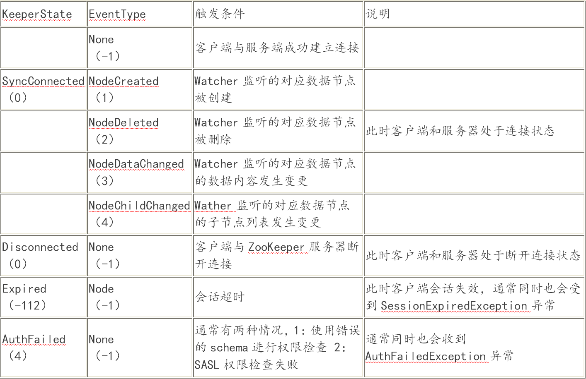
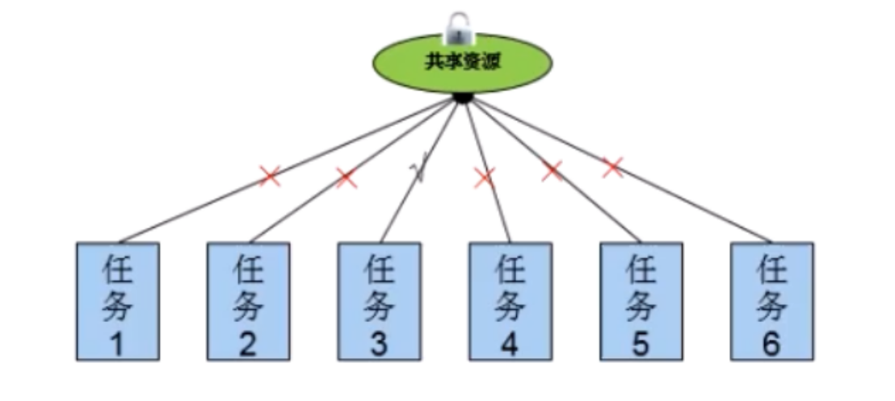

# Java架构师系列-Zookeeper

---

### 一、基本概念

1、什么是Zookeeper

Zookeeper是一个分布式开源框架，提供了协调分布式应用的基本服务。它向外部应用暴露一组通用服务——分布式同步（Distributed Synchronization）、命名服务（Naming Service）、集群维护（Group Maintenance）等，简化分布式应用协调及其管理的难度，提供高性能的分布式服务。

ZooKeeper本身可以以单机模式安装运行，不过它的长处在于通过分布式ZooKeeper集群（一个Leader，多个Follower），基于一定的策略来保证ZooKeeper集群的稳定性和可用性，从而实现分布式应用的可靠性。

* Zookeeper是为别的分布式程序服务的；
* Zookeeper本身就是一个分布式程序（只要有半数以上节点存活，zk就能正常服务）；
* Zookeeper所提供的服务涵盖：主从协调、服务器节点动态上下线、统一配置管理、分布式共享锁、统一名称服务等；
* 虽然说可以提供各种服务，但是zookeeper在底层其实只提供了两个功能：

1）管理(存储，读取)用户程序提交的数据（类似namenode中存放的metadata）； 

2）并为用户程序提供数据节点监听服务。

2、Zookeeper集群机制

Zookeeper集群的角色： Leader 和 follower ；只要集群中有半数以上节点存活，集群就能提供服务。

3、Zookeeper特性

* Zookeeper：一个leader，多个follower组成的集群；
* 全局数据一致：每个server保存一份相同的数据副本，client无论连接到哪个server，数据都是一致的；
* 分布式读写，更新请求转发，由leader实施；
* 更新请求顺序进行，来自同一个client的更新请求按其发送顺序依次执行；
* 数据更新原子性，一次数据更新要么成功，要么失败；
* 实时性，在一定时间范围内，client能读到最新数据。

4、Zookeeper数据结构

1）层次化的目录结构，命名符合常规文件系统规范(类似文件系统）；

2）每个节点在zookeeper中叫做znode，并且其有一个唯一的路径标识 ；

3）节点Znode可以包含数据和子节点（但是EPHEMERAL类型的节点不能有子节点）

a、Znode有两种类型：

* 短暂（ephemeral）（create -e /app1/test1 “test1” 客户端断开连接zk删除ephemeral类型节点） 
* 持久（persistent） （create -s /app1/test2 “test2” 客户端断开连接zk不删除persistent类型节点）

b、Znode有四种形式的目录节点（默认是persistent ）

* PERSISTENT 
* PERSISTENT_SEQUENTIAL（持久序列/test0000000019 ） 
* EPHEMERAL 
* EPHEMERAL_SEQUENTIAL

c、创建znode时设置顺序标识，znode名称后会附加一个值，顺序号是一个单调递增的计数器，由父节点维护 

d、在分布式系统中，顺序号可以被用于为所有的事件进行全局排序，这样客户端可以通过顺序号推断事件的顺序。

### 二、Zookeeper应用场景

1、统一命名服务

分布式环境下，经常需要对应用/服务进行统一命名，便于识别不同服务。类似于域名与ip之间对应关系，域名容易记住。通过名称来获取资源或服务的地址，提供者等信息按照层次结构组织服务/应用名称可将服务名称以及地址信息写到Zookeeper上，客户端通过Zookeeper获取可用服务列表类。

2、配置管理

分布式环境下，配置文件管理和同步是一个常见问题。一个集群中，所有节点的配置信息是一致的，比如Hadoop。对配置文件修改后，希望能够快速同步到各个节点上配置管理可交由Zookeeper实现。可将配置信息写入Zookeeper的一个znode上。各个节点监听这个znode。一旦znode中的数据被修改，zookeeper将通知各个节点。

3、集群管理

分布式环境中，实时掌握每个节点的状态是必要的。可根据节点实时状态作出一些调整。Zookeeper可将节点信息写入Zookeeper的一个znode上。监听这个znode可获取它的实时状态变化。典型应用比如Hbase中Master状态监控与选举。

4、分布式通知/协调

分布式环境中，经常存在一个服务需要知道它所管理的子服务的状态。例如，NameNode须知道各DataNode的状态，JobTracker须知道各TaskTracker的状态。心跳检测机制和信息推送也是可通过Zookeeper实现。

5、分布式锁

Zookeeper是强一致的。多个客户端同时在Zookeeper上创建相同znode，只有一个创建成功。Zookeeper实现锁的独占性。多个客户端同时在Zookeeper上创建相同znode ，创建成功的那个客户端得到锁，其他客户端等待。Zookeeper 控制锁的时序。各个客户端在某个znode下创建临时znode （类型为CreateMode. EPHEMERAL _SEQUENTIAL），这样，该znode可掌握全局访问时序。

6、分布式队列

两种队列。当一个队列的成员都聚齐时，这个队列才可用，否则一直等待所有成员到达，这种是同步队列。队列按照 FIFO 方式进行入队和出队操作，例如实现生产者和消费者模型。（可通过分布式锁实现）

同步队列。一个job由多个task组成，只有所有任务完成后，job才运行完成。可为job创建一个/job目录，然后在该目录下，为每个完成的task创建一个临时znode，一旦临时节点数目达到task总数，则job运行完成。

### 三、Zookeeper环境搭建

环境要求：必须要有jdk环境，本次使用jdk1.8。

1、结构

一共三个节点(zk服务器集群规模不小于3个节点)，要求服务器之间系统时间保持一致。

2、上传zk并且解压

进行解压： tar -zxvf zookeeper-3.4.6.tar.gz

重命名： mv zookeeper-3.4.6 zookeeper

3、修改zookeeper环境变量

~~~plaintext
vi /etc/profile
export JAVA_HOME=/opt/jdk1.8.0_71
export ZOOKEEPER_HOME=/usr/local/zookeeper
export CLASSPATH=.:$JAVA_HOME/lib/dt.jar:$JAVA_HOME/lib/tools.jar
export PATH=$JAVA_HOME/bin:$ZOOKEEPER_HOME/bin:$PATH

source /etc/profile
~~~
4、修改zoo_sample.cfg文件

~~~plaintext
cd /usr/local/zookeeper/conf
mv zoo_sample.cfg zoo.cfg
~~~

修改zoo.cfg，修改两处：

（1） dataDir=/usr/local/zookeeper/data（注意同时在zookeeper创建data目录）

（2）最后面添加

~~~plaintext
server.0=bhz:2888:3888
server.1=hadoop1:2888:3888
server.2=hadoop2:2888:3888
~~~

5、创建服务器标识

创建文件夹： mkdir data

创建文件myid并填写内容为0： vi myid (内容为服务器标识 ： 0)

6、复制zookeeper

进行复制zookeeper目录到hadoop01和hadoop02。还有/etc/profile文件，把hadoop01、 hadoop02中的myid文件里的值修改为1和2，路径(vi /usr/local/zookeeper/data/myid)。

7、启动zookeeper

路径： /usr/local/zookeeper/bin

执行： zkServer.sh start (注意这里3台机器都要进行启动)

状态： zkServer.sh status(在三个节点上检验zk的mode,一个leader和俩个follower)

### 四、Zookeeper配置文件介绍

~~~plaintext
# The number of milliseconds of each tick 
tickTime=2000 
 
# The number of ticks that the initial  
# synchronization phase can take 
initLimit=10 
 
# The number of ticks that can pass between  
# sending a request and getting an acknowledgement 
syncLimit=5 
 
# the directory where the snapshot is stored. 
# do not use /tmp for storage, /tmp here is just  
# example sakes. 
dataDir=/home/myuser/zooA/data 
 
# the port at which the clients will connect 
clientPort=2181 
 
# ZooKeeper server and its port no. # ZooKeeper ensemble should know about every other machine in the ensemble # specify server id by creating 'myid' file in the dataDir # use hostname instead of IP address for convenient maintenance
server.1=127.0.0.1:2888:3888 
server.2=127.0.0.1:2988:3988  
server.3=127.0.0.1:2088:3088 
 
# 
# Be sure to read the maintenance section of the  
# administrator guide before turning on autopurge. 
# 
# http://zookeeper.apache.org/doc/current/zookeeperAdmin.html#sc_maintenance 
# 
# The number of snapshots to retain in dataDir 
# autopurge.snapRetainCount=3 
# Purge task interval in hours 
# Set to "0" to disable auto purge feature   
#autopurge.purgeInterval=1 
dataLogDir=/home/myuser/zooA/log
~~~

* tickTime：心跳时间，为了确保连接存在的，以毫秒为单位，最小超时时间为两个心跳时间；
* initLimit：多少个心跳时间内，允许其他server连接并初始化数据，如果ZooKeeper管理的数据较大，则应相应增大这个值；
* clientPort：服务的监听端口；
* dataDir：用于存放内存数据库快照的文件夹，同时用于集群的myid文件也存在这个文件夹里（注意：一个配置文件只能包含一个dataDir字样，即使它被注释掉了。）
* dataLogDir：用于单独设置transaction log的目录，transaction log分离可以避免和普通log还有快照的竞争；
* syncLimit：多少个tickTime内，允许follower同步，如果follower落后太多，则会被丢弃。
* server.A=B：C：D：

A是一个数字,表示这个是第几号服务器，B是这个服务器的ip地址，C第一个端口用来集群成员的信息交换，表示的是这个服务器与集群中的Leader服务器交换信息的端口，D是在leader挂掉时专门用来进行选举leader所用。

### 五、Zookeeper客户端

ZooKeeper命令行工具类似于Linux的shell环境，不过功能肯定不及shell啦，但是使用它我们可以简单的对ZooKeeper进行访问，数据创建，数据修改等操作。使用 zkCli.sh -server 127.0.0.1:2181 连接到 ZooKeeper 服务。连接成功后，系统会输出 ZooKeeper 的相关环境以及配置信息。

命令行工具的一些简单操作如下：

* 显示根目录下、文件： ls / 使用 ls 命令来查看当前 ZooKeeper 中所包含的内容；
* 显示根目录下、文件： ls2 / 查看当前节点数据并能看到更新次数等数据；
* 创建文件，并设置初始内容： create /zk "test" 创建一个新的 znode节点“ zk ”以及与它关联的字符串；
* 获取文件内容： get /zk 确认 znode 是否包含我们所创建的字符串；
* 修改文件内容： set /zk "zkbak" 对 zk 所关联的字符串进行设置；
* 删除文件： delete /zk 将刚才创建的 znode 删除；
* 退出客户端： quit；
* 帮助命令： help；

### 六、Java操作Zookeeper

1、Zookeeper说明

创建节点(znode) 方法：create，提供了两套创建节点的方法，同步和异步创建节点方式。

同步方式：

* 参数1：节点路径(名称) ，InodeName (不允许递归创建节点，也就是说在父节点不存在的情况下，不允许创建子节点)；
* 参数2：节点内容，要求类型是字节数组(也就是说，不支持序列化方式，如果需要实现序列化，可使用java相关序列化框架，如Hessian、Kryo框架)；
* 参數3：节点权限，使用Ids.OPEN_ACL_UNSAFE开放权限即可。(这个参数一般在权展没有太高要求的场景下，没必要关注)；
* 参数4：节点类型，创建节点的类型，CreateMode，提供四种首点象型：PERSISTENT(持久节点)、PERSISTENT SEQUENTIAL(持久顺序节点)、EPHEMERAL(临时节点）、EPHEMERAL SEQUENTAL(临时顺序节点)；

2、引入maven依赖

~~~xml
<dependency>
	<groupId>org.apache.zookeeper</groupId>
	<artifactId>zookeeper</artifactId>
	<version>3.4.6</version>
</dependency>
~~~

3、客户端连接

~~~java
public class ZookeeperDemo {
	//集群连接地址
	private static final String CONNECT_ADDR = "192.168.110.138:2181,192.168.110.147:2181,192.168.110.148:2181";
	//session超时时间
	private static final int SESSION_OUTTIME = 2000;
	//信号量,阻塞程序执行,用户等待zookeeper连接成功,发送成功信号
	private static final CountDownLatch countDownLatch = new CountDownLatch(1);

	public static void main(String[] args) throws IOException, InterruptedException, KeeperException {
		ZooKeeper zk = new ZooKeeper(CONNECT_ADDR, SESSION_OUTTIME, new Watcher() {
			public void process(WatchedEvent event) {
				// 获取时间的状态
				KeeperState keeperState = event.getState();
				EventType tventType = event.getType();
				// 如果是建立连接
				if (KeeperState.SyncConnected == keeperState) {
					if (EventType.None == tventType) {
						// 如果建立连接成功,则发送信号量,让后阻塞程序向下执行
						countDownLatch.countDown();
						System.out.println("zk 建立连接");
					}
				}
			}
		});
		// 进行阻塞
		countDownLatch.await();
		//创建父节点
//		String result = zk.create("/testRott", "12245465".getBytes(), Ids.OPEN_ACL_UNSAFE, CreateMode.PERSISTENT);
//		System.out.println("result:" + result);
		//创建子节点
		String result = zk.create("/testRott/children", "children 12245465".getBytes(), Ids.OPEN_ACL_UNSAFE, CreateMode.PERSISTENT);
		System.out.println("result:"+result);
		zk.close();
	}
}
~~~

### 七、Watcher

在ZooKeeper中，接口类Watcher用于表示一个标准的事件处理器，其定义了事件通知相关的逻辑，包含KeeperState和EventType两个枚举类，分别代表了通知状态和事件类型，同时定义了事件的回调方法：process（WatchedEvent event）。

同一个事件类型在不同的通知状态中代表的含义有所不同，下表列举了常见的通知状态和事件类型。

回调方法process（）：

process方法是Watcher接口中的一个回调方法，当ZooKeeper向客户端发送一个Watcher事件通知时，客户端就会对相应的process方法进行回调，从而实现对事件的处理。process方法的定义如下：

~~~java
abstract public void process(WatchedEvent event);
~~~

这个回调方法的定义非常简单，我们重点看下方法的参数定义：WatchedEvent。

WatchedEvent包含了每一个事件的三个基本属性：通知状态（keeperState），事件类型（EventType）和节点路径（path）。ZooKeeper使用WatchedEvent对象来封装服务端事件并传递给Watcher，从而方便回调方法process对服务端事件进行处理。

提到WatchedEvent，不得不讲下WatcherEvent实体。笼统地讲，两者表示的是同一个事物，都是对一个服务端事件的封装。不同的是，WatchedEvent是一个逻辑事件，用于服务端和客户端程序执行过程中所需的逻辑对象，而WatcherEvent因为实现了序列化接口，因此可以用于网络传输。

服务端在生成WatchedEvent事件之后，会调用getWrapper方法将自己包装成一个可序列化的WatcherEvent事件，以便通过网络传输到客户端。客户端在接收到服务端的这个事件对象后，首先会将WatcherEvent还原成一个WatchedEvent事件，并传递给process方法处理，回调方法process根据入参就能够解析出完整的服务端事件了。

需要注意的一点是，无论是WatchedEvent还是WatcherEvent，其对ZooKeeper服务端事件的封装都是极其简单的。举个例子来说，当/zk-book这个节点的数据发生变更时，服务端会发送给客户端一个“ZNode数据内容变更”事件，客户端只能够接收到这个信息。

~~~java
public class ZkClientWatcher implements Watcher {
	// 集群连接地址
	private static final String CONNECT_ADDRES = "192.168.110.159:2181,192.168.110.160:2181,192.168.110.162:2181";
	// 会话超时时间
	private static final int SESSIONTIME = 2000;
	// 信号量,让zk在连接之前等待,连接成功后才能往下走.
	private static final CountDownLatch countDownLatch = new CountDownLatch(1);
	private static String LOG_MAIN = "【main】 ";
	private ZooKeeper zk;

	public void createConnection(String connectAddres, int sessionTimeOut) {
		try {
			zk = new ZooKeeper(connectAddres, sessionTimeOut, this);
			System.out.println(LOG_MAIN + "zk 开始启动连接服务器....");
			countDownLatch.await();
		} catch (Exception e) {
			e.printStackTrace();
		}
	}

	public boolean createPath(String path, String data) {
		try {
			this.exists(path, true);
			this.zk.create(path, data.getBytes(), Ids.OPEN_ACL_UNSAFE, CreateMode.PERSISTENT);
			System.out.println(LOG_MAIN + "节点创建成功, Path:" + path + ",data:" + data);
		} catch (Exception e) {
			e.printStackTrace();
			return false;
		}
		return true;
	}

	public Stat exists(String path, boolean needWatch) {
		try {
			return this.zk.exists(path, needWatch);
		} catch (Exception e) {
			e.printStackTrace();
			return null;
		}
	}

	public boolean updateNode(String path,String data) throws KeeperException, InterruptedException {
		exists(path, true);
		this.zk.setData(path, data.getBytes(), -1);
		return false;
	}

	public void process(WatchedEvent watchedEvent) {
		// 获取事件状态
		KeeperState keeperState = watchedEvent.getState();
		// 获取事件类型
		EventType eventType = watchedEvent.getType();
		// zk 路径
		String path = watchedEvent.getPath();
		System.out.println("进入到 process() keeperState:" + keeperState + ", eventType:" + eventType + ", path:" + path);
		// 判断是否建立连接
		if (KeeperState.SyncConnected == keeperState) {
			if (EventType.None == eventType) {
				// 如果建立建立成功,让后程序往下走
				System.out.println(LOG_MAIN + "zk 建立连接成功!");
				countDownLatch.countDown();
			} else if (EventType.NodeCreated == eventType) {
				System.out.println(LOG_MAIN + "事件通知,新增node节点" + path);
			} else if (EventType.NodeDataChanged == eventType) {
				System.out.println(LOG_MAIN + "事件通知,当前node节点" + path + "被修改....");
			}
			else if (EventType.NodeDeleted == eventType) {
				System.out.println(LOG_MAIN + "事件通知,当前node节点" + path + "被删除....");
			}
		}
		System.out.println("--------------------------------------------------------");
	}

	public static void main(String[] args) throws KeeperException, InterruptedException {
		ZkClientWatcher zkClientWatcher = new ZkClientWatcher();
		zkClientWatcher.createConnection(CONNECT_ADDRES, SESSIONTIME);
//		boolean createResult = zkClientWatcher.createPath("/p15", "pa-644064");
		zkClientWatcher.updateNode("/pa2","7894561");
	}
}
~~~

### 八、Zookeeper实现分布式锁

1、线程进程资源竞争

当有一个线程或进程在对资源进行操作时，其他线程或进程都不可以对这个资源进行操作，直到该线程或进程完成操作，其他线程或进程才能对该资源进行操作，而其他线程或进程又处于等待状态。

2、线程进程同步的方式和机制

* 临界区：通过对多线程的串行化来访问公共资源或一段代码，（synchronized 修饰的java方法），仅用于线程同步。
* 互斥量：采用互斥对象机制，只有拥有互斥对象的线程才有访问公共资源竞争的问题，（synchronized 修饰的代码块、java.util.concurrent.locks.Lock）。
* 信号量：它允许多个任务在同一时刻访问同一资源，但是需要限制在同一时刻访问此资源的最大线程数目；解决执行顺序，（CountDownLatch，CyclicBarrier和Semaphore）。
* 事件：通过通知操作的方式来保持任务的同步，还可以方便实现对多个任务的优先级比较的操作。

3、分布式锁实现的技术

1）基于数据库实现分布式锁

* 性能较差，容易出现单点故障
* 锁没有失效事件，容易死锁
* 非阻塞式
* 不可重入

2）基于缓存实现分布式锁

* 锁没有失效事件,容易死锁
* 非阻塞式
* 不可重入

3）基于Zookeeper实现分布式锁

* 实现相对简单
* 可靠性高
* 性能较好分布式锁实现的技术

4、分布式锁解决思路

分布式锁使用zk，在zk上创建一个临时节点（有效期） ，使用临时节点作为锁，因为节点不允许重复。如果能创建节点成功，生成订单号，如果创建节点失败，等待。临时节点zk关闭，释放锁，其他节点就可以重新生成订单号。

5、代码实现

~~~java
public class OrderNumGenerator {
	private static int count = 0;
    //生成订单号
	public String getOrderNumber() {
		SimpleDateFormat smt = new SimpleDateFormat("yyyy-MM-dd-HH-mm-ss");
		return smt.format(new Date()) + "-" + ++count;
	}
}

public class OrderService implements Runnable {
	private OrderNumGenerator orderNumGenerator = new OrderNumGenerator();
	private static Object oj = new Object();
	private Lock lock = new ZookeeperDistrbuteLock();

	public void run() {
		getNumber();
	}

	public void getNumber() {
		// synchronized (oj) {
		lock.getLock();
		String orderNumber = orderNumGenerator.getOrderNumber();
		System.out.println("获取订单号:" + orderNumber);
		lock.unLock();
		// }
	}

	public static void main(String[] args) {
		for (int i = 0; i < 100; i++) {
			new Thread(new OrderService()).start();
		}
	}
}

public interface Lock {
	// 获取锁
	public void getLock();
    // 释放锁
	public void unLock();
}

public abstract class ZookeeperAbstractLock implements Lock {
	private static final String CONNECT_ADDRES = "192.168.110.159:2181,192.168.110.160:2181,192.168.110.162:2181";
	protected ZkClient zkClient = new ZkClient(CONNECT_ADDRES);
	protected String PATH = "/lock";

	public void getLock() {
		// 如果当前节点已经存在,则等待
		if (tryLock()) {
			System.out.println("获取到锁 get");
		} else {
			// 等待
			waitLock();
			// 重新获取锁
			getLock();
		}
	}

	protected abstract void waitLock();

	protected abstract boolean tryLock();

	public void unLock() {
		if (zkClient != null) {
			zkClient.close();
		}
		System.out.println("已经释放锁...");
	}
}

//实现锁
public class ZookeeperDistrbuteLock extends ZookeeperAbstractLock {
	private CountDownLatch countDownLatch = new CountDownLatch(1);

	@Override
	protected boolean tryLock() {
		try {
			zkClient.createEphemeral(PATH);
			// 创建成功
			return true;
		} catch (Exception e) {
			// 创建失败
			return false;
		}
	}

	@Override
	protected void waitLock() {
		try {
			IZkDataListener iZkDataListener = new IZkDataListener() {
				public void handleDataDeleted(String path) throws Exception {
					// 唤醒等待线程， 继续往下走.
					if (countDownLatch != null) {
						countDownLatch.countDown();
					}
				}

				public void handleDataChange(String path, Object data) throws Exception {

				}
			};
			
			// 注册到zk监听中
			zkClient.subscribeDataChanges(PATH, iZkDataListener);
			
			if (zkClient.exists(PATH)) {
				countDownLatch = new CountDownLatch(1);
				// 等待
				countDownLatch.await();
			}
			
			// 删除事件通知
			zkClient.unsubscribeDataChanges(PATH, iZkDataListener);
		} catch (Exception e) {
			// TODO: handle exception
		}
	}
}
~~~

   

---

