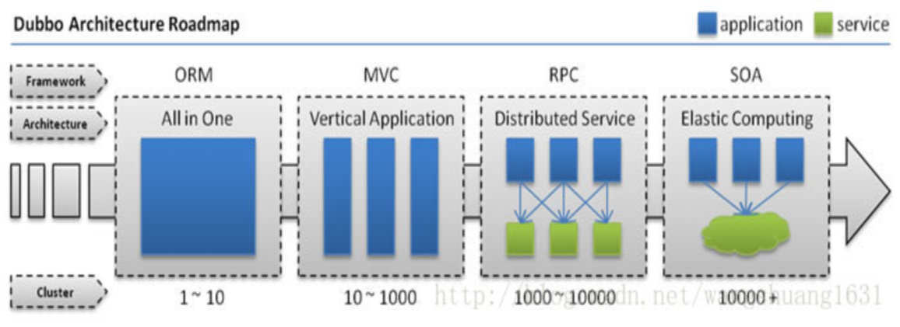
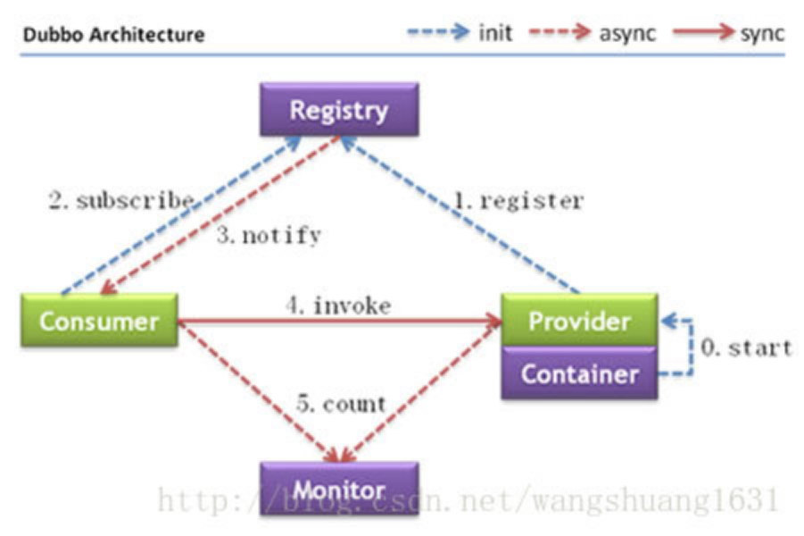
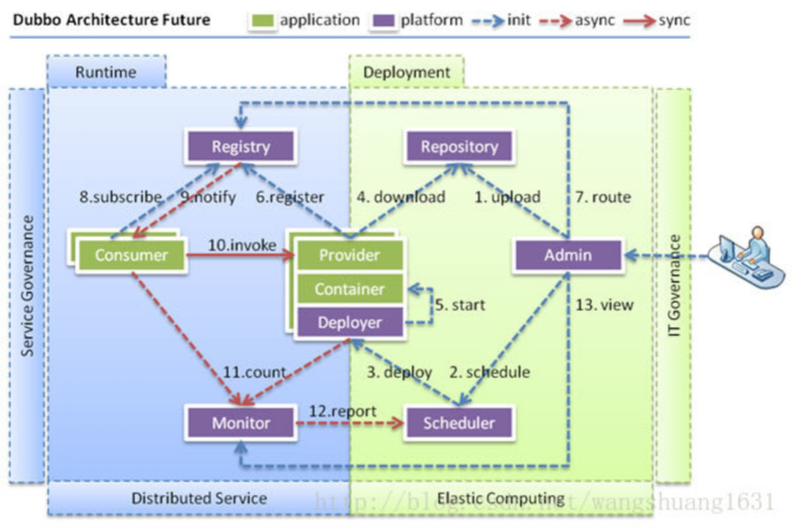
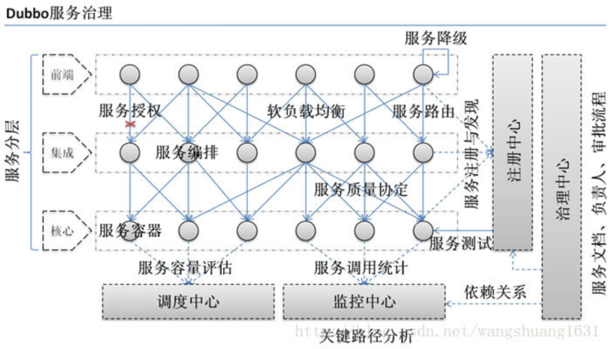
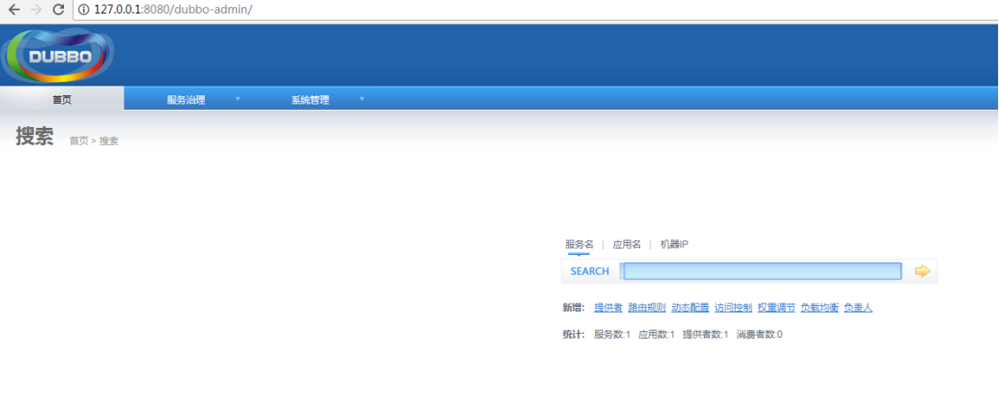

# Java架构师系列-Dubbo

---

### 一、Dubbo概述

1、Dubbo的背景

随着互联网的发展，网站应用的规模不断扩大，常规的垂直应用架构已无法应对，分布式服务架构以及流动计算架构势在必行，亟需一个治理系统确保架构有条不紊的演进。

* 单一应用架构

当网站流量很小时，只需一个应用，将所有功能都部署在一起，以减少部署节点和成本。 此时，用于简化增删改查工作量的 数据访问框架(ORM) 是关键。

* 垂直应用架构

当访问量逐渐增大，单一应用增加机器带来的加速度越来越小，将应用拆成互不相干的几个应用，以提升效率。 此时，用于加速前端页面开发的 Web框架(MVC) 是关键。

* 分布式服务架构

当垂直应用越来越多，应用之间交互不可避免，将核心业务抽取出来，作为独立的服务，逐渐形成稳定的服务中心，使前端应用能更快速的响应多变的市场需求。 此时，用于提高业务复用及整合的 分布式服务框架(RPC) 是关键。

* 流动计算架构

当服务越来越多，容量的评估，小服务资源的浪费等问题逐渐显现，此时需增加一个调度中心基于访问压力实时管理集群容量，提高集群利用率。 此时，用于提高机器利用率的 资源调度和治理中心(SOA) 是关键。

2、什么是Dubbo

Dubbo是一个分布式服务框架，致力于提供高性能和透明化的RPC远程服务调用方案，SOA服务治理方案。简单的说，dubbo就是个服务框架，如果没有分布式的需求，其实是不需要用的，只有在分布式的时候，才有dubbo这样的分布式服务框架的需求，并且本质上是个服务调用，说白了就是个远程服务调用的分布式框架。告别Web Service模式中的wsdl，以服务者与消费者的方式在dubbo 上注册)。

其核心部分包含：

* 远程通讯：提供对多种基于长连接的NiO框架抽象封装，包括多种线程模型，序列化，以及“请求一响应”模式的信息交换方式。
* 集群容错：提供基于接口方法的透明远程过程调用，包括多协议支持。以及负载均衡，失败容错，地址路由，动态配置等集群支持。 
* 自动发现：基于注册中心目录服务，使用服务消费能动态查找服务提供方,使地址透明,使用服务提供方可以平滑增加或减少服务器

3、Dubbo能做什么

问题：服务的URL管理非常困难(rmi://、http://、)、F5负载均衡器的单点压力(硬件成本)；各个服务之间依赖管理非常复杂，各个服务之间如何进行监控？

* 透明化的远程方法调用，就像调用本地方法一样调用远程方法，只需简单配置，没有任何API侵入。
* 软负载均衡及容错机制，可在内网替代F5等硬件负鞭均衡器，降低成本，减少单点。
* 服务自动注册与发现，不再需要写死服务提供方地址，注册中心基于楼口名查询服务提供者的IP地址，并且能够平滑添加或删除服务提供者。
* Dubbo采用全Spring 配置方式，透明化接入应用，对应用没有任何API侵入，只需用Spring加载Dubbo的配置即可，Dubbo基于Spring的Schema扩展进行加载。

### 二、Dubbo架构

1、节点角色说明：

* Provider: 暴露服务的服务提供方。 
* Consumer: 调用远程服务的服务消费方。 
* Registry: 服务注册与发现的注册中心。 
* Monitor: 统计服务的调用次调和调用时间的监控中心。

2、调用关系说明：

* 服务容器负责启动，加载，运行服务提供者。 
* 服务提供者在启动时，向注册中心注册自己提供的服务。 
* 服务消费者在启动时，向注册中心订阅自己所需的服务。 
* 注册中心返回服务提供者地址列表给消费者，如果有变更，注册中心将基于长连接推送变更数据给消费者。 
* 服务消费者，从提供者地址列表中，基于软负载均衡算法，选一台提供者进行调用，如果调用失败，再选另一台调用。 
* 服务消费者和提供者，在内存中累计调用次数和调用时间，定时每分钟发送一次统计数据到监控中心。 

### 三、Dubbo特性

1、连通性

注册中心负责服务地址的注册与查找，相当于目录服务，服务提供者和消费者只在启动时与注册中心交互，注册中心不转发请求，压力较小 。

监控中心负责统计各服务调用次数，调用时间等，统计先在内存汇总后每分钟一次发送到监控中心服务器，并以报表展示 。

服务提供者向注册中心注册其提供的服务，并汇报调用时间到监控中心，此时间不包含网络开销 。

服务消费者向注册中心获取服务提供者地址列表，并根据负载算法直接调用提供者，同时汇报调用时间到监控中心，此时间包含网络开销 。

注册中心，服务提供者，服务消费者三者之间均为长连接，监控中心除外 。注册中心通过长连接感知服务提供者的存在，服务提供者宕机，注册中心将立即推送事件通知消费者 。注册中心和监控中心全部宕机，不影响已运行的提供者和消费者，消费者在本地缓存了提供者列表 。注册中心和监控中心都是可选的，服务消费者可以直连服务提供者。

2、健状性

监控中心宕掉不影响使用，只是丢失部分采样数据 。数据库宕掉后，注册中心仍能通过缓存提供服务列表查询，但不能注册新服务 。注册中心对等集群，任意一台宕掉后，将自动切换到另一台 。注册中心全部宕掉后，服务提供者和服务消费者仍能通过本地缓存通讯 。服务提供者无状态，任意一台宕掉后，不影响使用 。服务提供者全部宕掉后，服务消费者应用将无法使用，并无限次重连等待服务提供者恢复。

3、伸缩性

注册中心为对等集群，可动态增加机器部署实例，所有客户端将自动发现新的注册中心 。服务提供者无状态，可动态增加机器部署实例，注册中心将推送新的服务提供者信息给消费者。

4、升级性

当服务集群规模进一步扩大，带动IT治理结构进一步升级，需要实现动态部署，进行流动计算，现有分布式服务架构不会带来阻力：

* Deployer：自动部署服务的本地代理。
* Repository：仓库用于存储服务应用发布包。
* Scheduler：调度中心基于访问压力自动增减服务提供者。
* Admin：统一管理控制台。

### 四、Dubbo服务治理

在大规模服务化之前，应用可能只是通过RMI或Hessian等工具，简单的暴露和引用远程服务，通过配置服务的URL地址进行调用，通过F5等硬件进行负载均衡。

(1) 当服务越来越多时，服务URL配置管理变得非常困难，F5硬件负载均衡器的单点压力也越来越大。此时需要一个服务注册中心，动态的注册和发现服务，使服务的位置透明。并通过在消费方获取服务提供方地址列表，实现软负载均衡和Failover，降低对F5硬件负载均衡器的依赖，也能减少部分成本。

(2) 当进一步发展，服务间依赖关系变得错踪复杂，甚至分不清哪个应用要在哪个应用之前启动，架构师都不能完整的描述应用的架构关系。这时，需要自动画出应用间的依赖关系图，以帮助架构师理清理关系。

(3) 接着，服务的调用量越来越大，服务的容量问题就暴露出来，这个服务需要多少机器支撑？什么时候该加机器？为了解决这些问题，第一步，要将服务现在每天的调用量，响应时间，都统计出来，作为容量规划的参考指标。其次，要可以动态调整权重，在线上，将某台机器的权重一直加大，并在加大的过程中记录响应时间的变化，直到响应时间到达阀值，记录此时的访问量，再以此访问量乘以机器数反推总容量。

### 五、Dubbo环境搭建

1、生产者

生产者主要发布服务。

1）引入依赖

~~~xml
<dependencies>
	<dependency>
		<groupId>cn.seasand.code</groupId>
		<artifactId>dubbo-interface</artifactId>
		<version>0.0.1-SNAPSHOT</version>
	</dependency>
	<dependency>
		<groupId>com.alibaba</groupId>
		<artifactId>dubbo</artifactId>
		<version>2.5.6</version>
	</dependency>
	<!-- 添加zk客户端依赖 -->
	<dependency>
		<groupId>com.github.sgroschupf</groupId>
		<artifactId>zkclient</artifactId>
		<version>0.1</version>
	</dependency>
</dependencies>
~~~

2）定义一个Service

~~~java
public interface UserService {
	public String getList(Integer id);
}
~~~

3）实现Service

~~~java
public class UserServiceImpl implements UserService {
	public String getList(Integer id) {
		System.out.println("客户端有人来消费了....");
		if (id==1) {
			return "张三";
		}
		if (id==2) {
			return "李四";
		}
		if (id==3) {
			return "小明";
		}
		return "没有找到";
	}	
}
~~~

4）发布服务

新建配置文件provider.xml

~~~xml
<?xml version="1.0" encoding="utf-8"?>
<beans xmlns="http://www.springframework.org/schema/beans" xmlns:xsi="http://www.w3.org/2001/XMLSchema-instance" xmlns:dubbo="http://code.alibabatech.com/schema/dubbo" xsi:schemaLocation="http://www.springframework.org/schema/beans http://www.springframework.org/schema/beans/spring-beans.xsd http://code.alibabatech.com/schema/dubbo http://code.alibabatech.com/schema/dubbo/dubbo.xsd ">
	<!-- 提供方应用信息，用于计算依赖关系 -->
	<dubbo:application name="provider" />
	<!-- 使用zookeeper注册中心暴露服务地址 -->
	<dubbo:registry address="zookeeper://127.0.0.1:2181" />
	<!-- 用dubbo协议在29014端口暴露服务 -->
	<dubbo:protocol name="dubbo" port="29014" />
	<!-- 声明需要暴露的服务接口 -->
	<dubbo:service interface="cn.seasand.code.service.UserService"
		ref="userService" />
	<!-- 具体的实现bean -->
	<bean id="userService" class="cn.seasand.code.service.impl.UserServiceImpl" />
</beans>
~~~

5）启动服务

~~~java
public class Provider {
	public static void main(String[] args) throws IOException {
		// 发布服务
		ClassPathXmlApplicationContext app = new ClassPathXmlApplicationContext("provider.xml");
		app.start();// 加载
		System.out.println("服务发布成功...");
		System.in.read(); // 让程序阻塞
	}
}
~~~

2、消费者

1）新建配置文件consumer.xml

~~~xml
<?xml version="1.0" encoding="UTF-8"?>
<beans xmlns="http://www.springframework.org/schema/beans" xmlns:xsi="http://www.w3.org/2001/XMLSchema-instance" xmlns:dubbo="http://code.alibabatech.com/schema/dubbo" xsi:schemaLocation="http://www.springframework.org/schema/beans http://www.springframework.org/schema/beans/spring-beans.xsd http://code.alibabatech.com/schema/dubbo http://code.alibabatech.com/schema/dubbo/dubbo.xsd">
	<!-- 消费方应用名，用于计算依赖关系，不是匹配条件，不要与提供方一样 -->
	<dubbo:application name="consumer" />
	<!-- 使用multicast广播注册中心暴露发现服务地址 -->
	<dubbo:registry protocol="zookeeper" address="zookeeper://127.0.0.1:2181" />
	<!-- 生成远程服务代理，可以和本地bean一样使用demoService -->
	<dubbo:reference id="userService" interface="cn.seasand.code.service.UserService" />
</beans>
~~~

2）启动服务

~~~java
public class Consumer {
	public static void main(String[] args) throws IOException {
		ClassPathXmlApplicationContext app = new ClassPathXmlApplicationContext("consumer.xml");
		UserService userService = (UserService) app.getBean("userService");
		String name = userService.getList(1);
		System.out.println("name:" + name);
	}
}
~~~

### 六、Dubbo支持哪些协议

1、Dubbo协议

Dubbo缺省协议采用单一长连接和NIO异步通讯，适合于小数据量大并发的服务调用，以及服务消费者机器数远大于服务提供者机器数的情况。Dubbo缺省协议不适合传送大数据量的服务，比如传文件，传视频等，除非请求量很低。

2、Hessian协议

Hessian协议用于集成Hessian的服务，Hessian底层采用Http通讯，采用Servlet暴露服务，Dubbo缺省内嵌Jetty作为服务器实现。Hessian是Caucho开源的一个RPC框架，http://hessian.caucho.com， 其通讯效率高于WebService和Java自带的序列化。

基于Hessian的远程调用协议：

* 连接个数：多连接；
* 连接方式：短连接；
* 传输协议：HTTP；
* 传输方式：同步传输；
* 序列化：Hessian二进制序列化；
* 适用范围：传入传出参数数据包较大，提供者比消费者个数多，提供者压力较大，可传文件；
* 适用场景：页面传输，文件传输，或与原生hessian服务互操作。

3、HTTP协议

此协议采用spring 的HttpInvoker的功能实现。

* 连接个数：多连接；
* 连接方式：长连接；
* 连接协议：HTTP；
* 传输方式：同步传输；
* 序列化：表单序列化；
* 适用范围：传入传出参数数据包大小混合，提供者比消费者个数多，可用浏览器查看，可用表单或URL传入参数，暂不支持传文件；
* 适用场景：需同时给应用程序和浏览器JS使用的服务。

4、RMI协议

采用JDK标准的`java.rmi.*`实现，采用阻塞式短连接和JDK标准序列化方式。Java标准的远程调用协议：　　

* 连接个数：多连接；
* 连接方式：短连接；
* 传输协议：TCP；
* 传输方式：同步传输；
* 序列化：Java标准二进制序列化；
* 适用范围：传入传出参数数据包大小混合，消费者与提供者个数差不多，可传文件；
* 适用场景：常规远程服务方法调用，与原生RMI服务互操作。

### 七、Dubbo-Admin管理平台

步骤：

* 将dubbo-admin.zip 解压到webapps目录下；
* 修改dubbo.properties配置文件，zk注册中心连接地址连接信息；
* 启动tomcat即可；

在启动dubbo-admin时我们会先启动zookeeper，如果项目跑到zkclient.ZkEventThread - Starting ZkClient event thread.就不走了，那么就是zookeeper没有跑起来，如果你在zookeeper的目录下运行了./zookeeper-3.3.6/bin/zkServer.sh start 还是这样的话，那么请执行/zookeeper-3.3.6/bin/zkServer.sh status命令看看zookeeper是否跑起来了，如果没跑起来很可能是因为你zookeeper下的conf目录没有zoo.cfg。解决办法：把conf目录下的zoo_sample.cfg复制一份为zoo.cfg。

### 八、Dubbox环境搭建

引入依赖：

~~~xml
<dependencies>
	<dependency>
		<groupId>com.alibaba</groupId>
		<artifactId>dubbo</artifactId>
		<version>2.8.4</version>
	</dependency>
	<!-- 添加zk客户端依赖 -->
	<dependency>
		<groupId>com.github.sgroschupf</groupId>
		<artifactId>zkclient</artifactId>
		<version>0.1</version>
	</dependency>
	<dependency>
		<groupId>cn.seasand.code</groupId>
		<artifactId>dubbo-service</artifactId>
		<version>0.0.1-SNAPSHOT</version>
	</dependency>
	<dependency>
		<groupId>org.jboss.resteasy</groupId>
		<artifactId>resteasy-jaxrs</artifactId>
		<version>3.0.7.Final</version>
	</dependency>
	<dependency>
		<groupId>org.jboss.resteasy</groupId>
		<artifactId>resteasy-client</artifactId>
		<version>3.0.7.Final</version>
	</dependency>
	<dependency>
		<groupId>javax.validation</groupId>
		<artifactId>validation-api</artifactId>
		<version>1.0.0.GA</version>
	</dependency>
	<!-- 如果要使用json序列化 -->
	<dependency>
		<groupId>org.jboss.resteasy</groupId>
		<artifactId>resteasy-jackson-provider</artifactId>
		<version>3.0.7.Final</version>
	</dependency>
	<!-- 如果要使用xml序列化 -->
	<dependency>
		<groupId>org.jboss.resteasy</groupId>
		<artifactId>resteasy-jaxb-provider</artifactId>
		<version>3.0.7.Final</version>
	</dependency>
	<!-- 如果要使用netty server -->
	<dependency>
		<groupId>org.jboss.resteasy</groupId>
		<artifactId>resteasy-netty</artifactId>
		<version>3.0.7.Final</version>
	</dependency>
	<!-- 如果要使用Sun HTTP server -->
	<dependency>
		<groupId>org.jboss.resteasy</groupId>
		<artifactId>resteasy-jdk-http</artifactId>
		<version>3.0.7.Final</version>
	</dependency>
	<!-- 如果要使用tomcat server -->
	<dependency>
		<groupId>org.apache.tomcat.embed</groupId>
		<artifactId>tomcat-embed-core</artifactId>
		<version>8.0.11</version>
	</dependency>
	<dependency>
		<groupId>org.apache.tomcat.embed</groupId>
		<artifactId>tomcat-embed-logging-juli</artifactId>
		<version>8.0.11</version>
	</dependency>
	<dependency>
		<groupId>com.esotericsoftware.kryo</groupId>
		<artifactId>kryo</artifactId>
		<version>2.24.0</version>
	</dependency>
	<dependency>
		<groupId>de.javakaffee</groupId>
		<artifactId>kryo-serializers</artifactId>
		<version>0.26</version>
	</dependency>
	<dependency>
		<groupId>de.ruedigermoeller</groupId>
		<artifactId>fst</artifactId>
		<version>1.55</version>
	</dependency>
	<dependency>
		<groupId>com.fasterxml.jackson.core</groupId>
		<artifactId>jackson-core</artifactId>
		<version>2.3.3</version>
	</dependency>
	<dependency>
		<groupId>org.mortbay.jetty</groupId>
		<artifactId>jetty</artifactId>
		<version>7.0.0.pre5</version>
	</dependency>
</dependencies>
~~~

1、生产者环境搭建

~~~java
@Path("/user")
public interface UserService {
	@GET
	@Path("/getUser/{id : \\d+}")
	@Consumes({ MediaType.APPLICATION_JSON })
	public String getUser(@PathParam("id") Integer id);
}
~~~

~~~xml
<?xml version="1.0" encoding="utf-8"?>
<beans xmlns="http://www.springframework.org/schema/beans" xmlns:xsi="http://www.w3.org/2001/XMLSchema-instance" xmlns:dubbo="http://code.alibabatech.com/schema/dubbo" xsi:schemaLocation="http://www.springframework.org/schema/beans http://www.springframework.org/schema/beans/spring-beans.xsd http://code.alibabatech.com/schema/dubbo http://code.alibabatech.com/schema/dubbo/dubbo.xsd ">
	<!-- 提供方应用信息，用于计算依赖关系 -->
	<dubbo:application name="dubbox-provider" />
	<!-- 使用zookeeper注册中心暴露服务地址 -->
	<dubbo:registry address="zookeeper://127.0.0.1:2181" />
	<!-- 用rest协议在8080端口暴露服务 -->
	<dubbo:protocol name="rest" port="8081" />
	<!-- 声明需要暴露的服务接口 -->
	<dubbo:service interface="cn.seasand.code.service.UserService" ref="userService" />
	<!-- 和本地bean一样实现服务 -->
	<bean id="userService" class="cn.seasand.code.service.impl.UserServiceImpl" />
</beans>
~~~

测试访问地址：http://127.0.0.1:8081/user/getUser/2

2、消费者环境搭建

~~~java
@Path("/user")
public interface UserService {
	@GET
	@Path("/getUser/{id : \\d+}")
	@Consumes({ MediaType.APPLICATION_JSON })
	public String getUser(@PathParam("id") Integer id);
}
~~~

~~~xml
<?xml version="1.0" encoding="UTF-8"?>
<beans xmlns="http://www.springframework.org/schema/beans" xmlns:xsi="http://www.w3.org/2001/XMLSchema-instance" xmlns:dubbo="http://code.alibabatech.com/schema/dubbo" xmlns:util="http://www.springframework.org/schema/util" xsi:schemaLocation="http://www.springframework.org/schema/beans http://www.springframework.org/schema/beans/spring-beans-2.5.xsd http://code.alibabatech.com/schema/dubbo http://code.alibabatech.com/schema/dubbo/dubbo.xsd http://www.springframework.org/schema/util http://www.springframework.org/schema/util/spring-util-3.0.xsd">
    <!-- 提供方应用信息，用于计算依赖关系 -->
	<dubbo:application name="consumer"  />
	<dubbo:registry address="zookeeper://127.0.0.1:2181" />
	<!-- 生成远程服务代理，可以像使用本地bean -->
	<dubbo:reference interface="cn.seasand.code.service.UserService"
		id="userService" check="false" />
</beans>
~~~

   

---

