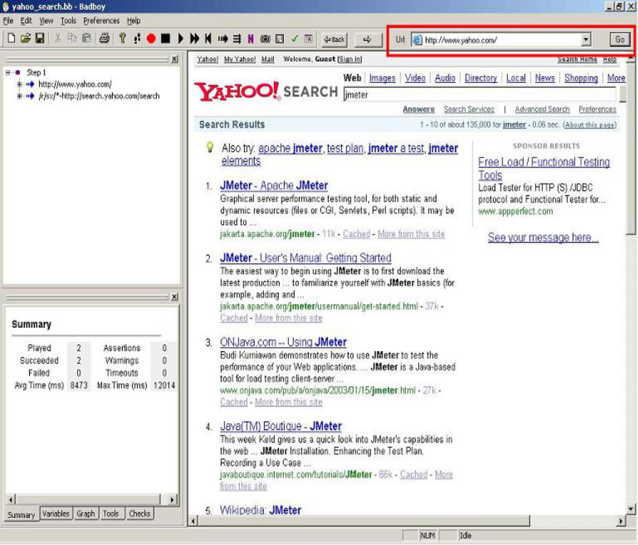

# Java架构师系列-深入理解Java虚拟机

---

### 一、Java虚拟机原理

所谓虚拟机，就是一台虚拟的机器。他是一款软件，用来执行一系列虚拟计算指令。大体上虚拟机可以分为系统虚拟机和程序虚拟机，大名鼎鼎的Visual Box、VMware就属于系统虚拟机，他们完全是对物理计算机的仿真，提供了一个可以运行完整操作系统的软件平台。程序虚拟机典型代表就是Java虚拟机，它专门为执行单个计算程序而计算，在Java虚拟机中执行的指令我们称为Java字节码指令。无论是系统虚拟机还是程序虚拟机，在上面运行的软件都被限制于虚拟机提供的资源中。

Java发展至今，出现过很多虚拟机。最初Sun使用的一款叫Classic的Java虚拟机，到现在应用最广泛的是HotSpot虚拟机。除了Sun以外，还有BEA的JRockit。目前JRockit和HotSopt都被Oracle收入旗下，大有整合的趋势。

### 二、Java内存结构

* 类加载子系统：负责从文件系统或者网络加载Class信息，加载的信息存放在一块称之方法区的内存空间。
* 方法区：就是存放类的信息、常量信息、常量池信息、包括字符串字面量和数字常量等。
* Java堆：在Java虚拟机启动的时候建立Java堆，它是Java程序最主要的内存工作区域，几乎所有的对象实例都存放到Java堆中，堆空间是所有线程共享。
* 直接内存：Java NIO库允许Java程序直接内存，从而提高性能，通常直接内存速度会优于Java堆。读写频繁的场合可能会考虑使用。
* 栈：每个虚拟机线程都有一个私有栈，一个线程的Java栈在线程创建的时候被创建，Java栈保存着局部变量、方法参数、同事Java的方法调用、返回值等。
* 本地方法栈：最大不同为本地方法栈用于本地方法调用，Java虚拟机允许Java直接调用本地方法（通过使用C语言写）。
* 垃圾收集系统是Java的核心，也是不可少的。Java有一套自己进行垃圾清理的机制，开发人员无需手工清理。
* PC（Program Couneter）寄存器也是每个线程私有的空间， Java虚拟机会为每个线程创建PC寄存器。在任意时刻，一个Java线程总是在执行一个方法，这个方法称为当前方法；如果当前方法不是本地方法，PC寄存器总会执行当前正在被执行的指令；如果是本地方法，则PC寄存器值为Underfined，寄存器存放如果当前执行环境指针、程序技术器、操作栈指针、计算的变量指针等信息。
* 虚拟机核心的组件就是执行引擎，它负责执行虚拟机的字节码，一般户先进行编译成机器码后执行。

### 三、堆、栈、方法区概念区别

1、Java堆

堆内存用于存放由new创建的对象和数组。在堆中分配的内存，由Java虚拟机自动垃圾回收器来管理。在堆中产生了一个数组或者对象后，还可以在栈中定义一个特殊的变量，这个变量的取值等于数组或者对象在堆内存中的首地址，在栈中的这个特殊的变量就变成了数组或者对象的引用变量，以后就可以在程序中使用栈内存中的引用变量来访问堆中的数组或者对象，引用变量相当于为数组或者对象起的一个别名，或者代号。

根据垃圾回收机制的不同，Java堆有可能拥有不同的结构，最为常见的就是将整个Java堆分为新生代和老年代。其中新生代存放新生的对象或者年龄不大的对象，老年代则存放老年对象。新生代分为Eden区、s0区、s1区，s0和s1也被称为from和to区域，他们是两块大小相等并且可以互相替换的空间。绝大多数情况下，对象首先分配在Eden区，在新生代回收后，如果对象还存活，则进入s0或s1区，之后每经过一次新生代回收，如果对象存活则它的年龄就加1，对象达到一定的年龄后，则进入老年代。

2、Java栈

Java栈是一块线程私有的空间，一个栈，一般由三部分组成：局部变量表、操作数据栈和帧数据区。

* 局部变量表：用于保存函数的参数及局部变量；
* 操作数栈：主要保存计算过程的中间结果，同时作为计算过程中的变量临时的存储空间；
* 帧数据区：除了局部变量表和操作数据栈以外，栈还需要一些数据来支持常量池的解析，这里帧数据区保存着访问常量池的指针，方便程序访问常量池，另外当函数返回或出现异常时虚拟机必须有一个异常处理表，方便发生异常的时候找到异常的代码，因此异常处理表也是帧数据区的一部分。

3、Java方法区

Java方法区和堆一样，方法区是一块所有线程共享的内存区域，他保存系统的类信息，比如类的字段、方法、常量池等。方法区的大小决定系统可以保存多少个类。如果系统定义太多的类，导致方法区溢出，虚拟机同样会抛出内存溢出的错误。方法区可以理解为永久区。

### 四、虚拟机参数配置

1、什么是虚拟机参数配置

在虚拟机运行的过程中，如果可以跟踪系统的运行状态，那么对于问题的故障排查会有一定的帮助。为此，在虚拟机提供了一些跟踪系统状态的参数，使用给定的参数执行Java虚拟机，就可以在系统运行时打印相关日志，用于分析实际问题。我们进行虚拟机参数配置，其实就是围绕着堆、栈、方法区进行配置。

2、堆的参数配置

~~~plaintext
-XX:+PrintGC		每次触发GC的时候打印相关日志
-XX:+UseSerialGC	串行回收
-XX:+PrintGCDetails 更详细的GC日志
-Xms               堆初始值
-Xmx               堆最大可用值
-Xmn               新生代堆最大可用值
-XX:SurvivorRatio	用来设置新生代中eden空间和from/to空间的比例
~~~

总结：在实际工作中，我们可以直接将初始的堆大小与最大堆大小设置相等，这样的好处是可以减少程序运行时垃圾回收次数，从而提高效率。

3、设置最大堆内存

~~~java
public class JvmDemo {

	public static void main(String[] args) throws InterruptedException {
		byte[] b1 = new byte[1 * 1024 * 1024];
		System.out.println("分配了1m");
		jvmInfo();
		Thread.sleep(3000);
		byte[] b2 = new byte[4 * 1024 * 1024];
		System.out.println("分配了4m");
		Thread.sleep(3000);
		jvmInfo();
	}

	static private String toM(long maxMemory) {
		float num = (float) maxMemory / (1024 * 1024);
		DecimalFormat df = new DecimalFormat("0.00");// 格式化小数
		String s = df.format(num);// 返回的是String类型
		return s;
	}

	static private void jvmInfo() {
		// 最大内存
		long maxMemory = Runtime.getRuntime().maxMemory();
		System.out.println("maxMemory:" + maxMemory + ",转换为M:" + toM(maxMemory));
		// 当前空闲内存
		long freeMemory = Runtime.getRuntime().freeMemory();
		System.out.println("freeMemory:" +freeMemory+",转换为M:"+toM(freeMemory));
		// 已经使用内存
		long totalMemory = Runtime.getRuntime().totalMemory();
		System.out.println("totalMemory:" +totalMemory+",转换为M"+toM(totalMemory));
	}
}
~~~

~~~plaintext
-Xms5m -Xmx20m -XX:+PrintGCDetails -XX:+UseSerialGC -XX:+PrintCommandLineFlags
~~~

4、设置新生代与老年代优化参数

-Xmn：新生代大小，一般设为整个堆的1/3到1/4左右；

-XX:SurvivorRatio：设置新生代中eden区和from/to空间的比例关系n/1；

1）设置新生代比例参数

~~~java
public class JvmDemo {
	 public static void main(String[] args) {
		//-Xms20m -Xmx20m -Xmn1m -XX:SurvivorRatio=2 -XX:+PrintGCDetails -XX:+UseSerialGC
		 byte [] b = null;
		 for (int i = 0; i < 10; i++) {
			b = new byte[1*1024*1024];
		}
	}
}
~~~

~~~plaintext
-Xms20m -Xmx20m -Xmn1m -XX:SurvivorRatio=2 -XX:+PrintGCDetails -XX:+UseSerialGC
~~~

2）设置新生与老年代代参数

~~~plaintext
-Xms20m -Xmx20m -XX:SurvivorRatio=2 -XX:+PrintGCDetails -XX:+UseSerialGC
~~~

总结：不同的堆分布情况，对系统执行会产生一定的影响。在实际工作中，应该根据系统的特点做出合理的配置。基本策略：尽可能将对象预留在新生代，减少老年代的GC次数。

除了可以设置新生代的绝对大小(-Xmn)，可以使用(-XX:NewRatio)设置新生代和老年代的比例：-XX:NewRatio=老年代/新生代。

5、内存溢出解决办法

1）设置堆内存大小

~~~java
public static void main(String[] args) throws InterruptedException {
	List<Object> list = new ArrayList<>();
	Thread.sleep(3000);
	jvmInfo();
	for (int i = 0; i < 10; i++) {
		System.out.println("i:"+i);
		Byte [] bytes=	new Byte[1*1024*1024];
		list.add(bytes);
		jvmInfo();
	}
	System.out.println("添加成功...");
}
~~~

错误原因：java.lang.OutOfMemoryError: Java heap space；

解决办法：设置堆内存大小 -Xms1m -Xmx70m -XX:+HeapDumpOnOutOfMemoryError。

2）设置栈内存大小

~~~java
public class JvmDemo {
	private static int count;
	public static void count() {
		try {
			count++;
			count(); 
		} catch (Throwable e) {
			System.out.println("最大深度:"+count);
			e.printStackTrace();
		}
	}
	public static void main(String[] args) {
		count();
	}
}
~~~

错误原因： java.lang.StackOverflowError，栈溢出产生于递归调用，循环遍历是不会的，但是循环方法里面产生递归调用，也会发生栈溢出。 

解决办法：设置线程最大调用深度，-Xss5m，设置最大调用深度。

3）Tomcat内存溢出在 catalina.sh 修改JVM堆内存大小

~~~plaintext
JAVA_OPTS="-server -Xms800m -Xmx800m -XX:PermSize=256m -XX:MaxPermSize=512m -XX:MaxNewSize=512m"
~~~

6、JVM参数调优总结

在JVM启动参数中，可以设置跟内存、垃圾回收相关的一些参数设置，默认情况不做任何设置JVM会工作的很好。但对一些配置很好的Server和具体的应用必须仔细调优才能获得最佳性能。通过设置我们希望达到一些目标：

* GC的时间足够的小；
* GC的次数足够的少；
* 发生Full GC的周期足够的长；

前两个目标是相悖的，要想GC时间小必须要一个更小的堆，要保证GC次数足够少，必须保证一个更大的堆，我们只能取其平衡。

（1）针对JVM堆的设置，一般可以通过-Xms -Xmx限定其最小、最大值，为了防止垃圾收集器在最小、最大之间收缩堆而产生额外的时间，我们通常把最大、最小设置为相同的值。

（2）年轻代和年老代将根据默认的比例（1：2）分配堆内存，可以通过调整二者之间的比率NewRadio来调整二者之间的大小，也可以针对回收代，比如年轻代，通过 -XX:newSize -XX:MaxNewSize来设置其绝对大小。同样，为了防止年轻代的堆收缩，我们通常会把-XX:newSize -XX:MaxNewSize设置为同样大小。

（3）年轻代和年老代设置多大才算合理？这个我问题毫无疑问是没有答案的，否则也就不会有调优。我们观察一下二者大小变化有哪些影响：

* 更大的年轻代必然导致更小的年老代，大的年轻代会延长普通GC的周期，但会增加每次GC的时间；小的年老代会导致更频繁的Full GC；
* 更小的年轻代必然导致更大的年老代，小的年轻代会导致普通GC很频繁，但每次的GC时间会更短；大的年老代会减少Full GC的频率；
* 如何选择应该依赖应用程序对象生命周期的分布情况：如果应用存在大量的临时对象，应该选择更大的年轻代；如果存在相对较多的持久对象，年老代应该适当增大。但很多应用都没有这样明显的特性，在抉择时应该根据以下两点：（A）本着Full GC尽量少的原则，让年老代尽量缓存常用对象，JVM的默认比例1：2也是这个道理 ；（B）通过观察应用一段时间，看其他在峰值时年老代会占多少内存，在不影响Full GC的前提下，根据实际情况加大年轻代，比如可以把比例控制在1：1。但应该给年老代至少预留1/3的增长空间。

### 五、垃圾回收机制

Java语言中一个显著的特点就是引入了垃圾回收机制，使C++程序员最头疼的内存管理的问题迎刃而解，它使得Java程序员在编写程序的时候不再需要考虑内存管理。由于有个垃圾回收机制，Java中的对象不再有“作用域”的概念，只有对象的引用才有“作用域”。垃圾回收可以有效的防止内存泄露，有效的使用空闲的内存。

内存泄露是指该内存空间使用完毕之后未回收，在不涉及复杂数据结构的一般情况下，Java 的内存泄露表现为一个内存对象的生命周期超出了程序需要它的时间长度，我们有时也将其称为“对象游离”。

1、垃圾回收简要过程

这里必须点出一个很重要的误区：不可达的对象并不会马上就会被直接回收，而是至少要经过两次标记的过程。 

第一次被标记过的对象，会检查该对象是否重写了finalize()方法。如果重写了该方法，则将其放入一个F-Query队列中，否则，直接将对象加入“即将回收”集合。在第二次标记之前，F-Query队列中的所有对象会逐个执行finalize()方法，但是不保证该队列中所有对象的finalize()方法都能被执行，这是因为JVM创建一个低优先级的线程去运行此队列中的方法，很可能在没有遍历完之前，就已经被剥夺了运行的权利。那么运行finalize()方法的意义何在呢？这是对象避免自己被清理的最后手段：如果在执行finalize()方法的过程中，使得此对象重新与GC Roots引用链相连，则会在第二次标记过程中将此对象从F-Query队列中清除，避免在这次回收中被清除，恢复成了一个“正常”的对象。但显然这种好事不能无限的发生，对于曾经执行过一次finalize()的对象来说，之后如果再被标记，则不会再执行finalize()方法，只能等待被清除的命运。 

之后，GC将对F-Queue中的对象进行第二次小规模的标记，将队列中重新与GC Roots引用链恢复连接的对象清除出“即将回收”集合。所有此集合中的内容将被回收。

2、手动GC回收

~~~java
public class JVMDemo {
	public static void main(String[] args) {
		JVMDemo jvmDemo = new JVMDemo();
		//jvmDemo = null;
		System.gc();
	}
	protected void finalize() throws Throwable {
       System.out.println("gc在回收对象...");
	}
}
~~~

3、finalize作用

Java技术使用finalize()方法在垃圾收集器将对象从内存中清除出去前，做必要的清理工作。这个方法是由垃圾收集器在确定这个对象没有被引用时对这个对象调用的。它是在Object类中定义的，因此所有的类都继承了它。子类覆盖finalize()方法以整理系统资源或者执行其他清理工作。finalize()方法是在垃圾收集器删除对象之前对这个对象调用的。

### 六、垃圾回收算法

1、引用计数法

给对象中添加一个引用计数器，每当有一个地方引用它时，计数器值就加1；当引用失效时，计数器值就减1；任何时刻计数器都为0的对象就是不再被使用的，垃圾收集器将回收该对象使用的内存。

优点：引用计数收集器可以很快的执行，交织在程序运行中。对程序需要不被长时间打断的实时环境比较有利。

缺点：无法检测出循环引用。如父对象有一个对子对象的引用，子对象反过来引用父对象。这样，他们的引用计数永远不可能为0，而且每次加减非常浪费内存。

2、标记清除算法

标记-清除（Mark-Sweep）算法顾名思义，主要就是两个动作，一个是标记，另一个就是清除。标记就是根据特定的算法（如：引用计数算法，可达性分析算法等）标出内存中哪些对象可以回收，哪些对象还要继续用。标记指示回收，那就直接收掉；标记指示对象还能用，那就原地不动留下。

缺点：

* 标记与清除效率低；
* 清除之后内存会产生大量碎片；

所以碎片这个问题还得处理，怎么处理，看标记-整理算法。

3、复制算法

s0和s1将可用内存按容量分成大小相等的两块，每次只使用其中一块，当这块内存使用完了，就将还存活的对象复制到另一块内存上去，然后把使用过的内存空间一次清理掉。这样使得每次都是对其中一块内存进行回收，内存分配时不用考虑内存碎片等复杂情况，只需要移动堆顶指针，按顺序分配内存即可，实现简单，运行高效。

复制算法的缺点显而易见，可使用的内存降为原来一半。复制算法用于在新生代垃圾回收。

4、标记-压缩算法

标记压缩法在标记清除基础之上做了优化，把存活的对象压缩到内存一端，而后进行垃圾清理。Java中老年代使用的就是标记压缩法。

5、分代收集算法

根据内存中对象的存活周期不同，将内存划分为几块，Java的虚拟机中一般把内存划分为新生代和年老代。当新创建对象时一般在新生代中分配内存空间，当新生代垃圾收集器回收几次之后仍然存活的对象会被移动到年老代内存中，当大对象在新生代中无法找到足够的连续内存时也直接在年老代中创建。

对于新生代和老年代来说，新生代回收频率很高，但是每次回收耗时很短，而老年代回收频率较低，但是耗时会相对较长，所以应该尽量减少老年代的GC。

6、垃圾回收时的停顿现象

垃圾回收的任务是识别和回收垃圾对象进行内存清理。为了让垃圾回收器可以更高效的执行，大部分情况下，会要求系统进入一个停顿的状态。停顿的目的是为了终止所有的应用线程，只有这样的系统才不会有新垃圾的产生。同时停顿保证了系统状态在某一个瞬间的一致性，也有利于更好的标记垃圾对象。因此在垃圾回收时，都会产生应用程序的停顿。

### 七、垃圾收集器

1、什么是Java垃圾回收器

Java垃圾回收器是Java虚拟机(JVM)的三个重要模块(另外两个是解释器和多线程机制)之一，为应用程序提供内存的自动分配(Memory Allocation)、自动回收(Garbage Collect)功能，这两个操作都发生在Java堆上(一段内存块)。某一个时间点，一个对象如果有一个以上的引用(Rreference)指向它，那么该对象就为活着的(Live)，否则死亡(Dead)，视为垃圾，可被垃圾回收器回收再利用。垃圾回收操作需要消耗CPU、线程、时间等资源，所以容易理解的是垃圾回收操作不是实时的发生(对象死亡马上释放)，当内存消耗完或者是达到某一个指标(Threshold，使用内存占总内存的比列，比如0.75)时，触发垃圾回收操作。有一个对象死亡的例外，java.lang.Thread类型的对象即使没有引用，只要线程还在运行，就不会被回收。

2、串行回收器(Serial Collector)

单线程执行回收操作，回收期间暂停所有应用线程的执行，client模式下的默认回收器，通过-XX:+UseSerialGC命令行可选项强制指定。参数可以设置使用新生代串行和老年代串行回收器。

1）年轻代的回收算法(Minor Collection)

把Eden区的存活对象移到To区，To区装不下直接移到年老代，把From区的移到To区，To区装不下直接移到年老代，From区里面年龄很大的升级到年老代。 回收结束之后，Eden和From区都为空，此时把From和To的功能互换，From变To，To变From，每一轮回收之前To都是空的。设计的选型为复制。

2）年老代的回收算法(Full Collection)

年老代的回收分为三个步骤，标记(Mark)、清除(Sweep)、合并(Compact)。标记阶段把所有存活的对象标记出来，清除阶段释放所有死亡的对象，合并阶段 把所有活着的对象合并到年老代的前部分，把空闲的片段都留到后面。设计的选型为合并，减少内存的碎片。

3、并行回收

1）并行回收器(ParNew回收器)

并行回收器在串行回收器基础上做了改进，他可以使用多个线程同时进行垃圾回收，对于计算能力强的计算机而言，可以有效的缩短垃圾回收所需的尖际时间。

ParNew回收器是一个工作在新生代的垃圾收集器，他只是简单的将串行回收器多线程快他的回收策略和算法和串行回收器一样。使用XX:+UseParNewGC 新生代ParNew回收器，老年代则使用串行回收器。

ParNew回收器工作时的线程数量可以使用XX:ParaleiGCThreads参数指定，一般最好和计算机的CPU相当，避免过多的栽程影响性能。

2）并行回收集器(ParallelGC)

老年代ParallelOldGC回收器也是一种多线程的回收器，和新生代的ParallelGC回收器一样，也是一种关往吞吐量的回收器，他使用了标记压缩算法进行实现。

-XX:+UseParallelOldGC 进行设置

-XX:+ParallelCThread 也可以设置垃圾收集时的线程教量

4、CMS(并发GC)收集器

CMS(Concurrent Mark Sweep)收集器是一种以获取最短回收停顿时间为目标的收集器。CMS收集器是基于“标记-清除”算法实现的，整个收集过程大致分为4个步骤：

* 初始标记(CMS initial mark)
* 并发标记(CMS concurrenr mark)
* 重新标记(CMS remark)
* 并发清除(CMS concurrent sweep)

其中初始标记、重新标记这两个步骤任然需要停顿其他用户线程。初始标记仅仅只是标记出GC ROOTS能直接关联到的对象，速度很快，并发标记阶段是进行GC ROOTS 根搜索算法阶段，会判定对象是否存活。而重新标记阶段则是为了修正并发标记期间，因用户程序继续运行而导致标记产生变动的那一部分对象的标记记录，这个阶段的停顿时间会被初始标记阶段稍长，但比并发标记阶段要短。

由于整个过程中耗时最长的并发标记和并发清除过程中，收集器线程都可以与用户线程一起工作，所以整体来说，CMS收集器的内存回收过程是与用户线程一起并发执行的。

CMS收集器的优点：并发收集、低停顿，但是CMS还远远达不到完美，CMS收集器主要有三个显著缺点：

CMS收集器对CPU资源非常敏感。在并发阶段，虽然不会导致用户线程停顿，但是会占用CPU资源而导致引用程序变慢，总吞吐量下降。CMS默认启动的回收线程数是：(CPU数量+3) / 4。

CMS收集器无法处理浮动垃圾，可能出现“Concurrent Mode Failure“，失败后而导致另一次Full  GC的产生。由于CMS并发清理阶段用户线程还在运行，伴随程序的运行自热会有新的垃圾不断产生，这一部分垃圾出现在标记过程之后，CMS无法在本次收集中处理它们，只好留待下一次GC时将其清理掉。这一部分垃圾称为“浮动垃圾”。也是由于在垃圾收集阶段用户线程还需要运行，即需要预留足够的内存空间给用户线程使用，因此CMS收集器不能像其他收集器那样等到老年代几乎完全被填满了再进行收集，需要预留一部分内存空间提供并发收集时的程序运作使用。在默认设置下，CMS收集器在老年代使用了68%的空间时就会被激活，也可以通过参数-XX:CMSInitiatingOccupancyFraction的值来提供触发百分比，以降低内存回收次数提高性能。要是CMS运行期间预留的内存无法满足程序其他线程需要，就会出现“Concurrent Mode Failure”失败，这时候虚拟机将启动后备预案：临时启用Serial Old收集器来重新进行老年代的垃圾收集，这样停顿时间就很长了。所以说参数-XX:CMSInitiatingOccupancyFraction设置的过高将会很容易导致“Concurrent Mode Failure”失败，性能反而降低。

最后一个缺点，CMS是基于“标记-清除”算法实现的收集器，使用“标记-清除”算法收集后，会产生大量碎片。空间碎片太多时，将会给对象分配带来很多麻烦，比如说大对象，内存空间找不到连续的空间来分配不得不提前触发一次Full  GC。为了解决这个问题，CMS收集器提供了一个-XX:UseCMSCompactAtFullCollection开关参数，用于在Full  GC之后增加一个碎片整理过程，还可通过-XX:CMSFullGCBeforeCompaction参数设置执行多少次不压缩的Full  GC之后，跟着来一次碎片整理过程。

5、G1回收器

G1回收器(Garbage-First)是在]dk1.7中提出的垃圾回收器，从长期目标来看是为了取代CMS回收器。G1回收器拥有独特的垃圾回收策略，G1属于分代垃圾回收器，区分新生代和老年代，依然有eden和from/to区，它并不要求整个eden区或者新生代、老年代的空间都连续，它使用了分区算法。

并行性：G1回收期间可多线程同时工作。

井发性：G1拥有与应用程序交替执行能力，部分工作可与应用程序同时执行，在整个GC期间不会完全阻塞应用程序。

使用-XX:+UseG1GC 应用G1收集器，使用-XX:MaxGCPause 指定最大停顿时间，使用-XX:ParallelGCThreads 设置并行回收的线程数量。

### 八、Tomcat配置调优测试

1、JMeter压力测试工具

JMeter是一款在国外非常流行和受欢迎的开源性能测试工具，像LoadRunner 一样，它也提供了一个利用本地Proxy Server（代理服务器）来录制生成测试脚本的功能，但是这个功能并不好用。所以在本文中介绍一个更为常用的方法——使用Badboy录制生成 JMeter 脚本。

简单的介绍一下Badboy。Badboy是一款不错的Web自动化测试工具，如果你将它用于非商业用途，或者用于商业用途但是安装Badboy 的机器数量不超过5台，你是不需要为它支付任何费用的。也许是一种推广策略，Badboy提供了将Web测试脚本直接导出生成JMeter 脚本的功能，并且这个功能非常好用，也非常简单。你可以跟着下面的试验步骤来迈出你在开源世界的第一步。

* 通过Badboy的官方网站下载Badboy的最新版本；
* 安装Badboy。安装过程同一般的Windows 应用程序没有什么区别，安装完成后你可以在桌面和Windows开始菜单中看到相应的快捷方式——如果找不到，可以找一下Badboy安装目录下的Badboy.exe 文件，直接双击启动Badboy；
* 启动Badboy，你可以看到下面的界面：

在地址栏（图中红色方框标注的部分）中输入你需要录制的Web应用的URL——这里我们以http://www.yahoo.com 为例，并点击GO 按钮开始录制；

* 开始录制后，你可以直接在Badboy内嵌的浏览器（主界面的右侧）中对被测应用进行操作，所有的操作都会被记录在主界面左侧的编辑窗口中——在这个试验中，我们在Yahoo的搜索引擎中输入 JMeter 进行搜索。不过你将看到，录制下来的脚本并不是一行行的代码，而是一个个Web对象——这就有点像LoadRunner的VuGen中的Tree View视图；
* 录制完成后，点击工具栏中的“停止录制”按钮，完成脚本的录制；
* 选择“File -> Export to JMeter”菜单，填写文件名“login_mantis.jmx”，将录制好脚本导出为JMeter脚本格式。也可以选择“File -> Save”菜单保存为Badboy脚本；
* 启动JMeter并打开刚刚生成的测试脚本。

2、测试示例

1）测试串行吞吐量

~~~plaintext
-XX:+PrintGCDetails -Xmx32M -Xms32M
-XX:+HeapDumpOnOutOfMemoryError
-XX:+UseSerialGC
-XX:PermSize=32M
~~~

2）扩大堆的内存

~~~plaintext
-XX:+PrintGCDetails -Xmx512M –Xms32M
-XX:+HeapDumpOnOutOfMemoryError
-XX:+UseSerialGC
-XX:PermSize=32M
~~~

结论：最大内存越大，吞吐量越高。

3）调整初始堆

~~~plaintext
-XX:+PrintGCDetails -Xmx512M –Xms256M
-XX:+HeapDumpOnOutOfMemoryError
-XX:+UseSerialGC
-XX:PermSize=32M
~~~

4）并行回收（UseParNewGC）

~~~plaintext
-XX:+PrintGCDetails -Xmx512M –Xms256M
-XX:+HeapDumpOnOutOfMemoryError
-XX:+UseParNewGC
-XX:PermSize=32M
~~~

5）并行合并回收（UseParallelGC）

~~~plaintext
-XX:+PrintGCDetails -Xmx512M -Xms256M
-XX:+HeapDumpOnOutOfMemoryError
-XX:+UseParallelGC
-XX:+UseParallelOldGC
-XX:ParallelGCThreads=8
-XX:PermSize=32M
~~~

   

---

