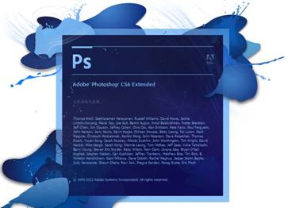
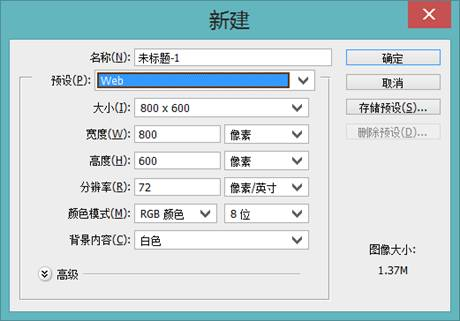
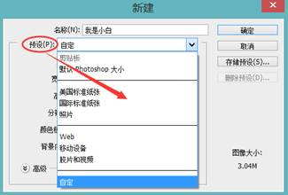
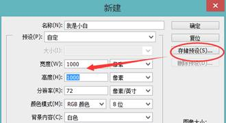
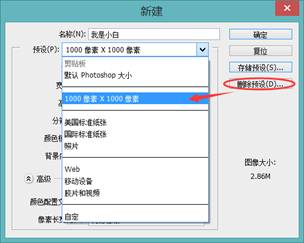
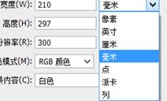
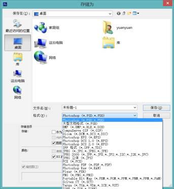
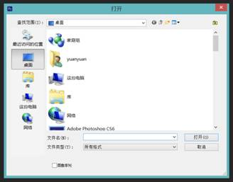
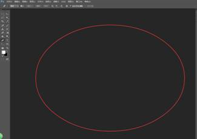
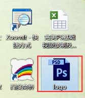

# Photoshop基础学习笔记

---

### PS介绍

Adobe Photoshop，简称“PS”，是由Adobe Systems开发和发行的图像处理软件。Photoshop主要处理以像素所构成的数字图像。使用其众多的编修与绘图工具，可以有效地进行图片编辑工作。ps有很多功能，在图像、图形、文字、视频、出版等各方面都有涉及。

* 1990年，Photoshop版本1.0.7;

* 1991年，Photoshop版本 2.0;

* 1994年，Photoshop 版本3.0;

* 1997年，Photoshop 版本4.0;

* 1998年，Photoshop 版本5.0;

* 1999年，Photoshop 版本5.5;

* 2000年，Photoshop 版本6.0;

* 2002年，Photoshop 版本7.0;

* 2003年，Photoshop 版本7.0.1;

* 2003年，Photoshop CS（8.0）;

* 2005年，Photoshop CS2;

* 2007年，Photoshop CS3;

* 2008年，Photoshop CS4;

* 2010年，Photoshop CS5;

* 2012年，Photoshop CS6;

* 2013年，Photoshop CC;

PS是一个神奇的软件，应用于生活当中的方方面面，包括平面设计、广告设计、网页设计、UI设计、影楼后期等等。

### 文件新建与配置

1、文件菜单--新建（快捷键：Ctrl+N）

注意：按住CTRL键的同时，在photoshop界面中双击。这个新建文件的方法在CS5这个版本已经取消，变为打开；

2、名称

新建文件时名称可根据实际情况自定义，改好之后，在保存文件时就不需要改名称了；

3、预设--预先定义好一些图像参数

若有经常使用的尺寸，可以直接设置好宽度和高度，点击存储预设；

注：ctrl+alt+n  重复上次的文件尺寸大小；

若不需要此尺寸，可以直接选中并点击删除预设；

4、剪贴板

熟练PS的设计人员，在制作教程的时候，就会经常进行截图，在截图的时候，我们所截的图像就是储存的剪贴板当中，复制图片后剪贴板可用，如果没有复制图片，剪贴板是灰色不可用的，如果想让他变成灰色的，可选择（在编辑——清理——剪贴板）。

5、宽度、高度：

可自定义，注意单位的把握；常用：厘米、毫米、像素。

6、分辨率

若用于网页设计，网页浏览，可选择72分辨率，单位为像素；

若用于高级图像处理，可选择300分辨率，单位为像素；

若用于印刷等出版，可选择300分辨率，单位可以选择毫米或厘米；

7、颜色模式

RGB模式、CMYK模式、位图、灰度、Lab颜色

1）RGB模式

RGB模式是PS中最常用的模式，也被称之为真彩色模式，在RGB模式下显示的图像质量较高，也是PS的默认模式；RGB颜色模式主要是由R（红）、G（绿）、B（蓝）三种基本色相加进行配色，并组成了红绿蓝三种颜色通道；该模式适用于显示器、投影仪、扫描仪、数码相机等；

2）CMYK模式

CMYK颜色模式是打印全彩图像的颜色系统。青色、品红、黄色、和黑色是平版印刷机和喷墨打印机使用的油墨颜色。CMYK模式主要是由C（青）、M（洋红）、Y（黄）、K（黑）4种颜色相减而配色的。因此它也组成了青、洋红、黄、黑4个通道，每个通道混合而构成了多种色彩。

当对图像进行印刷时，必须将它的颜色模式转换为CMYK模式。由于在CMYK模式下Photoshop的许多滤镜效果无法使用，所以一般都使用RGB模式，只有在即将进行印刷时才转换成CMYK模式，这时的颜色可能会发生改变。

3）位图

位图模式是用黑色和白色来表现图像的，不包含灰度和其他颜色，因此它也被称为黑白图像。

4）灰度

灰度模式下的图像只有灰度，而没有其他颜色。如果将彩色图像转换成灰度模式后，所有的颜色将被不同的灰度所代替。 

5）Lab颜色

Lab模式既不依赖光线,也不依赖于颜料,Lab模式由三个通道组成,它的一个通道是亮度,即L.另外两个是色彩通道,用A和B来表示.A通道包括的颜色是从深绿色（底亮度值）到灰色（中亮度值）再到亮粉红色（高亮度值）；B通道则是从亮蓝色（底亮度值）到灰色（中亮度值）再到黄色（高亮度值）.因此,这种色彩混合后将产生明亮的色彩。

6）8位、16位、32位

在灰度RGB或CMYK模式下，可以使用16位通道来代替默认的8位通道。根据默认情况，8位通道中包含256个色阶，如果增到16位，每个通道的色阶数量为65536个，这样能得到更多的色彩细节。Photoshop可以识别和输入16位通道的图像，但对于这种图像限制很多，所有的滤镜都不能使用，另外16位通道模式的图像不能被印刷。打印写真一般是CMYK模式8位图像，默认的是8位图像，因为一般软件只支持8位图像，高清电影胶片是16位图像的，所以我们看到的哪些电影清晰度非常高，颜色非常丰富。

8、背景内容

白色：背景画布为白色单色；

背景色：背景画布的颜色为背景色设置的颜色；

透明：背景内容无颜色填充，呈现透明状态；

### 文件的存储

1、PS文件储存方法

1）存储---ctrl+s

2）存储为---ctrl+shift+s

3）存储为Web所用格式---ctrl+shift+alt+s

注：保存为网页格式目的是输出展示在网页上的图片，创建网页使用的图像，保存的主要的目的之一是在维持图片质量的同时尽可能地缩小文件体积；其还可以保存GIF格式的动画文件。

2、PS常用的图像格式

在Photoshop中，文件的保存格式有很多种，不同的图像格式有各自的优缺点。Photoshop CS6支持20多种图像格式，下面针对其中常用的几种图像格式进行具体讲解。

1）PSD格式

PSD格式是Photoshop工具的默认格式，也是唯一支持所有图像模式的文件格式。它可以保存图像中的图层、通道、辅助线和路径等信息。一般寻找素材会选择PSD格式，文件做完或者没做完都习惯性保存PSD源文件，方便后期修改。由于PSD格式所包含的图像数据信息比较多，因此比其他格式的图像文件要大得多。

2）JPEG格式

JPEG是一种有损压缩的格式，此格式的图像通常用于图像预览和一些超文本的文档中（HTML文档），文件后辍名为“.jpg”或“.jpeg”，最大的特色是文件比较小，可以进行高倍率的压缩，是目前所有格式中压缩率比较高的格式之一，但是JPEG格式在压缩保存的过程中会以失量最小的方式丢掉一些肉眼不易察觉的数据，因而保存的图像与原图有所差别，没有原图的质量好，不适合印刷使用。

3）PNG格式

PNG用来存储灰度图像时，灰度图像的深度可多到16位：存储彩色图像时，彩色图像的深度可多到48位，并且还可存储多到16位的通道数据。PNG在网页应用中使用较为广泛,比如在Dreamweaver中插入一张透明背景图片，就可以使用PNG格式的图片。PNG能保留完整的照片色彩，是一种非失真性压缩格式。不过唯一的缺点是文件较大，不利于网页浏览。由于PNG格式不完全支持所有浏览器，所以在网页使用要比GIF和JPEG格式使用少的多。

4）GIF格式

GIF格式是一种图形格式，只是保存最多256色的RGB色阶数，是一种基于LZW算法的连续色调的无损压缩格式。目前几乎所有相关软件都支持它。GIF格式的另一个特点是其在一个GIF文件中可以存多幅彩色图像，如果把存于一个文件中的多幅图像数据逐幅读出并显示到屏幕上，就可构成一种最简单的动画。GIF分为静态GIF和动画GIF两种，扩展名为.gif，是一种压缩位图格式，支持透明背景图像，适用于多种操作系统，“体型”很小，网上很多小动画都是GIF格式。其实GIF是将多幅图像保存为一个图像文件，从而形成动画，所以归根到底GIF仍然是图片文件格式。

5）BMP格式

它是Window操作系统中的标准图像文件格式，其不支持CMYK模式的图像。由于BMP文件格式是Windows环境中交换与图有关的数据的一种标准，因此在Windows环境中运行的图形图像软件都支持BMP图像格式。

6）TIFF格式

TIFF是一种无损压缩格式，是一种非常广泛的图像格式，TIFF与JPEG和PNG一起成为流行的高位彩色图像格式。TIFF格式可以制作质量非常高的图像，因而经常用于出版印刷。如果您要在一个并非创建该图像的程序中编辑图像，则以这种格式保存将很有帮助，因为多种程序都可以识别它。TIFF用于在应用程序和计算机平台之间交换文件，是一种灵活的位图图像格式，几乎受所有的绘画、图像编辑和页面版画应用程序的支持。而且，几乎所有的桌面扫描仪都可以生成TIFF图像。

### 文件的打开与关闭

1、文件常用打开方法：

1）文件菜单--新建（ctrl+O）

2）双击PS画面区域打开

3）直接拖动文件到PS当中

4）直接双击打开PSD文件

### 移动工具

   

---

